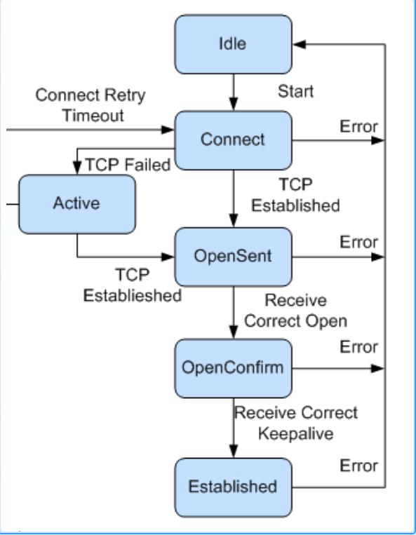
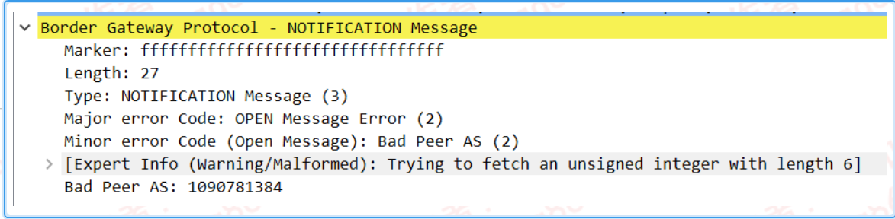

---
# HCIP-ISIS
layout: pags
title: BGP基本信息及邻居建立
date: 2025-07-01 12:29:54
tags: Network
categories: 
- [HCIP,4.1BGP基本信息及邻居建立] 
---

### BGP基本信息

#### 1.概述

边界网关协议        
- 用于实现自治系统AS之间的路由可达，并选择最佳路由的距离矢量路由协议
- 自治系统AS
  - AS是指在一个实体管辖下的拥有相同选路策略的IP网络
  - AS号分为2字节AS号和4字节AS号
   <!-- more -->
协议特点        
1. 关注路由传递，弱化路由计算------BGP协议本身不发现或计算路由，需要将其他路由引入到BGP路由表，实现AS间的路由互通。
2. 使用TCP作为传输协议------路由可靠传递，TCP 179
3. eBGP与iBGP外部优先级：255
4. 不支持周期更新，仅支持触发增量更新
5. 支持CIDR(无类域间路由)，VLSM（可变长子网掩码）
6. 无环路----iBGP水平分割、eBGP水平分割、反射器场景防环
7. 易于扩展 ----支持IPV4,IPV6,组播等、支持多拓扑
8. 路由策略丰富
9. 防止路由震荡 

技术优势        
1. 支持认证，GTSM，保证了网络的安全性
2. 提供丰富的路由策略，能够灵活的进行路由选路，并且能指导邻居按策略发布路由。
3. 支持路由聚合，路由衰减用于防止路由震荡，有效提高了网络的稳定性。
4. BGP端口ID TCP179，支持BGP与BFD联动、BGP Trackin和BGP GR和NSR，提高了网络的可靠性
5. 在邻居数目多、路由量大且大部分邻居具有相同出口策略的场景下，BGP使用按组打包技术极大的提高了BGP打包发包的性能 

#### 2.BGP分类

- EBGP
  - 运行于不同AS之间的BGP称为EBGP
  - 防环机制---当BGP设备接收EBGP对等体发送的路由时，会将带有本地AS号的路由丢弃。
- IBGP
  - 运行于同一AS内部的BGP称为IBGP
  - 防环机制---BGP设备不将从IBGP邻居学到的路由通过给其他IBGP对等体，并与所有IBGP对等体建立全连接
    - 为保障所有iBGP邻居学到路由故配置IBGP全互联---IBGP对等体的连接数量太多，设计了路由反射器和BGP联盟
- BGP报文交互中的角色
  - Speaker：发送BGP报文的设备称为BGP发言者（Speaker），它接收或产生新的报文信息，并分布(Advertise)给其他BGP Speraker. 
  - Peer：相互交互报文的Speaker之间互称对等体（Peer）。若干相关的对等体可以构成对等体组（Peer Group）

### BGP邻居建立

#### BGP状态机

1. idle状态是BGP初始状态。
  - 在Idle状态下，BGP拒绝邻居发送的连接请求
  - Idle时间32s
    - Start等待时间
    - Start事件后，BGP开始尝试和其他BGP对等体进行TCP连接，并转至Connect状态
  - 说明
    - Start事件是由一个操作者配置一个BGP过程，或者重置一个已经存在的过程或者路由器软件重置BGP过程引起的
    - 任何状态下收到Notification报文或TCP拆链通知等Error事件后，BGP都会转至Idle状态、

2. 在Connect状态下
   - 主动发起BGP建立连接
   - BGP启动连接重传定时器（Connect Retry），等待TCP完成连接---重传计时器32S
   - 如果TCP连接成功，那么BGP想对等体发送Open报文，并转至OpenSent状态。
   - 如果TCP连接失败，那么BGP转至Active状态。
   - 如果连接重传定时器超时，BGP仍未收到BGP对等体的响应，那么BGP继续尝试和其他BGP对等体进行TCP连接，停留在Connect状态。

3. 在Active状态下，BGP总是在试图建立TCP连接。
   - 被动等待建立BGP邻居
   - 如果TCP连接成功，那么BGP向对等体发送Open报文，关闭连接重传定时器，并转至OpenSent状态
   - 如果TCP连接成功zz，那么BGP停留在Active状态。
   - 如果连接重传定时器超时，BGP仍没有收到BGP对等体的响应，那么BGP转至Connect状态
  
4. 在OpenSent状态下，BGP对待对等体的Open报文，并对收到的Open报文中的AS号、版本号、认证码等进行检查。
   - 如果收到的OPen报文正确，那么BGP发送Keepalive报文，并转至OpenConfirm状态
   - 如果发现收到的Open报文有错误，那么BGP发送Notification报文给对等体，并转至Idle状态。
  
5. 在OpenConfirm状态下，BGP等待Keepalive或Notification报文。
   - 如果收到Keepalive报文，则转至Established状态
   - 如果收到Notification报文，则转至Idle状态
  
6. 在Estalished状态下，BGP可以和对等体交换Updata,Keepalive,Route-refresh报文和Notification报文
   - 如果收到正确的Updata或Keepalive报文，那么BGP就认为对端处于正常运行状态，将保持BGP连接。
   - 如果收到错误的Updata或Keepalive报文，那么BGP发送Notification报文通知对端，并转至Idle状态。
   - 如果收到Notification报文，那么BGP转至Idle状态
   - 如果收到TCP拆除通知，那么BGP端口连接，转至Idle状态

7. Route-refresh报文不会改变BGP状态。

#### BGP报文

1. Open报文：协商BGP参数 
   

- version：BGP版本
- holdtime：邻居保持时间（默认180S）---邻居协商选择较小的时间作为协商结果
- BGP Identifier：BGP router-id
  - 用于标识BGP设备的32位值
  - 选择原则：手动配置、本地loopback接口、物理接口IP（选择较大IP）
- optional parameters：描述BGP能力通过
  - 多协议扩展能力
  - 路由刷新--refresh bgp all触发
  - 4字节AS能力

2. Update报文：用于在对等体之间交换路由信息

- 前缀信息
- 路径属性

3. Keepalive报文：用于保持BGP连接 
   

4. Notification报文：用于提供BGP协商报错

- 例如：Bad Peer AS配置

1. Route-refresh报文：用于在改变路由策略后请求对等体重新发送路由信息

- 注：BGP路由更新仅支持触发，增量更新

[BGP邻居建立实验]() 

