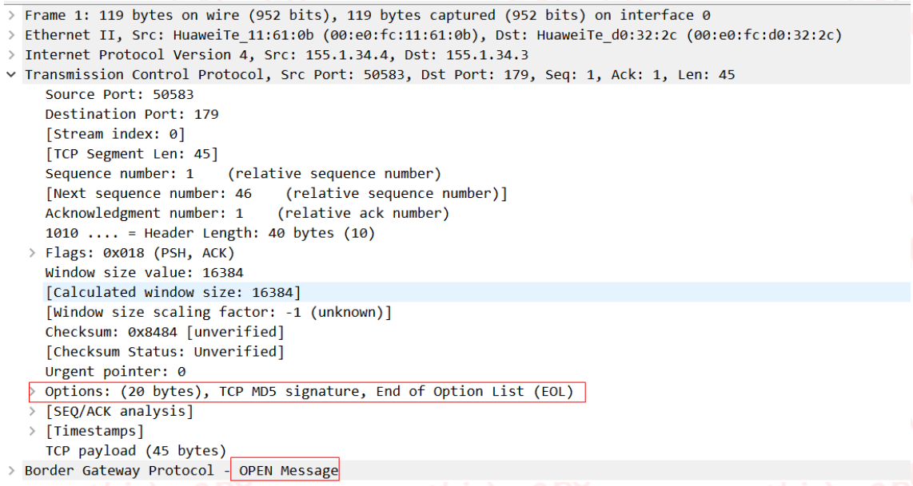

---
# HCIP-BGP
layout: pags
title: BGP安全和收敛
date: 2025-07-01 12:29:54
tags: Network
categories: 
- [HCIP,4.4BGP安全和收敛] 
---

### BGP安全加固

1. 配置MD5认证

抵御BGP peer伪造       

```bash
bgp 100
    peer 155.1.34.4 password simple HUAWEI
```
 <!-- more -->


2. 配置BGP DTSM功能

检测IP报文头中的TTL值。对于不符合TTL值范围的报文，GTSM可以设置为通过或丢弃

```bash
bgp 100 
    peer 155.1.34.4 vaild-ttl-hops 1
    gtsm default-action drop
     ENSP不支持  华为默认
```

### BGP收敛调优

1. 配置BGP连接重传定时器 

-  重传定时器
  - BFP重试发起TCP建立的等待时间
  - 默认32s

```bash
R2
    bpg 100
        peer 155.1.23.3 timer connect-retry 16
R3
    bgp 200
        timer connect-retry 16
```

2. 配置BGP存活时间和保持时间定时器

```bash
bgp 100 
    timer keepalive 60s hold 180s
    peer 150.1.1.1 timer keepalive 60s hold 180s
```

BGP的Keeplive消息用于维持BGP连接关系

3. 配置更新报文定时器

IBGP对等体的默认更新报文定时器为15秒       
EBGP对等体默认更新报文定时器为30秒

修改BGP更新时间为默认的1/3 

```bash
 R2
    bgp 100
        ipv4-family unicast
            peer 150.1.1.1 enable
            peer 150.1.1.1 route-update-interval 5
            peer 155.1.23.3 enable
            peer 155.1.23.3 route-update-interval 10
```

4. EBGP连接快速恢复

- 技术背景：接口震荡导致EBGP会话反复重建，引起网络震荡
- 默认启用：接口failure ,立即清除BGP会话

```bash
 bgp  100 
    undo ebgp-interface-sensitive
```

5. BGP下一跳延迟响应

背景：默认BGP下一跳DOWN，导致BGP通过通过路由撤销引起流量丢失；只适用于下游到达同一目的地有多个链路的场景        
默认未使能，建议配时间大于IGP收敛时间       

```bash
bgp 100
    nexthop recursive-lookup delay 5s
```

6. BGP Tracking

快速感知链路不可达或者邻居不可达，实现网络的快速收敛

```bash
 bgp 100
    peer 150.1.3.3 tracking
```

7. BFD for BGP

BGP引入BFD加速BGP收敛

```bash
bgp 100
    peer 150.1.1.1 bfd enable
    peer 150.1.2.2 bfd block // 禁用BFD功能
```
