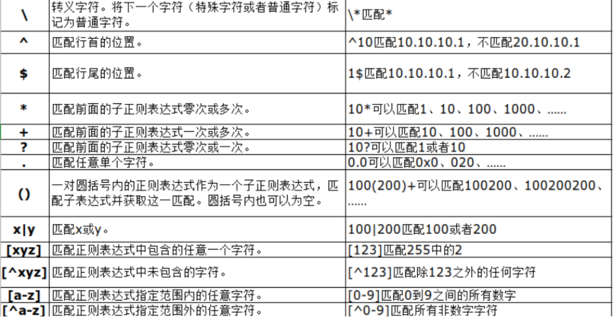
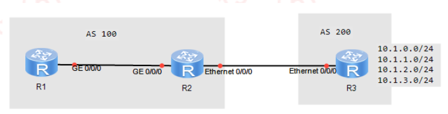
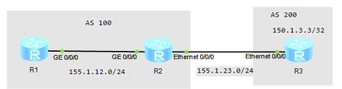
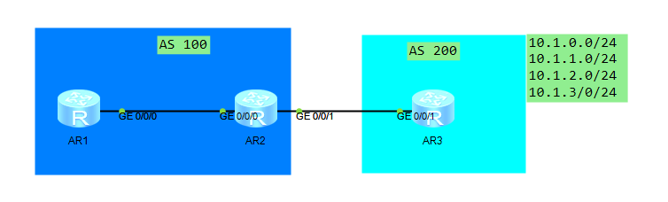
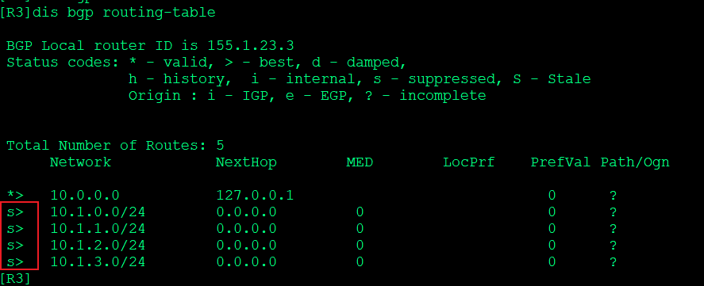
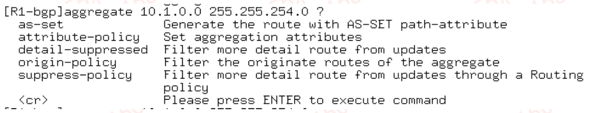

---
# HCIP-BGP
layout: pags
title: BGP路由控制
date: 2025-07-01 12:29:54
tags: Network
categories: 
- [HCIP,4.3BGP路由控制] 
---

### BGP路由控制

#### 1.BGP路由过滤

支持入方向或出方向      
过滤方法        
1. BGP正则表达式        
   1. 正则表达式为一种字符串匹配的模式
   2. 由普通字符（例如a到z，0-9）和特殊字符（例如？，#）组成
   3. 特殊字符表
 <!-- more -->


2. 使用前缀列表



 配置R2拒绝接收源自R3通告到10.1.2.0/24，允许接收其他前缀        

```bash
R2配置
    bgp 100
        peer 150.1.1.1 ip-prefix DENY_NET2 import
    ip ip-prefix DENY_NET2 index 10 deny 10.1.2.0 24
    ip ip-prefix DENY_NET2 index 20 permit 0.0.0.0 0  le 32
```

3. 使用route-policy+community-filter过滤


实验需求        
修改10.1.1.0/24与10.1.2.0/24添加Community 200：200      
对于携带community的路由做过滤       

```bash
R3
    bgp 200 
        peer 155.1.23.2 as-number 100
        ipv4-family unicast
            undo synchronization
            network 10.1.0.0  24
            network 10.1.1.0 24 route-policy SET_COMM
            network 10.1.2.0 24 route-policy SET_COMM
            network 10.1.3.0 24
            peer 155.1.23.2 enable 
            peer 155.1.23.2 advertise-community
    route-policy SET_COMM permit node 10
        apply community 200:200
R2
    ip community-filter 1 permit 200：200
    route-policy TEST deny node 10 
            if-match community-filter 1
    route-policy TEST permit node 20
    bgp 100
        peer 150.1.1.1 as-number 100
        peer 150.1.1.1 connect-interface Loopback0
        peer 155.1.23.3 as-number 200
        ipv4-family unicast 
            undo synchronization 
            peer 150.1.1.1 enable 
            peer 150.1.1.1 next-hop-local
            peer 155.1.23.3 enable
            peer 155.1.23.3 route-policy TEST import
```

4. 使用filter-policy + acl

实验需求        
利用Filter-policy 过滤10.1.X.0/24,其中X为奇数

```bash
R2
    acl number 2001 
        rule 5 permit source 10.1.1.0 0.0.254.0
    bgp 100
        ipv4-family unicast 
        undo synchronzation
        filter-policy 2001 import
```

5. 使用as-path-filter

实验需求        
过滤包含AS201或AS202的路由

```bash
R3
    route-policy SET_AS permit node 10  
        apply as-path 201 202 additive 
    route-policy SET_AS_201 permit node 10
        apply as-path 201 additive
    route-policy SET_AS_202 permit node 10 
        apply as-path 202 additive
    bgp 200
        peer 155.1.23.2 as-number 100
        ipv4-family unicast  
            undo synchronization 
            network 10.1.0.0 255.255.255.0 route-policy SET_AS
            network 10.1.1.0 255.255.255.0 route-policy SET_AS_201
            network 10.1.2.0 255.2255.255.0 route-policy SET_AS_202
            network 10.1.3.0 255.255.255.0
            peer 155.1.23.2 enable
R2 
    bgp 100 
        peer 150.1.1.1 as-number 100
        peer 150.1.1.1 connect-interfacee Lo0
        peer 155.1.23.3 as-number 200
        ipv4-family unicast                   
            undo  synchronization 
            peer 150.1.1.1 enable 
            peer 150.1.1.1 next-hop-local
            peer 155.1.23.3 enable 
            peer 155.1.23.3 as-path-filter 1 import 
    ip as-path-filter 1 deny 20(1| 2)
    ip as-path-filter 1 permit .*
```

6. BGP ORF

- 邻居按需发布路由        
    - 本端设备配置的基于前缀的入口策略通过路由刷新报文发送给BGP邻居
    - BGP邻居基于策略构造出口策略，在路由发送时进行过滤
- 部署特点
    -  避免本端设备接收大量无用的路由
    -  降低了本段设备的CPU使用率
    -  减少了BGP邻居的配置工作
    -  降低了链路带宽的占用率

实验需求        
实现R3只通向R2通告10.1.0.0/24 与10.1.1.0/24，其中过滤策略路由R2推送

```bash
R2
    bgp 100
        peer 155.1.23.3 ip-prefix BGP_ORF import
        peer 155.1.23.3 capability-advertise orf ip-prefix  send
        ip ip-prefix BGP_ORF index 10 premit 10.1.0.0 23 gr  24 le 24
R3 
    bgp 200
        peer 155.1.23.2 capability-advertise orf ip-prefix receive
```

#### 2.BGP条件路由与缺省路由

存在指定路由通告缺省路由

实验拓扑



实验需求        
若R2存在155.1.3.3/32 存在，则R2朝R1通告缺省路由

```bash
R2
  bgp 100
    peer 150.1.1.1 as-number 100
    peer 150.1.1.1 connect-interface Lo0
    peer 155.1.23.3 as-number 200
    ipv4-family unicast
        undo synchronization
        peer   150.1.1.1 enable
        peer 150.1.1.1  next-hop-local
        peer 150.1.1.1 default-toute-advertise   conditiomal-route-match-all 150.1.3.3 32  
R3 
  bgp  200
    peer 155.1.23.2 as-number 100
    ipv4-family unicast
        undo cynchronization
        network 150.1.3.3 3
```

#### BGP路由自动聚合

1. BGP路由聚合

减少路由条目，隔离明细路震荡，提升网络性能与稳定性。        
BGP在IPV4网络中支持自动聚合和手动聚合两种方式，而IPV6网络中仅支持手动聚合方式：          

- 分类
   - 自动聚合
     - 仅支持本地import方式引入的前缀---聚合的路由必须存在本地路由表（路由来源：直连，静态，IGP）
     - 聚合路由不保留明细路由属性
     - 自动抑制明细路由
     - 主类方式聚合
     - 验证BGP自动聚合

实验拓扑



实验需求        
自动聚合R3本地环回

```bash
R3
    ip ip-prefix SY index 10 premit 10.1.0.0 22 gr 24 le 24
    route-policy SY1 permit node 10
        if-match ip-prefix SY
    bgp 200
        ipv4-family unicast
            summary automatic
            import-route direct route-policy SY1
```

验证配置



S：抑制明细     
10.0.0.0：主类聚合      
仅支持聚合本地前缀      

- 手动聚合

对BGP本地路由表中存在的路由进行聚合。手动聚合可以控制聚合路由的属性，以及决定是否发布具体路由。     
明细路由存在起源属性未？则聚合路由起源属性为？      
手动聚合路由默认不会抑制明细路由        



为了避免路由聚合可能引起的路由环路，BGP设置了AS_Set属性     
AS_Set属性是一种无序的AS_Path属性，表明聚合路由所经过的AS号。用于防环聚合路由扩展参数：     
扩展参数这里就不展开说明了 感兴趣的朋友可自行查阅文档


