---
# HCIP-BGP
layout: pags
title: BGP路径属性
date: 2025-07-01 12:29:54
tags: Network
categories: 
- [HCIP,4.2BGP路径属性] 
---

### BGP路径属性

#### BGP路由传递

- BGP对等体之间的交互原则
  - 当存在多条到达同一目的地址的有效路由时，BGP设备只将最优路由发布给对等体。
  - BGP设备将最优路由加入BGP路由表，形成BGP路由 
  - 标识为 “>" 的路由必须满足以下条件
    - BGP Next-Hop可达
    - BGP同步禁用（默认开启）
  - 通过eBGP对等体获得的BGP路由，BGP设备发布给它所有eBGP和iBGP对等体
  - 通过iBGP对等体获得的BGP路由，传递到EBGP对等体，不传递到iBGP对等体
   <!-- more -->
  - iBGP与eBGP获得非BGP路由，能传递到任意BGP对等体----路由引入
  - BGP同步---定义：IBGP获得的路由传递能够传递的条件
    - 通过IBGP获得
    - 通过IGP获得
    - 目的：避免BGP黑洞 
    - 默认禁用（华为无法开启）
  - iBGP水平分割
    - 从IBGP对等体获得的BGP路由，BGP设备只发布给它的EBGP对等体。
  - eBGP防环机制
    - 默认eBGP路由器不接收包含本AS的前缀
    - 消除eBGP防环机制---peer 150.1.2.2 allow-as-loop 3 //允许重复AS出现3次
  - iBGP超网路由（华为默认禁用）
    - BGP通告的路由与Next-Hop在相同网段，即BGP超网路由
    - 华为默认不传递BGP超网路由（ENSP不支持禁用此功能）
    - supernet unicast advertise enable

#### 路由反射器与联盟

- 路由反射器
  - 当设备数目很多时，设备配置十分复杂，而且配置后网络资源和CPU资源的消耗都很大。
  - 路由反射器相关角色
  
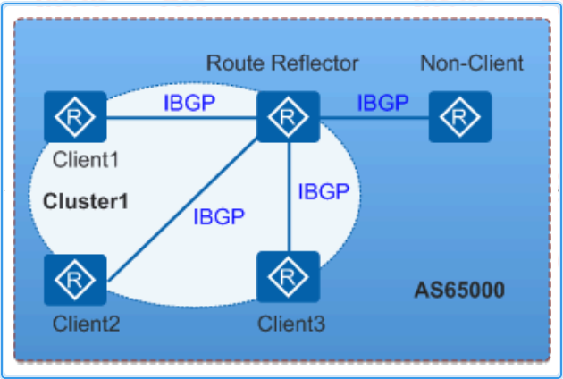

- 路由反射器RR（Route Reflector）
  - 允许把从IBGP对等体学到的路由反射到其他IBGP对等体的BGP设备
- 客户机（Client）
  - 与RR形成反射邻居关系的IBGP设备
- 非客户机（NON-Client）
  - 既不是RR也不是客户机的IBGP设备
- 始发者（Originator）
  - 在AS内部始发路由的设备。Originator_ID属性用于防止集群内产生路由环路
- 集群（Cluster）
  - 路由反射器及其客户机的集合。Cluster_List属性用于防止集群间产生路由环路 

1. 路由器反射原理
   1. 从非客户机学到的路由，发布给所有客户机。
   2. 从客户机学到的路由，发布给所有非客户机和客户机（发起此路由的客户机除外）
   3. 从EBGP对等体学到的路由，发布给所有的非客户机和客户机 
   
2. Cluster_List属性
   1. 路由反射器和它的客户机组成一个集群（Cluster），使用AS内唯一的Cluster ID作为标识
   2. 当一条路由第一次被RR反射的时候，RR会把本地Cluster ID添加到Cluster List前面。
   3. 当RR接收到一条更新路由时，RR检查Cluster List
   
3. Originator_ID属性
   1. Originator ID有RR产生，使用的Router ID的值标识路由的始发者，用于防止集群内产生路由环路
   2. 当一条路由第一次被RR反射的时候，RR将Originator_ID属性加入这条路由，标识这条路由的发起设备。
   3. 当设备接收到这条路由的时候，将比较收到的Originator ID和本地的Router ID，如果两个ID相同，则不接收此路由  

4. 备份路由反射器
   1. 为增加网络的可靠性，防止单点故障对网络造成影响，有时需要在一个集群中配置一个以上的RR
   2. 该集群中的所有RR必须使用相同的Cluster ID,以避免RR之间的路由环路

#### BGP联盟

联盟将一个AS划分为若干个子AS。每个子AS内部建立IBGP全连接关系，子AS之间建立联盟EBGP连接关系，但联盟外部AS仍认为联盟是一个AS

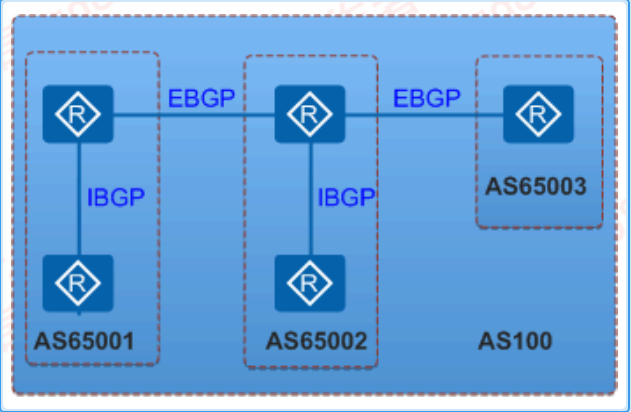

- 可以保留原有的IBGP属性，包括Local Preference属性、MED属性和NEXXT_HOP属性等；
- 联盟相关的属性在传出联盟时会自动被删除，即管理员无需在联盟的出口配置过滤子AS号等信息的操作。
- 路由反射器和联盟的比较

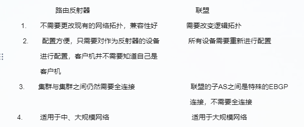

[路由反射器与联盟实验]()

查看通过或接收的前缀

```bash
 display bgp routing-table peer 150.1.2.2 advertised/received
 ```

 #### BGP属性

 1. BGP属性分类 
    1. 公认必须遵循（Well-known mandatory）     
          所有BGP设备必须识别且存在于Update报文中       
          必须识别与携带，如next-hop、as-path、origin
    2. 公认任意（Well-known discretionary）     
          所有BGP设备可以识别但可选存在于Update报文中       
          必须识别与可选携带，如local-preference,ATOMIC_AGGREGATE       
    3. 可选过渡（Optional transitive）      
          AS之间可被传递，BGP设备可以不识别此属性但仍然会接收并传递这类属性     
          不识别与能够被传递    列如：community、aggregator-ID      
    4. 可选非过渡（Optional non-reansitive）        
          BGP设备可以不识别此类属性，则会被忽略且不会传递给其他对等体       
          不识别与不能被传递，如MED.Ciuster-id,Originator-ID

2. BGP属性
   1. Origin属性        
     Origin属性用来定义路径信息的来源，标记一条路由是怎么成为BGP路由的，它有以下三种类型：      
      IGP：具有最高优先级。通过network命令注入到BGP路由表的路由，其Origin属性为IGP。        
      EGP：优先级次之。通过EGP得到的路由信息，其Origin属性为EGP     
      Incomplete：优先级最低。通过其他方式学习到的路由信息。比如BGP通过import-route命令     
      修改起源属性：修改R1本地loopback引入方式为network，修改起源属性为incomplete       
      配置：

```bash
R1
    ip ip-prefix NET1 index 10 permit 10.1.1.1 32
    route-policy ORIGIN permit node 10
        if-match ip-prefix NET1
         apply origin incomplete
    route-policy ORIGIN permit node 20
    bgp 100
        peer 150.1.2.2 as-numbner
        peer 150.1.2.2 connect-interface LO0
        peer 155.1.14.1 as-number 200
        peer 155.1.14.4 as-number 200
        ipv4-family unicast
            undo synchronization
            network 10.1.1.1 255.255.255.255 route-policy ORIGIN
            peer 150.1.2.2 enable 
            peer 150.1.2.2 next-hop-local
            peer 155.1.14.1 enable
            peer 155.1.14.4 enable 
```

验证

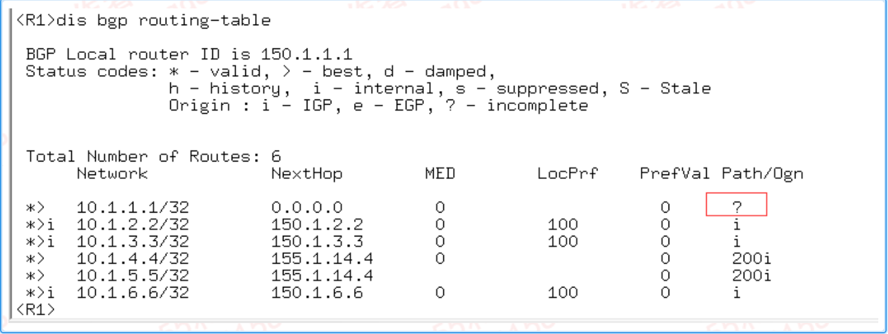

2. Next-Hop属性
   - Next_hOP属性记录了路由的下一跳信息
     - 接收到BGP前缀朝EBGP通过修改下一跳为本地邻居关系建立地址
     - 接收到BGP前缀朝IBGP通过，不修改下一跳
     - 本地前缀通告BGP邻居（EBGP,IBGP）跳地址为本地邻居建立地址设计初衷
     - IBGP不修改Next-Hop：用于选择抵达Next-Hop的最佳路径
     - EBGP修改Next-Hop：回避Next-Hop不可达引起BGP路由不优化无法传递修改Next-hop
   - 设置R3通告R6关于10.1.5.5下一跳为155.1.36.6，其他前缀使用R3本地lookback作为下一跳

```bash
 R3
    bgp 100
      ipv4-family unicast
        peer 150.1.6.6 route-policy SET_NEXT_HOIP export
        peer 150.1.6.6 next-hop-local 
    route-policy SET-NEXT-HOP permit node 10
        if-match ip-prefix NET5
        apply ip-address next-hop 155.1.36.3 
    route-policy SET-NEXT-HOP permit node 20
    ip ip-prefix NET5 index 10 permit 10.1.5.5 32
```

验证

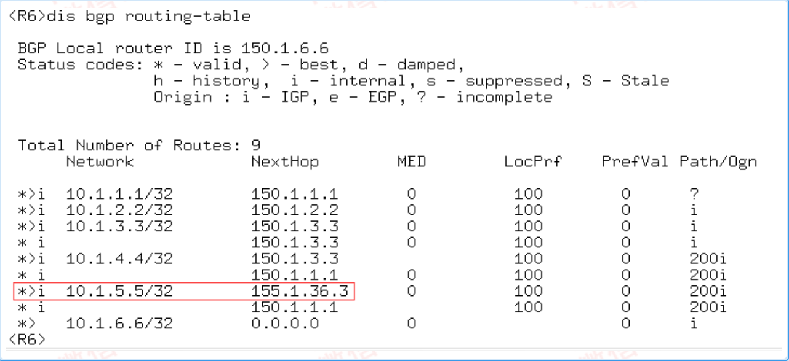

3. AS_Path属性
    - AS_Pash属性按矢量顺序记录了某条路由从本地到目的地址所要经过的所有AS编号
    - 当BGP Speaker 将这条路由通告EBGP对等体时，便会在Update报文中创建一个携带本地AS号的AS_Path列表
    - 当BGP Speaker 将这条路由通告IBGP对等体时，便会在Update报文中创建一个空的AS_Path列表
    - 在接收路由时，设备如果发现AS_Path列表中有本AS号，则不接收该路由，从而避免了AS间的路由环路
    - 调整AS_Path

```bash
allow-as-loop
bgp 100
    peer 155.1.12.2 allow-as-loop //配置本地AS号的重复次数
as overwrite  //AS Path重写
as additivate   //添加AS
public-as-only // 传递前缀移除私有 AS_Path 
fake-as   // 配置本段采用伪AS号与指定对等体建立连接
        AS迁移使用
        仅EBGP场景生效
bgp 100
        peer 150.1.1.1 as-number 200
        peer 150.1.1.1 fake-as 1000
```

[fake-as实验]()

4. Local_Pref属性

- Local_Pref 属性表明路由器的BGP优先级，用于判断流量离开AS时的最佳路由
- 当BGP的设备通过不同的IBGP对等体得到目的地址相同当下一跳不同的多条路由时，将优先选择Local_Pref属性较高的路由
- 缺省值 100--- Local-Pref属性仅在IBGP对等体之间有效，不通告给其他AS
- 部署
  - 支持IBGP入方向与出方向部署
  - 支持EBGP入方向部署，不支持出方向部署
- 公认可选属性
- 利用LP调整选项---AS200访问所有10.1.X.X/32 使用R4作为出口

```bash
R4
    bgp 200
        IPv4-family unicast
            peer 150.1.5.5 route-policy LP export 
    route-policy LP permit node 10 
        if-match ip-prefix ALL_NET
        apply local-preference 101
    ip ip -prefix ALL_NET index 10 wpermit 10.1.0.0 16 gr 32 le 32
```

验证配置

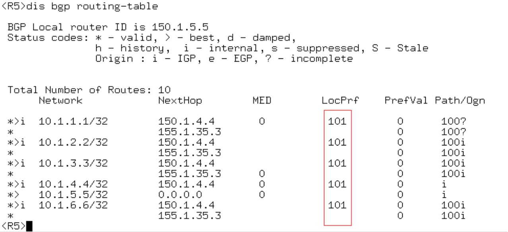

5. ATOMIC_AGGREGATE 

- 原子聚合属性
- 标识聚合路由不存在路由明细
  - 配置detail-suppressed
- BGP聚合产生
- 公认可选属性
- 手工聚合10.1.2.2/32位10.1.2.0/30

```bash
R2
  bgp 100
  ipv4-family unicast
  aggregate 10.1.2.0 255.255.255.252 detail-suppressed
```

验证配置

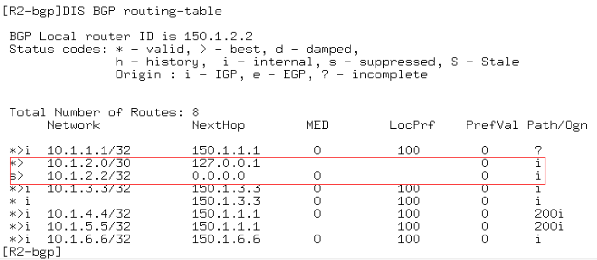

查看属性

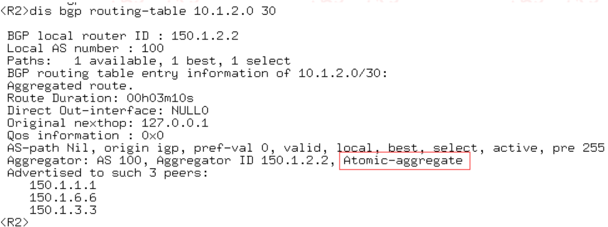

6. AGGREGATOR

- 聚合者
- 可选择传递属性
- 查看属性

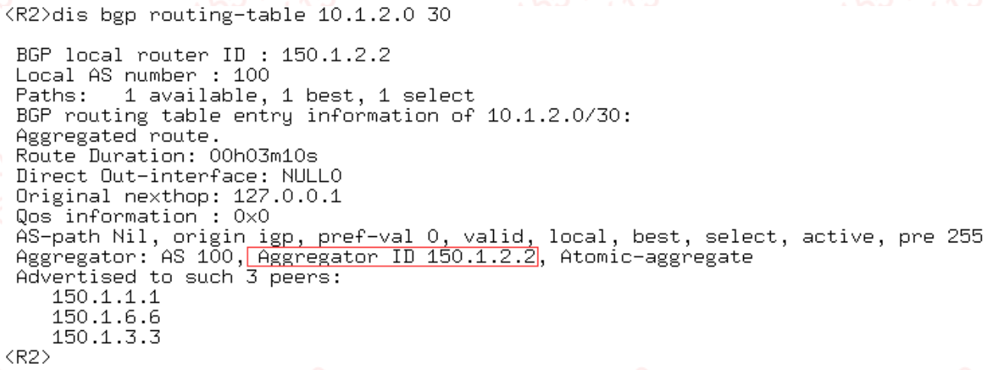

7. 团体属性

- 团体属性（Community）用于标识具有相同特征的BGP路由
- 使路由策略的应用更加灵活，同时降低了维护管理的难度
- 团体属性分为自定义团体属性和公认团体属性
- 公认团体属性

 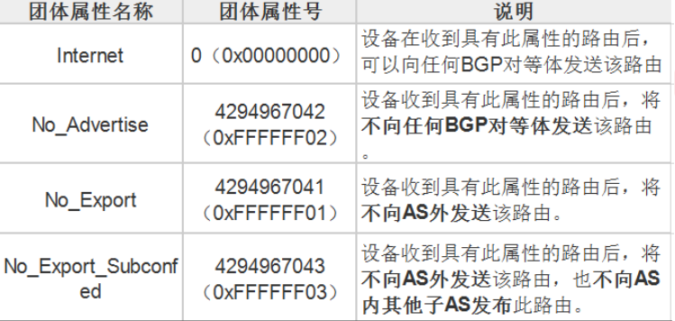

 - 自定义团体属性
 - 可选传递属性

 8. MED属性

- MED（Multi-Exit Discriminator）属性用于判断流量进入AS时的最佳路由
- 当一个运行BGP的设备通过不同的EBGP对等体得到目的地址相同但下一跳不同的多条路由时
- 在其他条件相同的情况下，将优先选择MED值较小作为最佳路由
- 部署特点
  - EBGP，IBGP入方向与出方向均可
  - 默认不比较不同AS的MED
  - deterministic-med
  - compare-different-as-med 
- 可选非传递
- 调整MED-实现流量进入AS200均已R4进入

```bash
bgp 200
  ipv4-family unicast 
    peer 155.1.35.3 route-policy MED export
route-policy MED permit node 10 
    apply cost 10
```

验证配置

 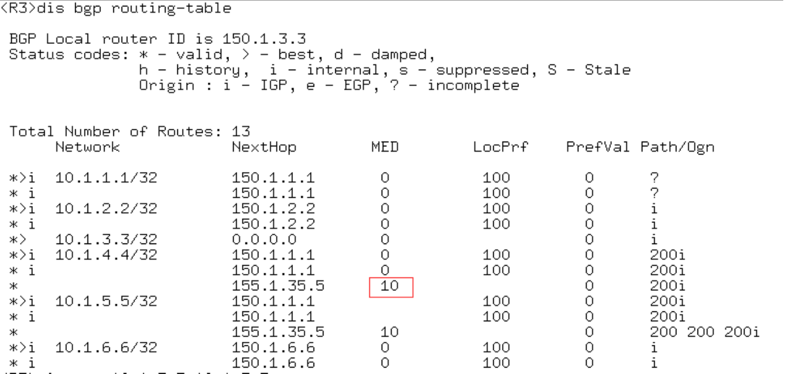

9. Originator_ID属性和Cluster_List属性

- 可选非传递属性
- Originator_ID属性和Cluster_List属性用于解决路由反射器场景中的环路问题，详细描述参加路由反射器
- 查看起源ID与集群ID

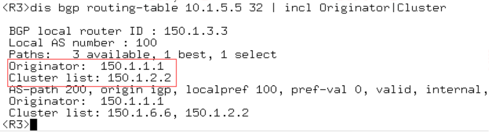

#### BGP选路

当到达同一目的地存在多条路由时，BGP依次对比下列属性来选择路由

1. 优选协议首选值（PrefVal）最高的路由
   1. 华为私有
   2. 仅设备本地有效
   3. 不支持传递
   4. 仅支持入方向部署
2. 优选本地优先级（Local_Pref）最高的路由--- 如果路由未携带本地优先级，缺省100
3. 依次优选手动聚合路由，自动聚合路由，network命令引入的路由，import-route 命令引入的路由，从对等体学习的路由
4. 优选AS路径（AS_PATH）最短的路由
5. 依次优选Origin类型为IGP，EGP,Incomplete的路由
6. 对于来自同一AS的路由，优选MED值最低的路由
7. EBGP优先于IBGP路由
8. 优选到BGP下一跳IGP度量值（metric）最小的路由---在IGP中，对到达同一目的地址的不同路由，IGP根据本身的路由算法计算路由的度量值
9. BGP负载分担
    1. 形成BGP等价负载分担的条件是“BGP选择路由的策略”的1至8条规则中需要比较的属性完全相同 
    2. 默认未启用
    3. 提升链路利用率

配置
```bash
  bgp 100
      maximum load-balancing [ ebgp | ibgp ]
```

10. 优选Cluster_List最短的路由
11. 优选Route ID最小的设备发布的路由---如果路由携带Originator_ID属性，选路过程中将比较Originator_ID的大小，优选Originator_ID最下的路由
12. 优选从具有最小IP ADDRESS的对等体学来的路由

#### 配置BGP软复位

- BGP支持手工对BGP连接进行软复位，可在不中断BGP连接情况下完成路由表的刷新
- BGP邻居关系重置
- 硬复位
  - reset bgp all
  - 导致BGP邻居关系重置
- 软复位
  - refresh bgp all import/export
  - export:重新通告本地BGP前缀
  - import：重新向BGP邻居请求BGP前缀（产生route-refresh）
  - BGP属性前缀刷新，不中断BGP邻居
- 注：现网不推荐使用 


   
