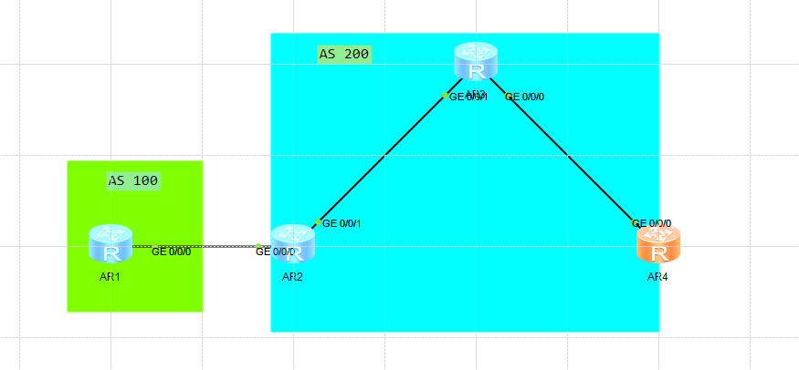
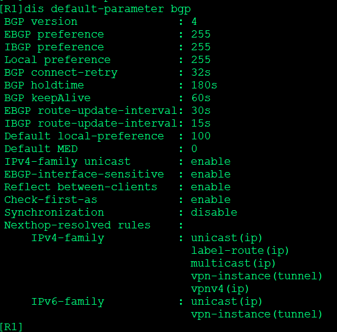
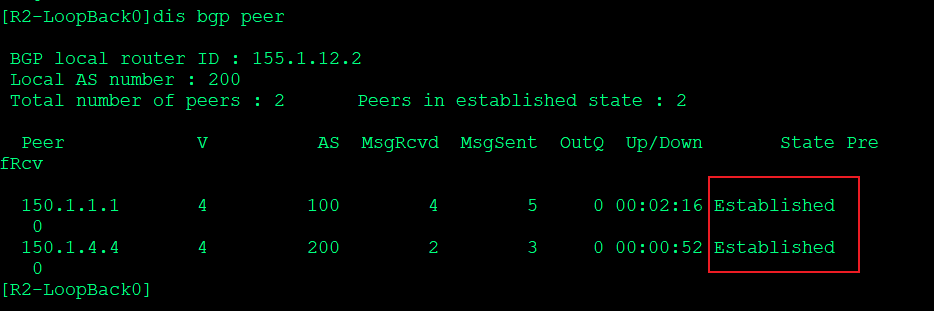
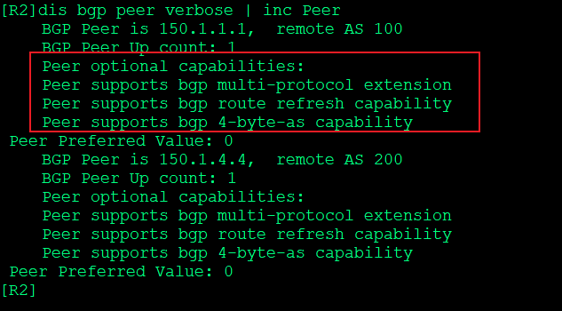

---
# HCIP-BGP
layout: pags
title: BGP邻居建立实验
date: 2025-07-01 12:29:54
tags: Network
categories: 
- [HCIP,4.1BGP基本信息及邻居建立] 
---

- 实验拓扑


   <!-- more -->
- 实验需求
1. 互联地址：155.1.XY.0/24 ；Lookback：150.1.x.x/32 
2. iBGP与eBGP邻居建立基本配置
3. BGP邻居关系使用Loopback建立
   
为了实验方便 使用的OSPF进行路由传递 实际生产环境中建议使用静态路由

```bash
R1
    bgp 100
        peer 150.1.2.2 as-number 200    //ebgp
        peer 150.1.2.2 connect-interface Loopback0  //指定建立BGP接口为回环口
        peer 150.1.2.2 ebgp-max-hop 255  //默认为1，指定TTL为255
        ipv4-family unicast
                undo synchronization
                network 10.1.1.1 255.255.255.255
                peer 150.1.2.2 enable
R2 
    bgp 200
         peer 150.1.4.4 as-number 200
         peer 150.1.4.4 connect-interface  lookback0
          peer 150.1.1.1 as-number 100
         peer 150.1.1.1 connect-interface Lookback0
         peer 150.1.1.1 ebgp-max-hop 255    
          ipv4-family unicast
                      undo synchronization
                       peer 150.1.4.4 enable
                      peer 150.1.4.4 next-hop-local
                     peer 155.1.12.1 enable 
R4
       bgp 200
          peer 150.1.2.2 as-number 200
          peer 150.1.2.2 connect-interface lookback0
          ipv4-family unicast
                     undo synchroniztion
                     peer 150.1.2.2 enable
                      peer 150.1.2.2 next-hop-local
```

- 查看BGP默认参数



- 查看BGP邻居



- 查看BGP能力值



- 查看BGP邻居关系类型


