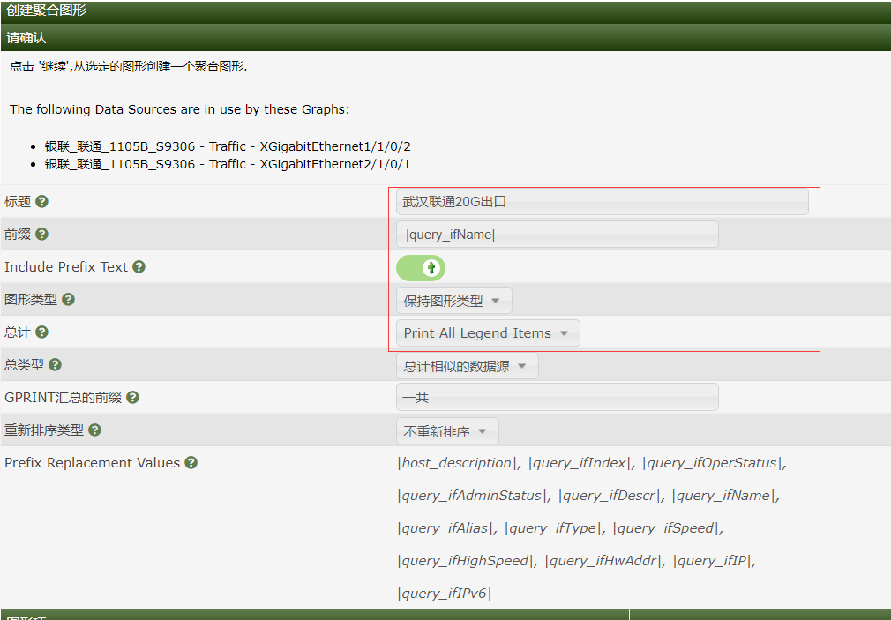

---
# 网络监控
layout: pags
title: Cacti调优
date: 2025-07-20 11:30:54
tags: 网络运维监控部署
categories: 
- [网络运维监控部署] 
---

### 参数设置

#### 数据采集器的线程数，可以参考CPU核心数量设置

设置--poller
<!-- more -->

#### 图形水印，可以添加自定义水印，关闭右侧rrd水印

设置--外观

#### 显示图形右侧控制按钮

设置--用户--admin–权限

#### 关闭自动创建图型

#### 修改标题长度最大值

#### 修改图形模板使图形显示设备、接口、接口描述:

|host_description| - |query_ifName| - |query_ifAlias|

### cacti新增业务，聚合图使用方法

#### 1.x以上版本cacti添加聚合图形

1. 图形管理，选择需要聚合的多个单图，创建聚合图形

2. 修改标题（新版已支持中文标题），前缀，开启前缀文本显示，保持图形类型，显示所有图形项目，汇总相似数据源，汇总前缀文本改为英文，中文不支持。勾选图形项，两个line类型的可以不勾选（用于填充区域的描边）前缀   |query_ifName|    

3. 再次开启前缀文本的显示     

4. 来到聚合，将聚合图形转换为一般图形

5. 来到图形管理，编辑转换好的一般图形，添加95值和95线 ，添加一个Hrule项目

- 颜色  红色
- 值  |95:bits:0:aggregate_max:2|
- 显示文本  95值：|95:bits:6:aggregate_max:2|M 

6. 保存后，将创建好的图形挂载到图形树上

----------------------------------------------------------------------------------------------------------

