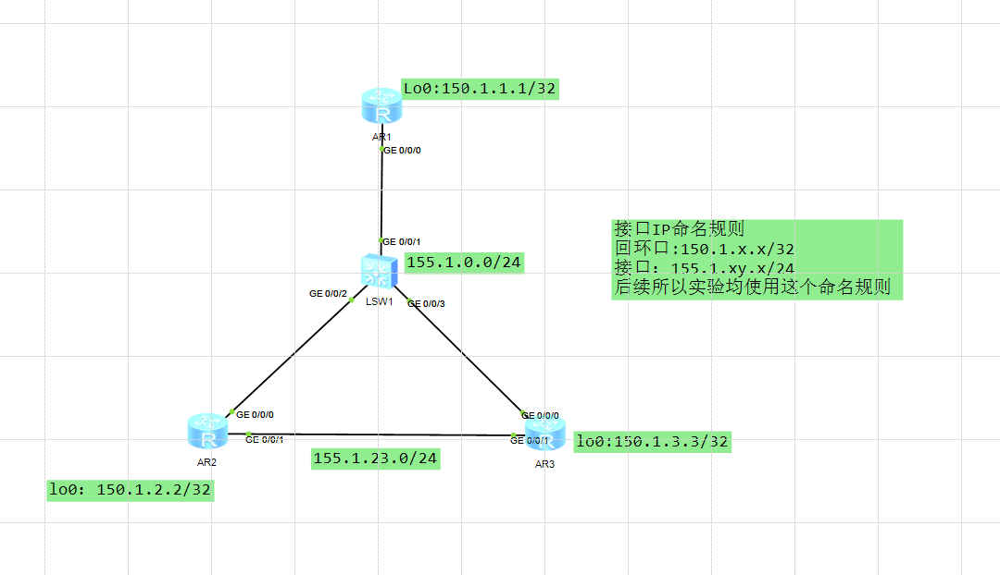
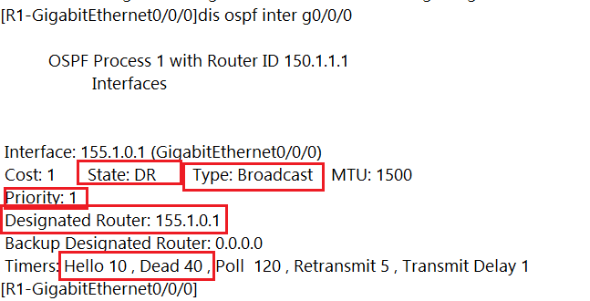
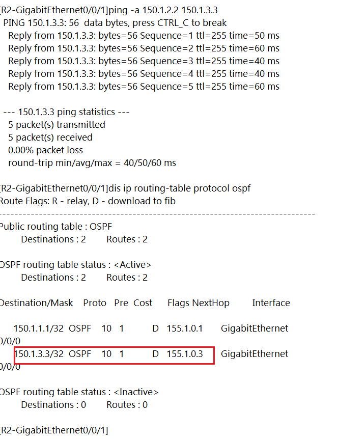
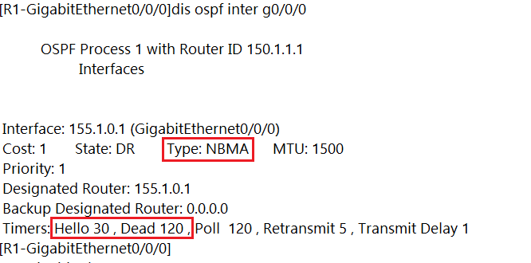
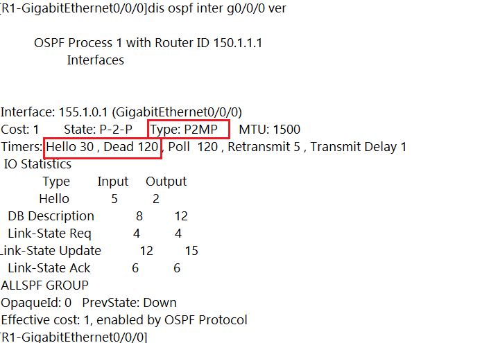

---
# HCIP-OSPF
layout: pags
title: DR和BDR实验-网络类型
date: 2025-06-25 14:25:54
tags: Network
categories: 
- [HCIP,OSPF基本概念]
---

### DR和BDR实验-网络类型

- 实验拓扑


- 实验需求
1. 部分互联网络如图所示，R1与R2，R3可以通信，155.1.0.2与150.1.0.3不能通信
2. R1,R2,R3属于OSPF区域0
3. 实现所以150.1.x.x/32之间通信，即使R2,R3互联故障
4. R2,R3互联加速收敛，不选择DR/BDR
<!-- more -->
- 配置
1. 验证P2P实现

```bash
  R2,R3
        interface g0/0/1 
            ospf network-type P2P
```
验证配置  

类型.png)

2. 利用BMA实现

```bash
R1,R3
    interface g0/0/0 
        ospf dr-priority 0
```

验证DR  



3. 关于Next-hop的问题

```BASH
 R2
    arp static 155.1.0.3 5489-98a1-7323
 R3
    arp static 155.1.0.2 5489-98a1-7323
```

验证配置  



4. 利于NBMA实现

```bash
R1
    ospf 1
        peer 155.1.0.2
        peer 155.1.0.3
R2,R3
    ospf 1 
        peer 155.1.0.1
```



5.利用P2MP实现

```bash
R1,R2,R3
    interfac g0/0/0 
        ospf network-type P2MP
```



