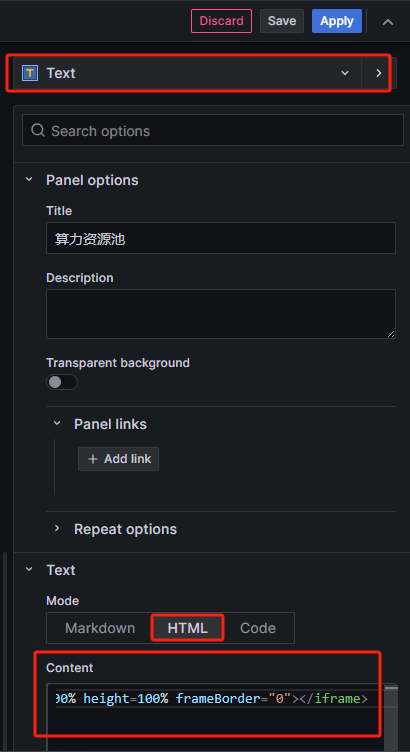

---
# 网络监控
layout: pags
title: Grafana 嵌入外部网站页面
date: 2025-07-20 14:30:54
tags: 网络运维监控部署
categories: 
- [网络运维监控部署] 
---

### 需要修改grafana配置文件以允许嵌入

```bash
vim /etc/grafana/grafana.ini
###########
disable_sanitize_html = true
allow_embedding=true
```

### 重启grafana服务

```bash
systemctl restart grafana-server
```

在dashboard中添加一个panel，类型为text， text mode选择HTML，content里面写入HTML代码

```bash
<iframe src="https://yunying.chinamye.com/monitor" width=100% height=100% frameBorder="0"></iframe>
```



----------------------------------------------------------------------------------------------------------

