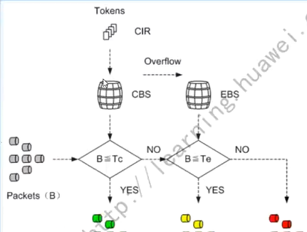
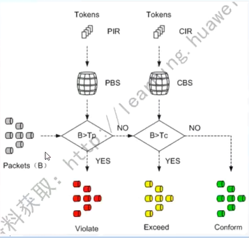
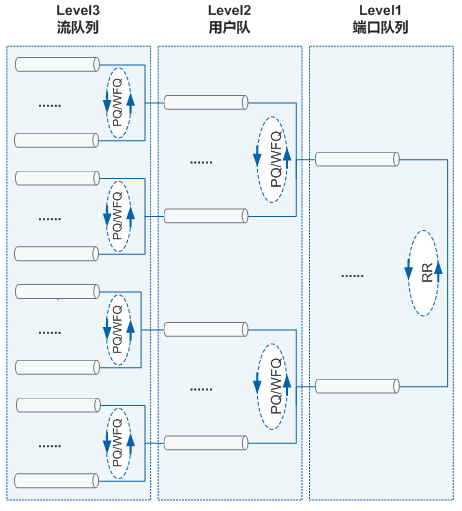
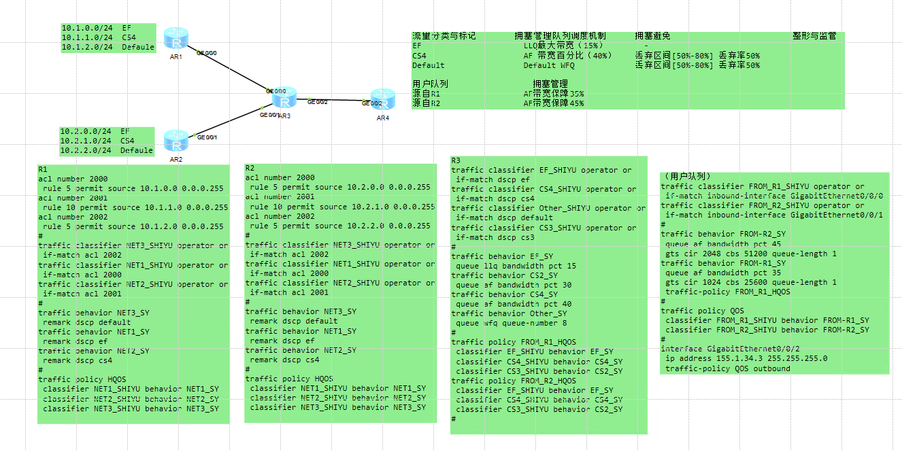

---
# HCIE-QOS
layout: pags
title: HQOS
date: 2025-08-01 15:23:54
tags: Network
categories: 
- [HCIE,4.3HQOS]
---

### 整形与监管

#### 基本信息

- 流量监管和流量整形通过监督进入网络的流量速率，用来限制流量及其资源的使用，保证更好的为用户提供服务
- 流量监管和流量整形就是一种通过对流量规格的监督，来限制流量及其资源使用的流控策略。
- 流量监管TP（Traffic Policing）就是对流量进行控制，通过监督进入网络的流量速率，对超出部分的流量进行“惩罚”，使进入的流量被限制在一个合理的范围之内，从而保护网络资源和用户的利益。
- 流量整形TS（Traffic Shaping）是一种主动调整流量输出速率的措施
<!-- more -->
区别

- 流量整形与流量监管的主要区别在于，流量整形对原本要被丢弃的报文进行缓存，当令牌桶有足够的令牌时，再均匀的向外发送这些被缓存的报文。流量整形与流量监管的另一区别是，整形可能会增加延迟，而监管几乎不引入额外的延迟

令牌桶算法简介

- 令牌桶可以看作是一个存放一定数量令牌的容器。系统按设定的速度向桶中放置令牌，当桶中令牌满时，多出的令牌溢出，桶中令牌不再增加
- 令牌桶处理报文的方式，RFC中定义了两种标记算法
  - 单速率三色标记（single rate three color marker，srTCM，或称为单速双桶算法）算法，主要关注报文尺寸的突发
  - 双速率三色标记（two rate three color marker，trTCM，或称为双速双桶算法）算法，主要关注报文速率的突发

两种算法的评估结果都是为报文打上红、黄、绿三种颜色的标记，所以称为“三色标记”。QoS会根据报文的颜色做相应的处理，两种算法都可以工作于色盲模式和色敏模式下

#### 令牌桶理论基础

- 利用令牌发放控制数据转发速率
- 算法术语
  - 承诺信息速率（CIR）
    - 单位时间加入令牌的速率
    - 单位kbit/s
  - 承诺突发尺寸
  - 时间间隔Tc
    - 注满令牌桶时间
  - 超额突发量Be
  - PIR

色盲模式下，在对到达报文（假设数据包大小为B）进行评估时，遵循以下规则；
- 如果报文长度超过P桶中的令牌数Tp,则报文被标记为红色，且Tc和Tp保持不变
- 如果报文长度不超过P桶中的令牌数Tp但超过C桶中的令牌数Tc,则报文被标记为黄色，且Tp=Tp-B
- 如果报文长度不超过C桶中的令牌数Tc,报文被标记为绿色，且Tp=Tp-B,Tc=Tc-B

色敏模式下，在对到达报文（假设数据包大小为B）进行评估时，遵循以下规则
- 如果报文已被标记为绿色且报文长度超过P桶中的令牌数Tp,则报文被标记为红色，且Tc和Tp保持不变
- 如果报文已被标记为绿色且报文长度不超过P桶中的令牌数Tp，但超过C桶中的令牌数Tc，则报文被标记为黄色，且且Tp=Tp-B,Tc不变
- 如果报文已被标记为绿色且报文长度不超过C桶中的令牌数Tc，则报文标记为绿色，且Tp=Tp-B,Tc=Tc-B
- 如果报文已被标记为黄色，则只比较P桶，如果报文长度超过P桶中的令牌数Tp,则报文被标记为红色，且Tp和Tc不变
- 如果报文已被标记为黄色，且报文长度不超过P桶中的令牌数Tp，则报文被标记为黄色，且Tp=Tp-B,Tc不变
- 如果报文已被标记为红色，直接将报文标记为红色，Tc和Tp不变

#### 流量监管

优势和限制
- 减小延迟
- 超速流量丢弃
- 丢包率较高
- 支持设置在接口入方向和出方向
  - 入方向操作顺序
    - 分类与标记
    - 限速操作
  - 出方向操作顺序
    - 限速操作
    - 其他QOS操作
  - 支持重标记

#### 流量监管原理

单速双桶三色
    

- CIR:承诺信息速率
- CBS：承诺突发尺寸
- EBS：超额突发尺寸

双速双桶三色

- PIR：峰值信息速率
- CIR:承诺信息速率
- PBS：峰值突发尺寸
- CBS：承诺突发尺寸
- 系统按照PIR速率向P桶中投放令牌，按照CIR速率向C桶中投放令牌
- 当Tp<PBS时，P桶中令牌数增加，否则不增加
- 当Tc<CBS时，C桶中令牌数增加，否则不增加
- 对于到达的报文，用B表示报文的大小
- 若Tp<B,报文被标记为红色
- 若Tc<B≤Tp,报文被标记为黄色，且Tp减少B
- 若B≤Tc,报文被标记为绿色，且Tp和Tc都减少B

#### 流量整形

- 超速流量缓存，待后续闲置带宽传输
- 流量整形原理
  - 单速单桶双色

- CIR：承诺信息速率，表示向C桶中投放令牌的速率
- CBS：承诺突发尺寸，表示C桶的容量

### HQoS
   
原理描述
- 传统的QoS基于接口进行流量调度，单个接口只能区分业务优先级，只要属于同一优先级的流量，使用同一个接口队列，彼此之间竞争同一个队列资源。因此，传统的QoS无法对接口上多个用户的多个流量进行区分服务
- HQoS（Hierarchical Quality of Service）基于多级队列实现层次化调度，不仅区分了业务，也区分了用户。既能够提供精细化的服务质量保证，又能够从整体上节约网络运行维护成本

示意图

- 流队列
  - 每个用户的同类业务可以被认为是一个业务流，HQoS能够针对每个用户的不同业务流进行队列调度。流队列一般与业务类型相对应，包括EF、AF、BE等，用户可以配置流队列的调度方式
- 用户队列
  - 来自同一用户的所有业务可以被认为是一个用户队列，HQoS可以使该用户队列下的所有业务共享一个用户队列的带宽
- 接口队列
  - 每个接口一个队列，接口队列之间进行轮询调度（RR），用户仅可以配置基于接口的流量整形，且其调度方式不可配置 

#### 配置嵌套流策略

父流策略和子流策略的嵌套使用，可以实现区分用户和用户业务，提供更为精细的服务

#### 子流策略

背景
- 子流策略用来区分用户的不同业务，即命中父策略的流分类后再次命中子策略的流分类的报文进入同一个流队列
- 在主接口上配置嵌套流策略时，子策略的流行为中支持配置流量整形、自适应流量整形、拥塞管理或拥塞避免
- 在子接口上配置嵌套流策略时，仅支持以下两种组合
  - 在子策略的流行为中配置除流量整形、自适应流量整形、拥塞管理和拥塞避免以外的QoS动作，则父策略的流行为中仅支持配置流量整形+子策略、流量整形+AF+子策略或EF+子策略
  - 在子策略的流行为中配置流量整形、拥塞管理或拥塞避免，则父策略的流分类中仅支持配置缺省分类default-class，且对应的流行为中仅支持配置流量整形

#### 父流策略

背景
- 父流策略用来区分网络中不同用户，配置父流策略前，必须已经完成子策略的配置。
- 在接口出方向上配置嵌套流策略时，父流策略的流行为可以从以下几种中选择一种进行配置
- GTS+子策略：此时对用户的报文采取平均调度方式，接口带宽平均分配给用户。
- GTS+AF+子策略：通过配置AF，可以为不同的用户配置确保带宽占接口可用带宽的百分比
- 建议父策略中的每个用户都采用这种配置方式，这样可以通过配置AF为每一个用户带宽计算权重，为不同的用户分配不同的保证带宽
- AF+子策略：通过配置AF，可以为不同的用户配置确保带宽占接口可用带宽的百分比。
- EF+子策略：当父策略绑定的是EF队列时，用户级队列是按照PQ调度的优先级进行调度的，可以优先保证优先级高的用户报文优先转发
- LLQ+子策略：当父策略绑定的是LLQ队列时，用户级队列是按照PQ调度的优先级进行调度的，可以优先保证优先级高的用户报文优先转发

#### HQOS实验拓扑配置

--------------------------------------------------------------------------------------------------------------------------------------------------------------------------------------