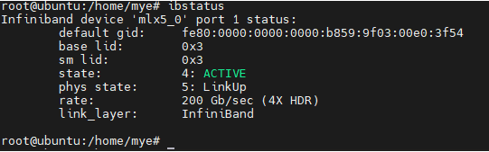

---
# IB网络笔记
layout: pags
title: IB网卡性能测试
date: 2025-06-23 15:23:54
tags: IB网络
categories: 
- InfiniBand
---

## IB网卡性能测试

- [参考链接1](https://blog.csdn.net/m0_37929348/article/details/106227581)
- [参考链接2](https://www.cnblogs.com/edenlong/p/10273433.html)

### 测试网卡
 CX6,最大速率200GB

### 服务端

```bash
ib_write_bw -a -d mlx5_0 --report_gbits
```


### 客户端

其中 192.168.192.2 为服务端IB网卡的ip地址

```bash
ib_write_bw -a -F  192.168.192.2 -d mlx5_0 --report_gbits
```


## IB诊断常用命令

### 查看IB网卡

```bash
lspci | grep Mell
```


```bash
ibv_devices
```


### 查看网络中IB设备，包括网卡和交换机

```bash
ibnodes
```


### 查看IB网卡状态

```bash
ibstat
```


```bash
ibstatus
```



```bash
ibv_devinfo
```


### 查看IB网卡的网口

```bash
ibdev2netdev
```


