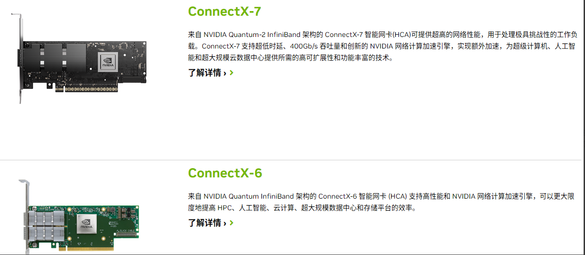
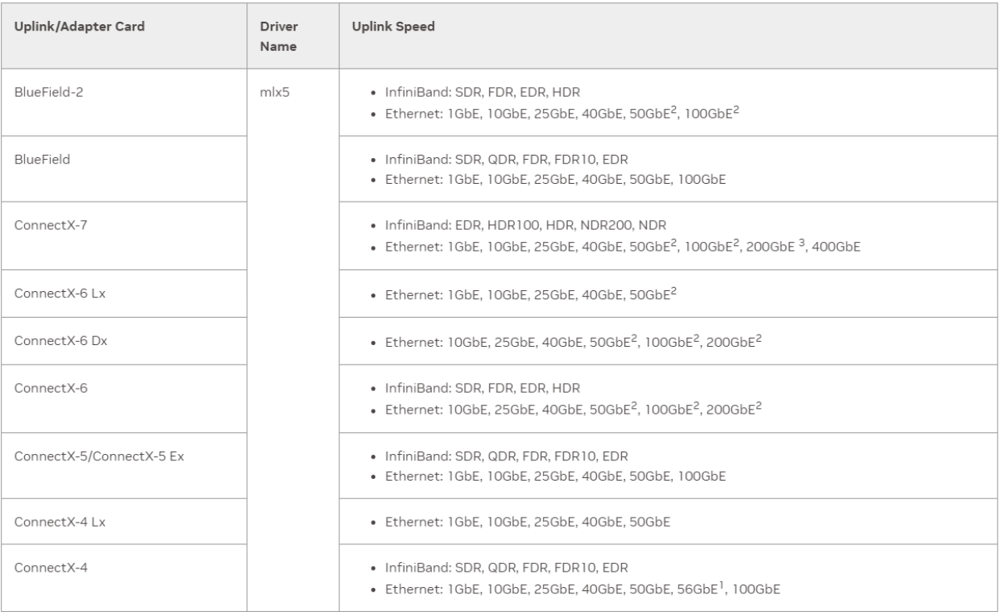
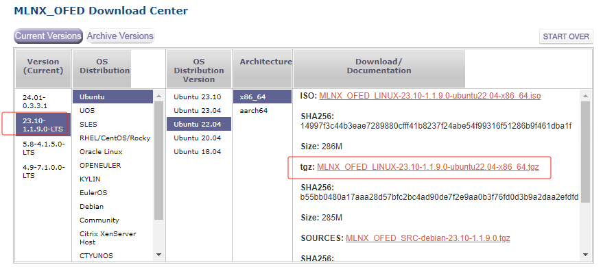
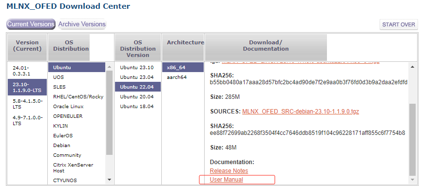
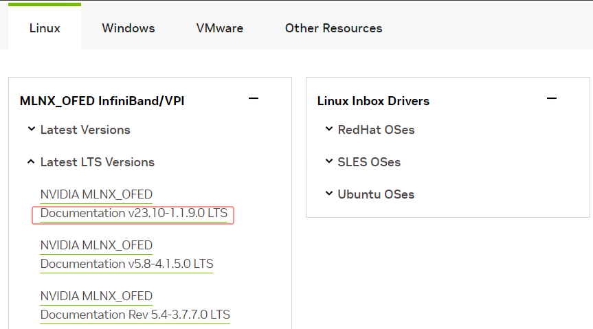
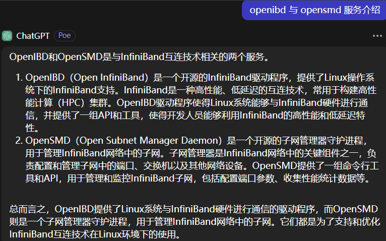
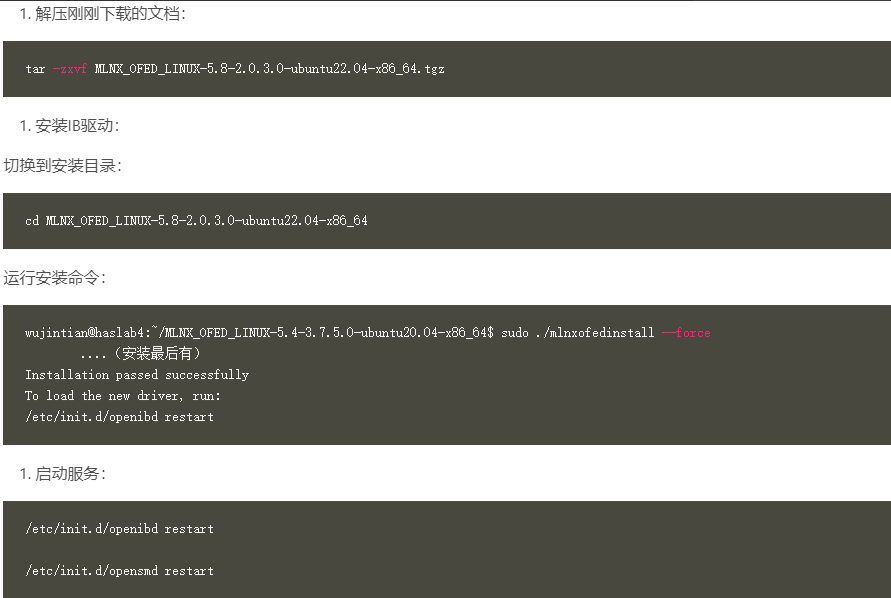
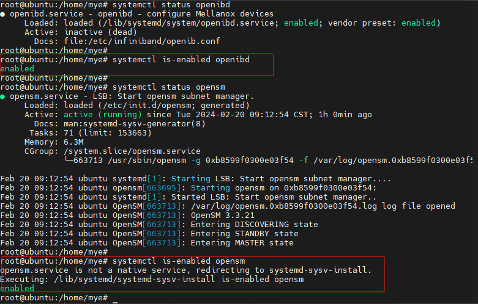
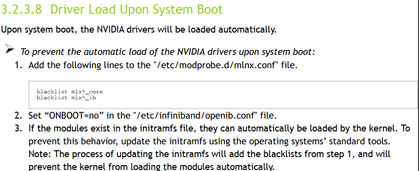

---
# IB网络笔记
layout: pags
title: IB网络网卡驱动安装
date: 2025-06-23 15:23:54
tags: IB网络
categories: 
- InfiniBand
---

### IB网卡驱动安装

- [链接1](https://haslab.org/2023/09/10/IB%E7%BD%91%E5%8D%A1%E9%85%8D%E7%BD%AE.html)
- [链接2](https://www.cnblogs.com/xysmlx/p/5711069.html)
- [链接3](https://blog.csdn.net/m0_37201243/article/details/108655015)

### ConnectX InfiniBand 网卡介绍

- [链接1](https://www.nvidia.cn/networking/ethernet-adapters/)
- [链接2](https://www.nvidia.cn/networking/infiniband-adapters/)



 各网卡支持速率



<!-- more -->

安装IB网卡驱动

- [驱动下载链接1](https://network.nvidia.com/products/infiniband-drivers/linux/mlnx_ofed/)
- [驱动下载链接2](https://downloaders.azurewebsites.net/downloaders/mlnx_ofed_downloader/downloader3.html#)

下载驱动时选择 LTS 版本

 

驱动安装方法查看下载页面中的手册链接



或者从下面链接进入

- [手册链接](https://docs.nvidia.com/networking/software/adapter-software/index.html#linux)



安装IB网卡驱动

```bash
sudo /mlnxofedinstall --force
/etc/init.d/openibd restart
/etc/init.d/opensmd restart
```

之后查看 IB 网卡状态，如果不是 active，reboot服务器后再试下，无误后需要给 IB 网卡配置 ip 地址





安装完驱动后，openibd 和 opensm 会自动配置自启动



驱动默认会开机自动加载，如果不需要开机自动加载驱动，参考下面的配置




