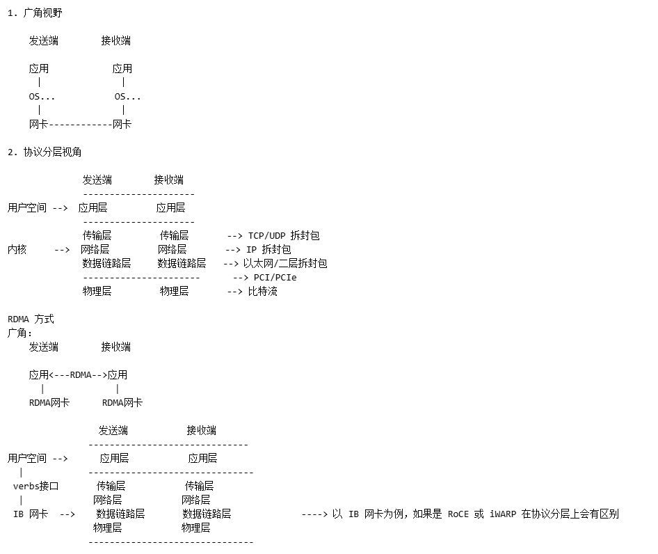
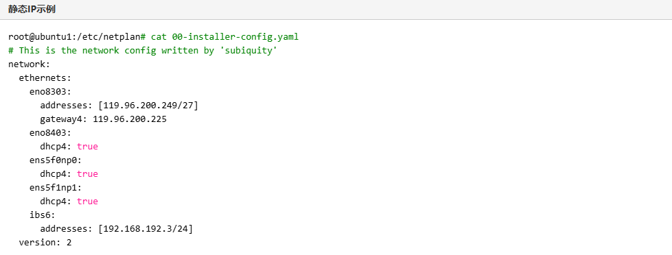
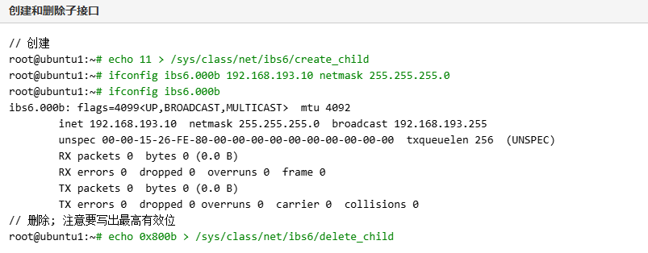
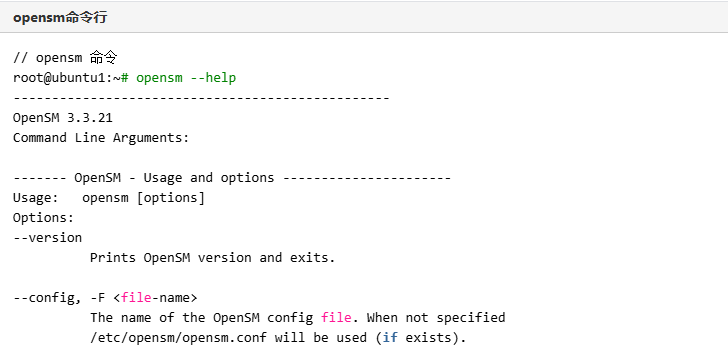

---
# IB网络笔记
layout: pags
title: IB网络学习笔记
date: 2025-06-23 15:23:54
tags: IB网络
---

### why(为什么出现了 IB 网络？背景？它解决了什么问题)

随着计算性能的快速提升，对于数据传输的性能要求也随之增高，而采用Intel架构的处理器输入/输出性能会受到PCI或者PCI-X总线的限制，IB 网络应运而生。

### what(IB 网络是什么)

- 定义：IB 是 InfiniBand 的缩写，直译为“无限带宽” 技术，是一个用于高性能计算的计算机通信标准
- 特点：具有极高的吞吐量和极低的延迟
- 应用场景：用于计算机与计算机之间的互联，或者服务器与存储系统之间、存储系统之间的互联
  
### IB 网络实现原理
利用RDMA(Remote Direct Memory Access，远程直接内存访问)提供基于通道的点对点消息队列转发模型，每个应用都可通过创建的虚拟通道直接获取本应用的数据消息，无需其他操作系统及协议栈的介入

- RDMA 技术是一种直接内存访问技术，将数据直接从一台计算机的内存传输到另一台计算机，无需双方操作系统的介入。
  
使用 RDMA 网卡和TCP/IP 协议栈数据传输流程上的区别

使用RDMA 方式和TCP/IP 协议栈对比

TCP/IP 协议栈

### HOW 如何使用/测试IB网卡(以 ConnectX-6 为例)

#### 关于 NVIDIA MLNX OFED 驱动(基于 23.10-2.1.3.1 - LTS)

NVIDIA OFED(OpenFabrics Enterprise Distribution): 是一个单一虚拟协议互连 (VPI) 软件堆栈，可在所有 NVIDIA 网络适配器解决方案上运行. 所有 NVIDIA 网络适配器卡均兼容基于 OpenFabrics 的 RDMA 协议和软件，并受主要操作系统发行版的支持。

### 了解 NVIDIA MLNX OFED 支持的一些功能

- IPoIB(IP over IB)

IPoIB 驱动程序是一种基于 InfiniBand 的网络接口实现。IPoIB 通过 InfiniBand 连接或数据报传输服务封装 IP 数据报。

IPoIB 的配置需要为每个HCA(host channel adapter) 端口分配一个 IP 地址和一个子网掩码，就像任何其他网络适配器卡一样（即您需要为每个端口准备一个名为 ifcfg-ib<n> 的文件）。主机中第一个 HCA 上的第一个端口称为接口 ib0，第二个端口称为 ib1，依此类推。IPoIB 配置可以基于 DHCP 或您需要提供的静态配置.

测试环境配置的静态IP示例:

IPoIB 支持创建/移除子接口

### [NVIDIA SM] (https://docs.nvidia.com/networking/display/mlnxofedv23102131lts/nvidia+sm)
NVIDIA SM 是符合 InfiniBand 标准的子网管理器 (SM)。它以名为“opensm”的固定流程可执行文件的形式提供，并附带一个名为 osmtest 的测试应用程序。NVIDIA SM 根据 InfiniBand 架构规范章节实施符合 InfiniBand 标准的 SM：管理模型、子网管理和子网管理.

OpenSM 是符合 InfiniBand 规范的子网管理器和子网管理员，运行在 NVIDIA OFED 堆栈之上。OpenSM 执行 InfiniBand 规范所需的任务，以初始化 InfiniBand 硬件。每个 InfiniBand 子网必须运行一个 SM。

OpenSM 默认设置旨在满足最多几百个节点的集群的常见情况。因此，在此默认模式下，OpenSM 将扫描 IB 结构，对其进行初始化，并偶尔扫描更改。

OpenSM 连接到本地计算机上的特定 IB 端口，并仅配置与其连接的结构。（如果本地计算机有其他 IB 端口，OpenSM 将忽略连接到其他端口的结构）。如果未指定端口，opensm 将选择第一个“最佳”可用端口。opensm 还可以显示可用端口并提示要连接的端口号。

默认情况下，OpenSM 运行记录到 /var/log/opensm.log。此日志文件中报告的所有错误都应视为 IB 结构健康问题的指标。（请注意，当发生致命且不可恢复的错误时，OpenSM 将退出）。如果 OpenSM 能够正确设置子网，opensm.log 应包含消息“SUBNET UP”。

opensm 命令示例

- 其它功能见官方文档：NVIDIA MLNX OFED

