---
# HCIP-VRRP
layout: pags
title: IPV6基础
date: 2025-07-08 21:24:40
tags: Network
categories: 
- [HCIP,C.1IPV6]
---

### IPV6概述

优势
- "无限“地址空间：地址长度为128bit,海量的地址空间，满足物联网等新业务，有利于业务演进及扩展
- 层次化的地址结构：相较于IPV4地址，IPV6地址分配更加规范，利于路由聚合、路由快速查询
- 即插即用：IPV6支持无状态自动配置（SLAAC），终端接入更简单
- 简化的报文头部：简化报文头，提高效率；通过扩展包头支持新应用，利于路由器等网络设备的转发处理，降低投资成本 
- 安全特性:IPsec、真实源地址认证等保证端到端安全；避免NAT破坏端到端通信的完整性
- 移动性：对移动网络实时通信有较大改进，整改移动网络性能有比较大的提升
- 增强QOS特性：额外定义了流标签字段，可为应用程序或者终端所用，针对特殊的服务和数据流，分配特定的资源
<!-- more -->
IPV4网络演变为IPV6网络主要有以下三种

1. 双栈技术：在同一台设备上同时启用IPV4协议栈和IPV6协议栈的技术
2. 隧道技术：将一种协议的数据封装在另一种协议中的技术
3. 转换技术：将IPV6地址和IPv4地址进行转换的一直技术

本章不详细展开说 详细技术原理见进阶内容

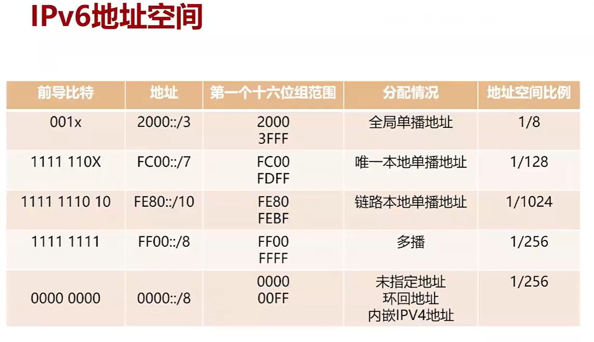

IPV6地址格式
- 首选格式
  - 例如:2001:0DB8:0000:0001:0000:0000:0000:45ff/64
- 压缩格式
  - 例如：2001:DB8:0:1::45ff/64
- 内嵌IPV4地址的格式
  - 例如:0:0:0:0:0:0:166.168.1.2/64   

IPv6地址类型
- 单播地址：标识一个接口，目的地址为单播地址的报文会被送到被标识的接口。在IPv6中，一个接口拥有多个IPv6地址是非常常见的现象
- 组播地址：标识多个接口，目的地址为组播地址的报文会被送到被标识的所有接口。只有加入相应组播组的设备接口才会侦听发往该组播地址的报文
- 任播地址：任播地址标识一组网络接口（通常属于不同的节点）。目标地址是任播地址的数据包将发送给其中路由意义上最近的一个网络接口
- IPV6没有定义广播地址

IPV6常见单播地址-GUA
- GUA（Global Unicast Address，全球单播地址），也被称为可聚合全球单播地址。该类地址全球唯一，用于需要有互联网访问需求的主机，相当于IPv4的公网地址

IPV6常见单播地址-ULA
- LLA（Link-Local Address，链路本地地址）是IPv6中另一种应用范围受限制的地址类型。LLA的有效范围是本地链路，前缀为FE80::/10

IPV6组播地址
- IPv6组播地址标识某个组，目的为组播地址的报文会被送到该组播组内的成员。组播地址由前缀（FF::/8），标志（Flag）字段、范围（Scope）字段以及组播组ID（Group ID）4个部分组成

- Flage：用来表示永久或临时组播地址
  - 0000表示永久组播地址
  - 0001表示临时组播地址
- Scope：表示组播地址的范围  
  - 0：预留
  - 1：节点本地范围；单个接口有效，仅用于Loopback通讯
  - 2：链路本地范围；例如FF02::1
  - 5：站点本地范围；
  - 6：组织本地范围；
  - E：全球范围；
  - F：预留
- Group ID :组播组ID 
  
IPv6组播MAC地址
- 组播IPv6报文的目的IP为组播IPv6地址，同样，目的MAC为组播MAC地址
- 组播MAC的前16bit为“33:33”，是专门为IPv6组播预留的MAC地址前缀。后32bit从组播IPv6地址的后32bit直接映射而来

被请求节点组播地址
当一个节点具有了单播或任播地址，就会对应生成一个被请求节点组播地址，并且加入这个组播组。该地址主要用于邻居发现机制和地址重复检测功能。被请求节点组播地址的有效范围为本地链路范围

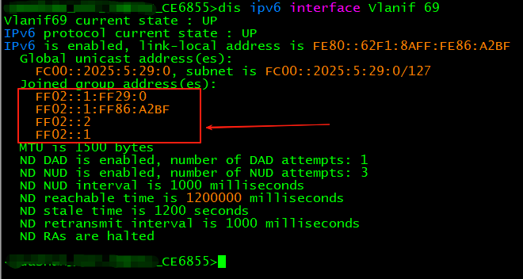

IPV6任播地址
- 任播地址标识一组网络接口（通常属于不同的节点）。任播地址可以作为IPv6报文的源地址，也可以作为目的地址
- 一般用于跨国服务 运营商管控

### IPV6报文结构

IPv6报文一般由三个部分组成：

1. 基本报头
   1. 提供报文转发的基本信息，路由器通过解析基本报头就能完成绝大多数的报文转发任务
   2. 每一个IPv6数据报文都必须包含报头，其长度固定为40字节
   3. 基本报头提供报文转发的基本信息，会被转发路径上的所有路由器解析
2. 扩展报头
   1. 提供一些扩展的报文转发信息，如分段、加密等，该部分不是必需的，也不是每个路由器都需要处理，仅当需要路由器或目的节点做某些特殊处理时，才由发送方添加一个或多个扩展头
   2. IPv6扩展报头是可能跟在基本IPv6报头后面的可选报头。IPv6数据包中可以包含一个或多个扩展报头，当然也可以没有扩展头，这些扩展报头可以具有不同的长度。IPv6报头和扩展报头代替了IPv4报头及其选项。新的扩展报头格式增强了IPv6的功能，使其具有极大的扩展性。与IPv4报头中的选项不同，IPv6扩展报头没有最大长度的限制，因此可以容纳IPv6通信所需要的所有扩展数据。扩展报头提供报文转发的扩展信息，并不会被路径上所有的路由器解析，一般只会被目的路由器解析处理
3. 上层协议数据单元：
   1. 般由上层协议报头和它的有效载荷构成，该部分与IPv4的上层协议数据单元相似。
   2. 上层协议数据单元一般由上层协议报头和它的有效载荷构成，有效载荷可以是一个ICMPv6报文、一个TCP报文或一个UDP报文

IPV6基本报头

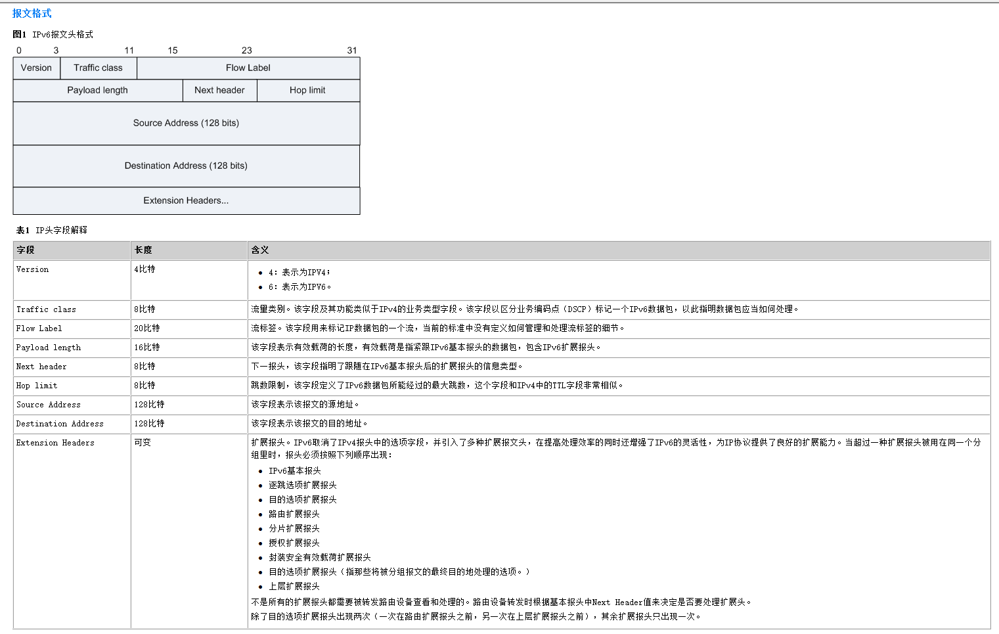

### ICMPv6概述

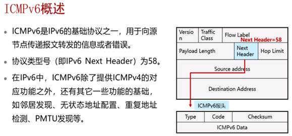

- Type：表明消息的类型，将ICMP消息分成了两大类
  -  差错消息，取值0~127
  -  通知消息，取值128~255
- Code:表示此消息类型细分的类型，是对消息的进一步细分
- Checksum:表示ICMPv6报文的校验和

- 数据包过长（patack too big）
- 超时（time out）

#### IPv6邻居发现协议-NDP概述

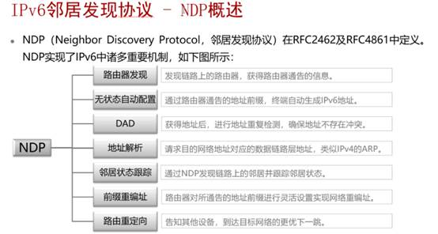

NDP协议是ICMPv6的功能实现       
在IPv6中没有ARP，不需要ARP，叫地址解析      
邻居状态跟踪，用来刷新维护邻居的地址信息，对邻居的状态进行维护      

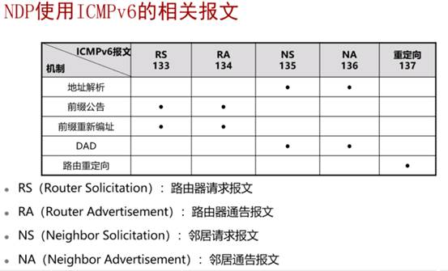

地址解析

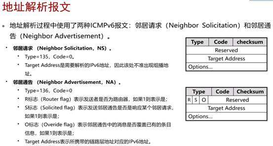

- IPV6的地址解析不在使用ARP，也不在使用广播方式
- 地址解析在三层完成，针对不同的链路层协议可以采用相同的地址解析协议
- 通过ICMPv6（类型135的NS及类型136的NA报文）来实现地址解析
- NS报文发送使用组播的方式，报文的目的IPV6地址为被请求的IPV6地址对应的“被请求节点组播地址”，报文的目的MAC为组播MAC
- 采用组播的方式发送NS消息相比于广播的方式更加高效，也减少了对其他节点的影响和对二层网络的性能压力
- 可以使用三层的安全机制（例如IPsec）避免地址解析攻击

组播MAC根据被请求节点组播地址算出来的       
NS报文的源地址就是你自己的全局单播IPv6地址，或者说是你PC网卡上的IPv6地址        
目标地址就是你要解析的目标主机单播IPv6地址所对应的请求节点组播地址      

用请求节点组播的优势：减轻了目标主机的负担，减轻了解析过程对整个局域网主机的影响提高了设备的性能        

- R：表示发送者是否为路由器，1表示是路由器，邻居不可达检测机制利用R比特来检测变更为主机的路由器
- S：是为了响应某个NS报文而发出来的，是为了响应某个邻居请求，如果1则表示是
- 如果是1则表示；表示该邻居宣告消息应该通过更新已经缓存的IPv6地址对于 的二层地址来覆盖现有的邻居表项。如果Obit为0，表示该邻居宣告消息将不更新已缓存的链路层地址，而是创建一个新的链路层地址（如果没有的话），用于刷新用的
- Target Address（目标地址）

#### 邻居状态种类

- INCOMPLETE：NS已经发送到了目标节点了，还没有收到NA，所以是不完整的。
- REACHABLE：邻居是可达的，收到了邻居的NA报文，不需要在发包确认
- STALE：可能是有的，但是可能不是最新的，可能变了，30秒
- DELAY：5秒内没有收到NA的回复
- PROBE：我自己发NA报文给你，问邻居在不在，主动的探查邻居的可达性。

#### 邻居状态变化

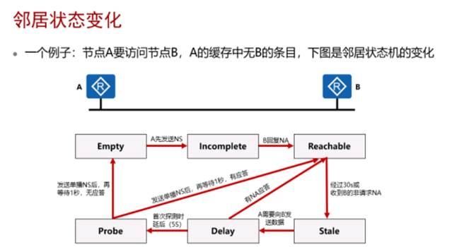

假装A.B两个节点之前没有任何通讯：
1. A先发个NS报文，进行地址解析，生成邻居缓存条目，状态为Incomplete
2. B收到之后，回复NA报文，则Incomplete->Reachable，完成一次解析，并且确定对方是可达的，如果在10秒后收不到这个NA报文，则Incomplete->Empty，删除条目，认为解析失败 
3. 经过ReachableTime（可达状态）（默认30秒），条目状态Reachable->Stale
4. 如果在Reachable状态，收到了B的非请求NA报文，且链路层地址不同，则马上->Stale
5. 在Stale状态若A需要向B发送数据，则Stale->Delay，同时发送NS请求
6. 在Delay First Probe Time（默认5秒）后，Delay->Probe，如果有回NA应答，则Delay->Reachabel
7. 在Probe状态，每隔RetransTimer（默认1秒）发送单播NS，发送MAX UNICAST_SOLICIT个后在等RetransTimer，有应答则->Reachable，否则进入Empty，即删除表项，而不是被动的老化  

 IPv6的邻居关系维护机制确保通讯发起之前邻居是可达的，而ARP本身是做不到的，仅仅只能通过老化机制来实现。（IPv6与IPv4之间的优势）      
 邻居状态跟踪：是可以在发数据之前，确定这个邻居是否可达的。而ARP是不知道这个邻居可不可达的。        

 #### 重复地址检测

 机制概述
 - 重复地址检测确保网络中无两个相同的单播地址
 - 所有地址都需要做DAD
 - 使用NS和NA完成DAD交互过程

原理
- 一个地址在通过DAD地址重复检测之前称为“tentative地址”也就是试验性地址。接口暂时还不能使用这个试验性地址进行正常的IPV6单播通讯，但是会加入和该地址所对应的Solicited-Node组播组
- DAD重复地址检测：节点向该tentative地址所在的Solicited-Node组播地址发送一个NS，如果收到某个其他站点回应的NA，就证明该地址已被网络上使用，节点将不能使用该tentative地址通讯
- 接口在启用任何一个单播IPV6地址前都需要先进行DAD，包括Link_Local地址

重复地址检测是为了保证网络中没有两个相同的单播地址（在同一个广播域里面）在一个广播域里所有的地址都需要做重复地址检测

IPV4 
- ARP协议  免费ARP
- 检测IPv4地址冲突
- 刷新交换机的MAC地址表

IPV6
- DAD检测报文是通过NS报文来完成的，NS报文的源地址是未指定地址（全0）
- NS报文源地址的特点；
  - 地址解析 使用 自身接口的单播IPv6地址，目标地址请求节点组播地址
  - NUD（邻居可达检测）使用自身Link-local地址，目标单播地址。
  - DAD 使用 ：：，目标地址请求节点组播地址

DAD过程

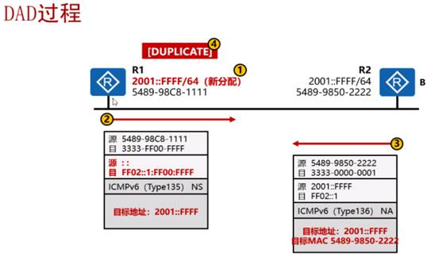

- R2的源地址是自己，所以目标地址不能是自己
- R1的地址是临时性的地址，R2要回给R1，告诉R1地址冲突了，首先这个目标地址不能是自己，但是R1是谁，R2又不知道，所以用一个全部节点组播地址，能够保证R1可以收到这个报文，知道地址冲突了

IPV6地址无状态自动配置概述

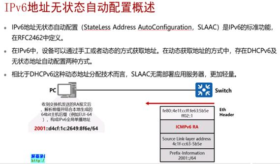

- 让用户更加的方便的连入IPv6的网络，而不需要去部署DHPC服务器
- 还是NDP协议，通过路由器请求（RS）和路由器通告（RA）这两种报文来实现SLAAC的功能。
- 在华为的设备上，SLAAC默认是关闭的，如果开起来，路由器就会发送RA报文，而思科是200秒周期性发送。
- IPv6的前缀由SLAAC来实现其他高级的网络参数可以通过部署额外的DHCPv6服务器实现动态设置。

RA报文和RS报文

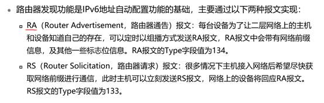

- RA报文中携带了那些参数：被关注最多的是前缀信息参数。前缀信息这个参数就是路由器默认情况下会把它自己这个接口上所有的单播前缀信息发出去，而且它是通过所有节点组播地址来发，因此在这个网段中的其他所有主机如果开启了Out Config功能的话，就可以收到这个前缀信息，然后通过自己的MAC地址去生成Interface id，或者是操作系统通过算法生成Interface id，就可以获得一个全球唯一的单播地址，这就是SLAAC的最基本的一个功能介绍，周期性发送
- RA报文的源地址是路由器接口的链路本地地址（默认FE80作为前缀的链路本地地址）
  - 而目标地址就是所有节点组播地址
- 还携带了一些参数，比如路由器的存活时间，TTL值的限制，自动配置标记位，还有一些options。

- RA按照默认200秒-600秒的时间发送，如果开机了之后不发NS报文，等路由器发过来NA报文，那么获得前缀的时间是比较长，那么在上网的时候能够连到网路的时间比较久，那么电脑为了让自己更快的获得IP地址，在开机之后，主动的发送RS报文叫路由器请求，路由器收到之后就会响应RA，这样子主机获得地址的速度更快，连上网络的时间更短，RS报文主机在初始化重启，就会马上发，路由器在这个时候就会响应它
- RA有2种响应机制：第一种就是周期性发送，第二种收到RS之后再发

主机通过SLAAC前缀信息以及其他参数的过程

1. 当存在以下情况时忽略RA发送的前缀
  - RA报文选项中的“auto”末置位
  - 前缀与已有地址前缀重复（包括Link-Local）地址
  - RA报文选项中的“preferred lifetime”时间大于“valid lifertime”
  - 前缀长度与接口ID长度之和不等于128位
2. 主机获得前缀的同时也获得一些相关时间参数

生存时间

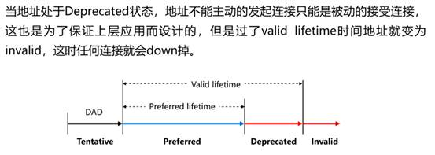

- 如果一个IPv6地址目前的时间处于在Deprecated时间段内的话，那么这个地址就不能用于对外发起新的访问，但是这个地址可以被别人发起访问。Deprecated类似于过渡期，做地址的重新编制用的。
- 优先存活时间（Preferred lifetime）代表如果你的地址在这段时间范围内，这个地址既可以对外发起访问，也可以被人访问。上层应用来决定哪个地址来发起连接，用这个优先存活时间内去发起。
- 设计这两个时间的目的是：实现主机IP地址的自动编制，它可以从一个前缀切换到另一个前缀上去，来进行无缝的切换。如果当一个地址超过了可用生存时间（Valid lifetime）的话，这一个地址建立起来的所有连接都会down掉。
- 如果这个地址没有进行DAD检测，这段时间叫实验时间，如果通过了，就进行一个优先存活时间的老化，同时也进行一个可用时间的老化，再进入这个Deprecated的状态，如果可用存活时间也到期了，那么地址就变成不可用了。 相当于老前缀被淘汰掉了
- 设备每收到一条新的路由器宣告消息（RA），都要复位优选生存时间和有效生存时间定时器。有效生存期是设备应该将路由器RA消息中的前缀视为有效的时间，有效生存期大于优选生存期。  优选生存期到期后，设备无法在使用优选地址创建新连接，但是在有效生存期到期前，现有的所有连接都有效

##### ICMPv6 RA消息中的Flags字段

1. M=1，O=1：这个组合表示用DHCPv6来执行地址和其他参数的配置，即有状态地址配置
2. M=0, O=1: 这个组合表示DHCPv6仅用于配置其他主机参数，主机通告RA获取前缀信息配置无状态地址，DHCPv6只会分配主机配置参数
3. M=1，O=0：这个组合表示DHCPv6仅用于地址配置，而不用于配置其他参数
4. M=0，O=0：对应无DHCPv6设备的网络，主机通告RA获取前缀信息配置无状态地址，并且用其他方法（手动配置）配置其他参数

简单来说
- M=1 不讨论 O 的取值
- M=0  讨论O的取值
- O = 0 不管DHCPv6是否存在，都不使用DHCPv6获取除IPv6地址之外的其他参数
- O = 1 除了IPv6地址之外，其他网络参数通过DHCPv6获取。 

实验就不详细贴出来了 感兴趣的同学可以参考下图进行配置验证

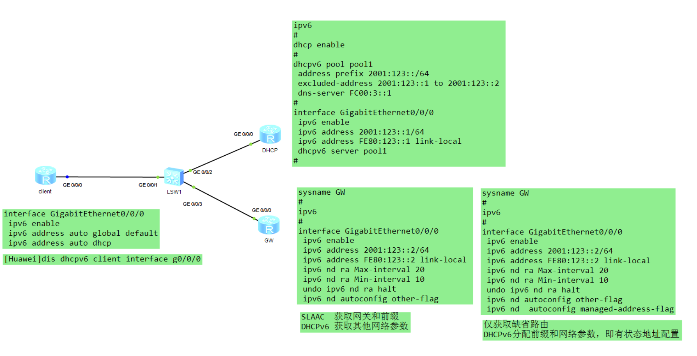

RA默认携带路由器接口地址的前缀信息

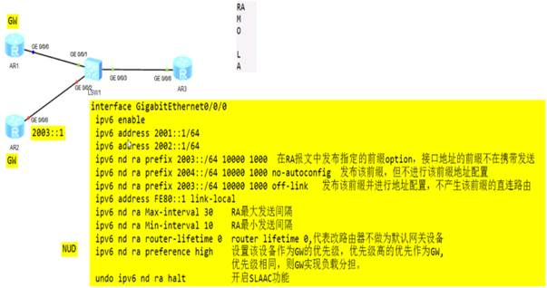

#### 重定向报文

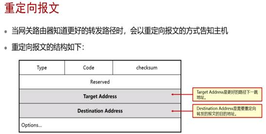

重定向要满足的五个条件
- 报文的目的地址不是一个组播地址
- 报文并非通过路由转发给路由器
- 经过路由计算后，路由的下一跳出接口是接收报文的接口
- 路由器发现报文的最佳下一跳IP地址和报文的源IP地址处于同一网段
- 路由器检查报文的源地址，发现自身的邻居表项中有用该地址作为全球单播地址或链路本都地址的邻居存在

#### PMTU (IE面试题)

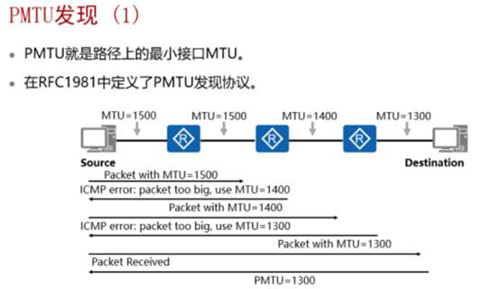

- 就是报文在端到端通信的过程中所经过的路径上某一个最小的接口MTU，简单的说就是：让我们源主机知道在访问目标主机的这个过程中这条路径上的最小的MTU是多少，这就是PMTU发现机制
- 为什么需要PMTU机制？  在IPv6的标准中，分片这种行为只有源主机才可以做，而重组的行为也只有目标主机能够做，转发过程中的设备是不会对IPv6报文进行分片或者是进行重组的，原因就是提高IPv6的转发效率
- 分片会加大沿途路由器的负担，在IPv6中，为了解决这个问题，就做了一个这样的标准，路由器不在分片也不重组，源主机就把分片分好，目标主机就去重组，我就只需要根据报文的目标地址做路由就行了，但是要做到这一点就需要让我们的源主机能够知道去往目标主机的路径上最小的接口MTU是多少，那么在它进行分片的时候，只要每一个分片小于这个最小的MTU，那么沿途的路由器就不需要再对它分片了，这样也就比较好的解决了，同时也能够去满足我的网络不需要为用户在分片了
- 在发包的时候在做PMTU的时候根据自己网卡设置的MUT来对业务报文进行分片，发给我们的网络，第一跳路由器在收到之后，发现这个报文的MTU值小于自己接口的MTU值，那么这台路由器可以对这个报文进行正常的转发，然后发给第二跳，第二跳路由器收到之后发现这个报文的MTU值已经超过了自己的出接口MTU，那么这台路由器就会说不行，于是这台路由器会向源主机回一个ICMPv6的报文，这个报文叫packet too big（包太大了），并且在这个报文中会携带去往目标地址的出接口上的MTU值，告诉源主机把分片分的小于1400才可以，不然发不出去，这个时候源主机就会根据它探测出来的1400再一次发包探测（以1400的长度），在第三跳发现还是大了，再重复之前的过程，这样源主机就会知道最小MTU是1300，那么在未来发包的时候，数据都小于1300的长度，那么之后的过程中，路由器就不在进行分片了，就进行高速的转发就行，这就是PMTU。（根据上图的解释）

