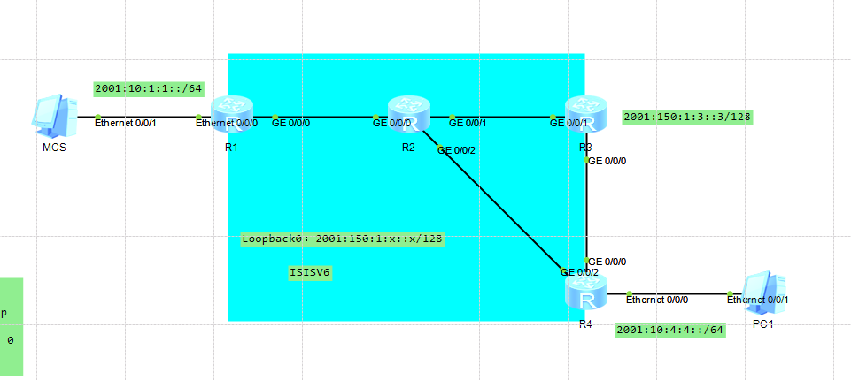

---
# HCIE-IPV6
layout: pags
title: IPV6组播
date: 2025-07-27 9:29:54
tags: Network
categories: 
- [HCIE,3.3IPV6组播] 
---

### MLD

组播侦听发现协议

功能
- 组成员管理
- 组成员查询与响应

版本信息
- MLDv1
-  MLDv2
<!-- more -->
#### MLDv1

RFC2710     
功能类似IGMPV2      

信息类型
- 组播侦听查询
  - 类型130
  - 普遍组查询
  - 特定组查询
- 组播侦听报告
  - 类型131
- 组播侦听离开
  - 类型132

报文格式


工作原理

MLD查询器选举过程
- 初始阶段
  - 所有成员假设本地为查询
  - 通告普遍组查询（组地址FF02::1）
- 选举阶段
  - 选举参数比较
    - IPV6地址
    - 较小地址优选
- 维护阶段
  - 非查询器启用定时器，监控查询者状态

组成员加组过程
- 查询器周期发送普遍组查询
- 所有期望加入组的主机启用定时器
- 接收者组播方式发送加组信息响应查询，抑制其他接收者发送加组信息 

组成员离组过程
- 组成员以组播方式发送离组信息（组播地址的ff02::2）
- 查询者接收离组信息，发送特定组查询
  - 发送次数-----last listener query count
  - 发送间隔-----last listener query intetval


#### MLDv2

RFC3810     
功能类似LGMPv3

新增功能
- 组播源过滤
- 组播组状态跟踪
- 接收者状态监听

报文格式

查询信息报文格式


成员报告报文格式 


工作原理

 MLDv2兼容MLDv1     
 MLDv2新增
 - 特定源组加入
   - MLDv2的成员报告报文的目的地址为FF02::16
   - 通过这种报告报文中携带组播地址记录，能够要求接收或不接收特定组播源
-  特定源查询
  - 但接收到组成员发送的改变组播组与源列表的对应关系的报告时
  - MLD查询器会发送特定源组查询报文
  - MLD查询器根据反馈的组成员报告更新该组对应的源列表


#### 实验

实验拓扑




实验配置

```bash
R1
#
 ipv6 
 multicast ipv6 routing-enable
 #
 interface Ethernet0/0/0
 ipv6 enable
 ipv6 address 2001:10:1:1::1/64
 isis ipv6 enable 1
 pim ipv6 sm
#
interface GigabitEthernet0/0/0
 ipv6 enable
 ipv6 address auto link-local
 isis ipv6 enable 1
 pim ipv6 sm
 # 
interface LoopBack0
 ipv6 enable
 ipv6 address 2001:150:1:1::1/128
 isis ipv6 enable 1
#
isis 1
 is-level level-2
 network-entity 49.0000.0000.0000.0001.00
 #
 ipv6 enable topology ipv6
 #
 
 R2
 #
 ipv6 
 multicast ipv6 routing-enable
 #
 interface GigabitEthernet0/0/0
 ipv6 enable
 ipv6 address auto link-local
 isis ipv6 enable 1
 pim ipv6 sm
#
interface GigabitEthernet0/0/1
 ipv6 enable
 ipv6 address auto link-local
 isis ipv6 enable 1
 pim ipv6 sm
#
interface GigabitEthernet0/0/2
 ipv6 enable
 ipv6 address auto link-local
 isis ipv6 enable 1
 pim ipv6 sm
#
interface LoopBack0
 ipv6 enable
 ipv6 address 2001:150:1:2::2/128
 isis ipv6 enable 1
#
isis 1
 is-level level-2
 network-entity 49.0000.0000.0000.0002.00
 #
 ipv6 enable topology ipv6
 #
 
 R3
  #
 ipv6 
 multicast ipv6 routing-enable
 #
 interface GigabitEthernet0/0/1
 ipv6 enable
 ipv6 address auto link-local
 isis ipv6 enable 1
 pim ipv6 sm
#
interface GigabitEthernet0/0/0
 ipv6 enable
 ipv6 address auto link-local
 isis ipv6 enable 1
 pim ipv6 sm
#
interface LoopBack0
 ipv6 enable
 ipv6 address 2001:150:1:3::3/128
 isis ipv6 enable 1
 pim ipv6 sm
#
isis 1
 is-level level-2
 network-entity 49.0000.0000.0000.0003.00
#
 ipv6 enable topology ipv6
#

pim-ipv6
 c-bsr 2001:150:1:3::3
 c-rp 2001:150:1:3::3
#

R4
  #
 ipv6 
 multicast ipv6 routing-enable
 #
interface GigabitEthernet0/0/0
 ipv6 enable
 ipv6 address auto link-local
 isis ipv6 enable 1
 pim ipv6 sm
#
interface GigabitEthernet0/0/2
 ipv6 enable
 ipv6 address auto link-local
 isis ipv6 enable 1
 pim ipv6 sm
#
interface Ethernet0/0/0
 ipv6 enable
 ipv6 address 2001:10:1:4::4/64
 isis ipv6 enable 1
 pim ipv6 sm
 mld enable
 mld static-group FF1E::4
#
isis 1
 is-level level-2
 network-entity 49.0000.0000.0000.0004.00
 #
 ipv6 enable topology ipv6
 #
 ```

 验证邻居关系

 


验证路由信息


验证（*，g）表项


查看MLD信息


查看MLD加组信息


验证（S，G）表项


### SSM Mapping

指定源组播      
使用场景----组成员不支持MLDv2       
实现路由器识别组成员希望接收的指定组播源        

配置
- 使能ipv6组播路由功能
- 使能SSM Mapping功能接口
- 配置SSM Mapping策略名
  - 组播组定制与掩码，组播源地址与掩码


### 嵌入式RP

基于IPV6组播地址提取RP地址---组播地址包含RP地址

技术优势---无需部署动态RP或静态RP

使用场景
- 域间组播
  - IPV6不支持MSDP
  - 使用特定组地址解决

特殊的组播地址

FF|flag|scope|rsvd|RIID|plen|网络前缀|Group ID
- flag范围：7-F
- scope范围：0，3-F
- rsvd:4bit
- RIID:RP接口ID----作为RP地址的Interface ID的后4bit,其余部分用0填充
- plen:RP地址前缀长度----长度8bit
- 网络前缀：长度64bit
- Group ID:长度32bit

HCIP-IPV6文档中有提过组播地址格式怎么计算的，这里就不详细说了

例如：      
FF70:0140:2001:0DB8:8EEF:FEED::/96      
2001:DB8:8EEF:FEED::1/64

-----------------------------------------------------------------------------------------------------------------------------------------------------------------