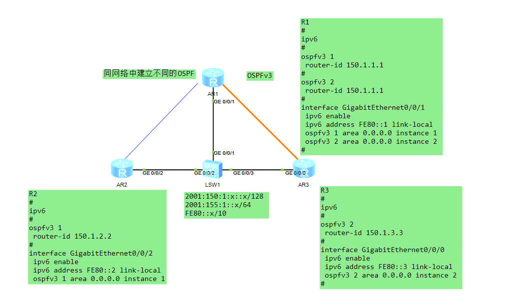
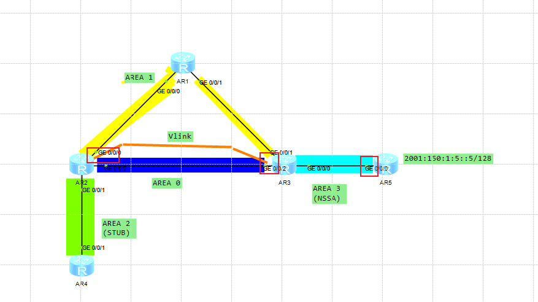

---
# HCIE-IPV6
layout: pags
title: IPV6路由协议
date: 2025-07-25 14:29:54
tags: Network
categories: 
- [HCIE,3.1IPV6路由协议] 
---

这里就直接讲路由协议了 IPV6基础部分看HCIP-IPV6内容

### IPV6路由协议

#### 静态路由

- 设置静态路由
  - 前提：激活IPV6路由----IPV6
  - 设置下一跳为全局单播地址
    - ipv6 route-static 2001:150:1:2::2/128 2001:155:1:12::2/64
  - 设置下一跳为链路本地地址（需要添加出接口）
    - ipv6 route-static 2001:150:1:2::2/128 F0/0 fe80::c802:1aef:fe30:2
  - 部分互联场景部署IPV6
<!-- more -->
#### 路由控制

ACL    

- 基本信息
  - 类型：扩展ACL
  - 表示方式：命名方式
  - 隐含拒绝条目
- 工作原理
  - 执行顺序（参考IPV4 ACL）
  - 方向参考IPV4

前缀列表

```bash
 ip ipv6-prefix TEST permit 2000::3 less-equal 128
```

#### OSFPv3（重点）

扩展
为什么其他协议（ISIS,BGP）IPV4演变到IPV6变动不是很大，而OSPF改动很大
原因：其他协议用的TLV结构，感兴趣的可以深度探究下

1. OSPFv3 报文格式


- Instance ID:缺省值为0。允许在一个链路上运行多个OSPFv3的实例。每个实例应该具有唯一的Instance ID。Instance ID只在本地链路上有意义。如果接收到的OSPF包的Instance ID和本接口的Instance ID不同，则丢弃这个包

2. OSPFv3 Hello报文格式


- Interface ID :  唯一标识了建立连接的（发送Hello报文的）接口
- Options
  - DC:处理按需链路
  - R：路由转发能力标识
  - E：允许Flood AS-External-LSAs
  - N:NSSA功能标识
  - MC：转发IP组播报文
  - V6：参与IPV6路由计算标识

3. OSPFv3 DD报文格式


- Options
  - E：允许Flood AS-External-KSAs
  - MC:转发组播报文
  - N/P：处理Type-7 LSAs 
  - DC:处理按需链路

- DB Description  
  - I: 当发送连续多个DD报文时，如果这是第一个DD报文，则置为1，否则置为0
  -  M :当发送连续多个DD报文时，如果这是最后一个DD报文，则置为0。否则置为1，表示后面还有其他的DD报文
  - MS:当两台OSPF路由器交换DD报文时，首先需要确定双方的主从关系，Router ID大的一方会成为Master。当值为1时表示发送方为Master

4. OSPFv3 LSR报文格式 


-  LS Type 参考LSA Type描述

5. OSPFv3 LSU报文格式


6. OSPFv3 LSAck报文格式


7. LSA头部结构 


- LS Type
  - U比特位标识对未知LSA的处理方法
    - 0：该LSA只能泛洪到本地链路上
    - 1：该LSA当作类型已知的LSA来处理，也就是存储并泛洪
    - 注：仅当Fuction不识别才处理Ubit
  - S1和S2比特位标识了LSA的泛洪范围
    - S2 S1 = 0 0 ：链路本地范围内，即只在始发链路上泛洪
    - S2 S1 = 0 1 : 区域范围内，即泛洪到始发区域内的所有路由器
    - S2 S1 = 1 0：AS范围内，即泛洪到本AS的所有路由器
    - S2 S1 = 1 1：预留

LSA类型  


OSPFv3基础实验


验证OSPFv3邻居关系


ospfV3实例实验



验证OSPFv3实例


#### LSA类型

类型1-5、7就不过多描述了 看HCIP-OSPF文档，重点讲解类型8和类型9

OSPFv3-LSA1


OSPFv3-LSA2


OSPFv3-LSA3


OSPFv3-LSA4


OSPFv3-LSA5


OSPFv3-LSA7


- 以上OSPFV3类型都是通过本都链路地址建立的OSPF
- 注：但下图中这三个点需要用到单播地址，分别是Vlink和FA地址，思科Vlink好像是可以用链路地址建立，华为不行
- 配置就不贴了 同IPV4



LSA8(Link-LSA)
- 每个设备都会为每个链路产生一个Link-LSA，仅在始发链路泛洪
- 作用
  - 向该链路上其他路由器通告本接口的链路本地地址
  - 向该链路上其他路由器通告本接口的IPV6前缀列表
  - 向该链路上其他路由器通告本链路始发的Network-LSA设置的可选项

报文格式


LSA9（Intra-Area-Prefix-LSA）
- 描述的是网段信息，只在所属的区域内传播，它需要依赖于拓扑信息，才能实现OSPFv3的路由计算
- 每台设备均产生描述与Router-LSA相关联的IPV6前缀地址的Type9 LSA
- DR会产生描述与Network-LSA相关联的IPV6前缀地址的Type9 LSA

报文格式


OSPFv2 vs OSPFv3

- 相同点
  - 网络类型
  - 邻居建立过程
  - LSA泛洪机制
  - 五种协议报文
  - 路由生成方式
- 不同点
  - OSPFv3使用link-local地址建立邻居
  - OSPFv3使用link-local地址作为Next-Hop
  - 支持多实例复用
  - 必须手动配置Router-id
  - OSPFv3使用IPV6扩展头部实现认证
  - 报文格式
  - 新增LSA8、LSA9
  - Option的区别


#### ISISv6

基于是TLV架构，配置和V4差不多

为了支持IPV6路由的处理和计算，IS-IS新增了两个TLV和一个NLPID（Network Layer Protocol Identifier,网络层协议标识符）


新增TLV
- 232号TLV（IPV6 Interface Address）
  - 相当于把132号TLV（用于描述IPV4接口地址），只不过把原来的32 bit的IPV4地址改为128 bit的IPV6地址
- 236号TLV（IPV6 Reachability）
  - 相当于128号和130号TLV，通过X-bit来标识IPV6内/外可达性信息

129号TLV中新增NLPID
- 129号TLV：用于表示支持的协议

ISIS多拓扑

- 背景：不能使用IPv4区域来连接不同的IPv6区域，即无法通过IPv4网络解决IPv6孤岛问题
- 实现过程
  - 建立拓扑：通过报文交互建立邻居，从而建立多拓扑
  - SPF计算：在不同的拓扑上分别进行SPF计算

多拓扑TLV

- 多拓扑TLV仅包含在IIH报文和LSP的0分片报文中。
- 预留的MT ID字段
  - MT ID=0，用于标准IPv4拓扑
  - MT ID=2，预留给IPv6拓扑

配置

```bash
isis
ipv6 enable topology ipv6
```

#### BGP4+

BGP路径属性
- BGP的Update报文在对等体之间传递路由信息，可以用于发布和撤销路由

Update报文格式
  


- MP-BGP中引入两个NLRI属性，分别是
  - MP_REACH_NLRI:Multiprotocol Reachable NLRI,多协议可达NLRI，用于发布可达路由及下一跳信息
  - MP_UNREACH_NLRI:Multiprotocol Unreachable NLRI,多协议不可达NLRI，用于撤销不可达路由
- BGP4+通过以上两个NLRI属性传递IPV6路由信息

----------------------------------------------------------------

