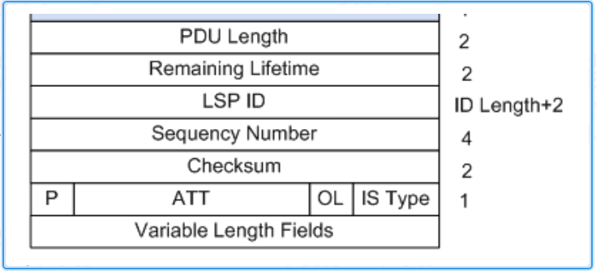
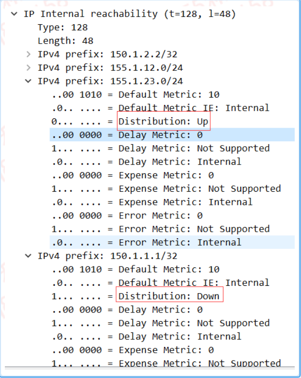
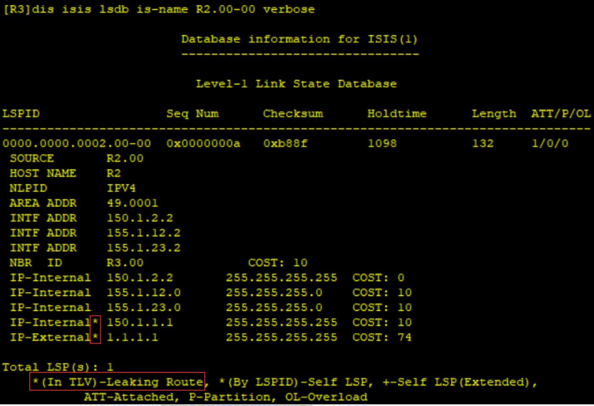

---
# HCIP-ISIS
layout: pags
title: ISIS原理描述
date: 2025-06-29 15:23:54
tags: Network
categories: 
- [HCIP,2.2ISIS原理描述] 
---

### IS-IS邻居建立

- IS-IS的报文类型
1. Hello-- Hello报文用于建立和维持邻居关系，也称为IIH(IS-to-IS Hello PDUs)  
    分类:

    
   <!-- more -->
2. 默认通告间隔10S保持时间30S
3. 组播地址：  
      01-80-C2-00-00-14（L1使用）  
      01-80-C2-00-00-15（L2使用）  

- LSP
1. 链路状态PDU：功能类似OSPF LSA
2. 用于交换链路状态信息
3. 分类  
     L1 LSP（Type 18）  
     L2 LSP（Type 20）  

- SNP
1. 序列号PDU
2. 描述全部或部分数据库中的LSP，或同步LSDB使用
3. 分类  
   完整序列号SNP(CSNP)  
   部分序列号PDU（PSNP）

- IS-IS报文中的变长字段部分是多个TLV三元组----作为ISIS的功能组件  
  TLV详情可自行搜索，这里不详细讲解了

- ISIS报文通用格式
1. 采用TLV结构
2. 模块化设计扩展性强
3. 报文格式详解


- Intradomain Routeing Protocol Discriminator：域内路由选择协议鉴别符，设置为0X83
- Length Indicator：PDU头部的长度
- Version/Protocol ID Extension：版本/协议标识扩展，设置为1（0X01）
- ID Length：NSAP地址或NET中System ID区域的长度
- R(Reserved)：保留，设置为0
- PDU Type：PDU的类型。IS-IS PDU共有9中类型
- Version：设置为1（0x01）
- Maximum Area Address：支持的最大区域个数  

#### ISIS网络类型
- BMA网络类型--ISIS Hello报文类型
1. Reserved/Circuit Typr：高位的6比特保留，值为0.低位的2比特表示路由器的类型
2. Source ID：发出Hello报文的路由器的System ID
3. Holding Time：邻居保持时间
4. PDU Length：PDU的总长度，单位是字节
5. Priority：选举DIS的优先级，取值范围为0-127
6. LAN ID：包括DIS的System ID和一字节的伪节点ID 

- 建立过程
1. 接收到为仅包含邻居system-id(不包含本地system-id)的IIH进入初始化
2. 接收到包含本地的system-id的IIH进入UP  
 MA网络，等待两个Hello报文间隔，进行DIS（指定中间系统）的选举

#### DIS选举

- IS-IS需要在所有的路由器中选举一个路由器作为DIS  
    伪节点是虚拟节点，非真实物理设备  
    描述LAN网络内的节点  
- DIS选举意义  
    简化网络拓扑  
    降低SPF资源消耗  
    伪节点标识（其中Circuit ID为非零）  
- DIS选举规则  
    L1和L2的DIS是分别选举的  
    比较参数（选择较大）--- 优先级，接口MAC地址，DLCI标识 
- 选举具有抢占性  
    当有新的路由器加入，并符合成为DIS的条件时，这个路由器被选中成为新的DIS，原有的伪节点被删除  
    DIS Hello发送周期为默认时间的1/3  
- DIS只负责LSP同步
- DIS选举并未减少邻接关系

#### 邻居关系建立原则

- 直连层次相同  
      L1邻居关系，区域号必须一致  
      L2邻居关系允许区域ID不一致  
- 网络类型必须一致

```bash
 interface g0/0/0 
    isis circuit-type P2P
```

- 接口和掩码
1. 默认相同网段，掩码相同
2. 基于TLV 132判断是否为相同网段
3. P2P网络类型---允许不同子网，不同掩码建立ISIS邻居

- P2P握手机制一致
- MTU匹配
- 认证---接口认证方式,认证密钥

### ISIS度量值计算

- 接口开销确认方式  
1）接口开销  2）全局开销  3）自动计算开销   
默认接口开销为10；Loopback默认为0；开销类型Narrow  
- 开销类型
1. Narrow   
    - 接口与路由Cost范围  
    - Cost范围   
         路径Cost：0-1023   
         接口Cost：0-63
    - 拓扑描述:TLV2描述邻居信息
    - 路由描述   
         TLV128描述域内路由  
         TLV130描述外部路由  
    - 邻居关系描述   
         TLV240（MA网络）  
          TLV6（P2P网络）  
2. Wide
    - Cost范围      
          路径Cost：2^32        
          接口Cost：2^24    
    - 拓扑描述：TLV22描述ISIS邻居信息
    - 路由描述:TLV135描述ISIS内部与外部路由
    - 新增Sub-TLV  ---需要wide cost支持           
           作为TLV的功能扩展 
    - 支持DN --- ISIS防环   
    - 配置
    
       

- 设置接口开销

```bash
 interface s1/0/0 
    isis cost 20
```


- 设置全局开销
```bash
isis 
    circuit-cost{cost | maximum}[L1 | L2]
```

- 设置自动计算接口开销      

```bash
 isis
    bandwidth-reference value
```

### LSP同步

####  LSP报文结构



- PDU Length：PDU的总长度，以字节为单位
- Remaining Lifetime：LSP的生存时间，以秒为单位
- LSP ID：由三部分组成，Syetem ID，伪节点ID（一字节）和LSP分片后的编号（一字节）
- Sequency Number：LSP的序列号
- Checksum：LSP校验和
- P（Partition Repair）：仅与L2 LSP 有关，表示路由器是否支持自动修复区域分割---类似虚链路功能（ISIS不支持）
- ATT（Attachment）：由L12路由器产生，用来指明始发路由器是否与其他区域相连
- OL（LSDB Overload）：过载标志位
- IS Type：生成LSP的路由器的类型---用来指明是Level-1还是Level-2路由器

#### P2P LSP交互过程

1. 互相交互CSNP：仅通告一次
2. 发送PSNP作为请求与接收LSP确认
3. 接收到剩余时间为0，则路由撤销并泛洪
4. PSNP序列号0：表示请求，否则为确认

#### MA LSP交互过程

1. 相关报文类型
   -  CSNP---仅DIS产生,功能类似OSPF DD
   -  PSNP---功能类似OSPF LSR
   -  LSP---功能类似OSPF LSU
2. LSP操作---LSP产生的触发条件
   - 邻居UP或DOWN
   - IS-IS相关接口UP或DOWN
   - 引入的IP路由发生变化
   - 区域间的IP路由发生变化
   - 接口修改metric值
   - 周期性更新
3. LSP比较参数
   - 本地是否存在相应LSP
   - 比较序列号
   - 检查剩余时间为0
   - 选择校验和较

### ISIS区域间路由传递

通常同一区域内的节点，LSDB同步      
默认L2的路由无法进入L1，L1的路由可以进入L2      
缺省情况
-  L2->L1----- L12向L1通过LSP（其中ATT=1）
-  L1->L2-----L12转换L1的路由为L2路由器通告到L2区域
       
ISIS路由渗透        
- L12泄露部分明细路由到L1，实现路径优化
- 防环机制---添加UP/DOWN Flag

查看UP/DOWN FLAG



查看路由泄露




