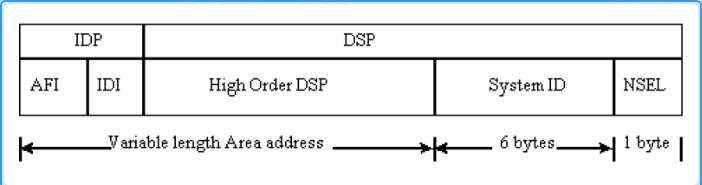

---
# HCIP-ISIS
layout: pags
title: ISIS基础
date: 2025-06-29 15:23:54
tags: Network
categories: 
- [HCIP,2.1ISIS基础] 
---

### 中间系统到中间系统

- 基于无连接网络协议（CLNP）设计的一种动态路由协议。
- 支持TCP/IP和OSI协议栈，称为集成IS-IS---支持CLNP网络，IP网络
- ISIS编址
   1. 使用NSAP（网络服务访问点）地址
   2. OSI协议族网络层简介   
   CONS（面向连接网络服务）； CLNS（无连接网络服务）
   <!-- more -->
- CLNS
   1. 功能类似TCP/IP协议栈的IP服务
   2. CLNS协议组成---1）CLNP  2）IS-IS  3）ES-IS
-  CLNS寻址  
    NSAP（网络服务访问点）：用于标识上层协议与网络层地址----（类似IP地址+服务端口）
- NSAP结构：

- NSAP这里就不详细介绍报文结构了

### 链路状态协议

  1. 使用最短路径优先SPF计算路由
  2. 传递内容：链路状态信息

### 协议特点

- 优先级15
- 基于数据链路层之上-----封装标准：802.3
- 收敛优于OSPF
- 支持承载大规模路由
- 扩展性强----采用TLV（类型，长度，值）模块化设计
- 无Vlink----故L2需要连续

### 区域扁平化设计

- 边界划分：路由器
- 区域分类
1. 骨干区域---由L2或L1/L2路由器组成
2. 非骨干区域---由L1/L2与L1路由器组成  
基于Level区分骨干与非骨干区域，与区域ID无关
-  路由器的分类
1. L1路由器  
    仅能与相同区域的L1或L1/L2路由器能建立邻居  
    L1仅负责L1的LSDB  
    L1/L2路由器负责提供L1区域去往其他区域路由  
2. L2路由器  
    所有L2级别的路由器组成路由域的骨干网，负责在不同区域间通信  
    L2路由器必须的物理连续的的  
3. L12路由器  
    同时属于L1和L2的路由器称为L12路由器  
    支持与L1或L2建立邻居关系----L1建立邻居关系需要区域ID相同  
    功能---通告L1路由到L2，反之不允许（防环），产生ATT置外的LSP

