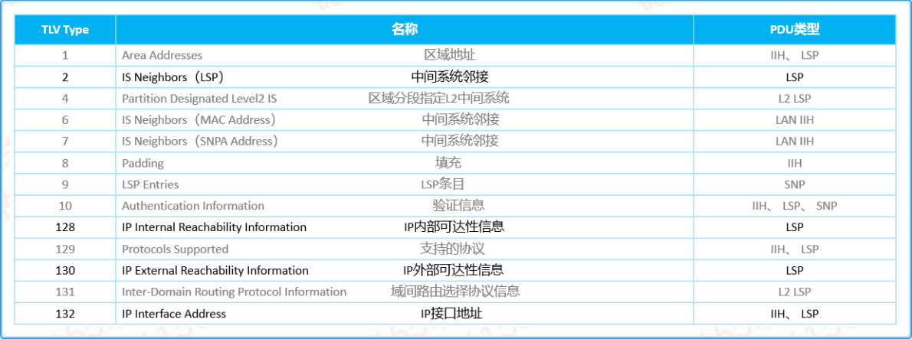

---
# HCIP-ISIS
layout: pags
title: ISIS收敛调优和总结
date: 2025-06-30 10:29:54
tags: Network
categories: 
- [HCIP,2.3ISIS收敛调优和总结] 
---

### ISIS收敛步骤

1. 检测到故障时间---可以基于BFD,ISIS,Hello改善  
2. 生成新LSP时间
3. 泛洪LSP时间
4. SPT计算时间
5. 加载到RIB
6. 更新路由到主控板
 <!-- more -->
### ISIS快速收敛机制

1. ISPF
    1. 增量路由计算
    2. 当网络拓扑改变的时候，只对受影响的节点进行路由计算，从而加快路由的计算
2. PRC
    1. 部分路由计算
    2. 当网络上路由发生变化的时候，只对发生变化的路由重新计算
3. 智能定时器
    1. SPF智能定时器--- SPF智能定时器可以对少量的外界突发事件进行快速响应，又可以避免过度的占用CPU
    2. LSP生成智能定时器
        1. 对于突发事件（如接口UP/DOWN）快速响应，加快网络收敛速度
        2. 单网络变化频繁时，智能定时器的间隔时间会自动延长，避免过度占用CPU资源
    3. 网络变化频繁，延长定时器     超时时间，反之缩短定时器时间   
4. LSP快速扩散---收到一个或多个较新的LSP时，在路由计算之前，先将小于指数目的LSP扩散出去，加快LSDB的同步过程
5. 按优先级收敛---在大量路由情况下，能够让某些特定的路由（列如匹配指定IP前缀的路由）优先收敛的一种技术

### 配置LSP报文属性 

-  配置LSP的大小
   - 当链路状态信息变大时，可以增大生成LSP的报文长度，使得每个LSP可以携带更多的信息 
   - 当缺省情况下，IS-IS系统生成的LSP报文长度为1497字节
      - 使用lsp-length命令设置的max-size值必须满足以下要求，否则接口的MTU状态会被认为是DOWN
      - 以太网接口的MTU值大于等于max-size+3
      - P2P接口的MTU值大于等于max-size
    - 配置
      - lsp-length originate max-size,配置生成LSP的大小
      - lsp-length receive max-size 配置接收LSP的大小
    - 配置LSP的最大有效时间 
      - 控制LSP的最大有效时间，保障在未收到更新的LSP之前旧LSP的有效性
      - timer lsp-max-age age-time 配置LSP最大有效时间----缺省情况下，LSP的最大有效时间为1200秒
    - 配置LSP的刷新周期
      - 控制LSP的泛洪定时刷新，保持LSDB的同步
      - 缺省情况下，LSP刷新周期的缺省值为900秒
      - timer lsp-refresh refesh-time 配置LSP刷新周期
    - 配置接口发送LSP的最小时间间隔
      - 控制LSP刷新时单个LSP之间的发送间隔
      -  isis timer lsp-throttle 50ms[ count 10 ] 配置IS-IS接口发送LSP报文的最小间隔时间和此时间内发送最大的报文数
      -  缺省情况下，接口上发送LSP报文的最小间隔时间是50毫秒，每次发送LSP报文数目是10 
    - 配置LSP生成的智能定时器
      - timer lsp-generayion max-interval [ init-interval ] [incr-interval ] [level-1 ] [ level-2 ]  配置LSP生成使用的智能定时器
      - 智能控制LSP生成的频率1，平衡提高收敛速度与减轻系统负荷之间的关系

### ISIS总结

#### ISIS相关TLV

#### ISIS与OSPF区别

- 基本框架
  - OSPF网络层协议
    - IPV4 OSPFV2
    - IPV6 OSPFV3
  - ISIS数据链路层协议
    - TLV架构灵活扩展
- 区域
  - OSPF
    - OSPF区域边界位于路由器
    - 利用区域ID区分骨干与非骨干
    - 支持vlink
    - 不支持区域平滑迁移
    - 支持特殊区域
    - 区域间支持渗透
  - ISIS
    - ISIS区域划分位于链路
    - 基于邻接关系区域骨干区域与非骨干区域
    - 不支持vlink技术
    - 支持区域平滑迁移
    - 不支持特殊区域
    - L2默认不渗透到L1
- 节点标识
  - OSPF
    - router-id ----支持自动选举
  - ISIS
    - 利用NET地址手动配置
- 邻居建立
  - OSPF
    - 信息类型--- Hello，DD,LSR,LSU.LSACK
    - 建立过程--- init->2way->exstart->exchange->loading->full
  - ISIS
    - 信息类型--- IIH,CSNP,PSNP.具体分为L1/L2
    - 建立过程--- DOWN->INIT->UP
- 网络类型
  - OSPF
    - P2P,BMA,NBMA,P2MP 
  - ISIS
    - BMA,P2P
  - DIS与DR
    - 选举参数对比---优先级范围区别，ISIS中优先级0可以参与DIS选举
    - 抢占机制---DR不能抢占，DIS可以抢占
    - 是否存在备份---ISIS DIS不存在备份，OSPF DR 存在BDR备份
    - Hello通告间隔---OSPF DR Hello 10s， ISIS DIS IIH 3
    - LSA与LSP可靠性机制--- LSA采用LSACK显示确认，ISIS使用CSNP周期发送保障可靠性
    - 邻接关系对比---DR/BDR出现减少OSPF邻居关系，DIS出现并未减少邻接关系
- LSDB同步过程
  - OSPF
    - LSA分类与同步过程---显示确认
    - LSA泛洪周期---1800s
    - LSA生命周期---3600
    - LSA类型---LSA1,2,3,4,5,7
  - ISIS
    - LSP分类与同步过程--- BMA网络类型无确认机制
    - LSP泛洪周期---900S
    - LSP生命周期---1200S
    - LSP类型---L1,L2 LSP
- 安全加固
  - OSPF
    - 认证字段于通用报头 
  - ISIS
    - 支持接口，区域，路由认证,TLV10 