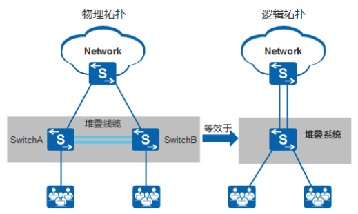

---
# HCIP-VRRP
layout: pags
title: Istack,CSS
date: 2025-07-08 21:24:40
tags: Network
categories: 
- [HCIP,10.1Istack和CSS]
---

### 基本信息

将多台交换机通过堆叠线缆从逻辑上变成一台交换设备        
堆叠功能：默认启用

<!-- more -->
功能

- 提高可靠性
- 扩展端口数量
- 增大带宽
- 简化组网

技能分类

- 横向堆叠（实际环境中一般为这种）
  - istack
    - 智能堆叠
    - 适用于盒式设备
    - S系列堆叠上限：9
    - CE系列堆叠上限：16
  - CSS
    - 集群交换系统
    - 适用于框式设备
    - 集群上限：2
- 纵向堆叠
  - SVF

堆叠方式

1. 链式

2. 环形

3. 堆叠连接拓扑对比  

部署限制

- 堆叠组建约束
  - 不同系列之间一定不能混堆
  - 相同系列不同产品之间一定不能混堆
  - 相同系列相同产品不同款型之间不一定可以混堆
  - 堆叠成员数量限制
- 与版本相关的限制
- 多主检测相关规格

### Istack

#### 堆叠基本概念

堆叠成员
- 参与堆叠的交换机
- 成员角色
  - 主交换机（master）
    - 管理整套堆叠系统
    - 提供业务转发
    - 仅有一台
  - 备交换机（standby）
    - 作为主交换机备份交换机
    - 提供业务转发
    - 仅有一台
  - 从交换机
    - 仅提供业务转发
    - 允许存在多台
    - 备交换机故障，从交换机允许成为备交换机
- 选举参数
  - 堆叠优先级（选择较大）---默认100
  - MAC地址（选择较小）
  - 抢占不生效 

查看堆叠ID  

- Slot即为成员交换机的堆叠ID

接口编号规则
- 对于单台没有允许堆叠的交换机，接口编号采用：槽位号/子卡号/端口号（槽位号统一取值为0）
- 交换机加入堆叠后，接口编号采用：堆叠ID/子卡号/端口号。子卡号与端口号的编号规则与单机状态下一致

堆叠操作步骤

- 使能堆叠并配置堆叠参数
  - 堆叠ID
  -  堆叠优先级
- 修改堆叠ID重启生效
- 连接堆叠线缆
  - 选择适当的连接方式与连接拓扑，组建堆叠网络 
  - 堆叠方式
    - 堆叠卡堆叠
    - 通过专用的堆叠插卡及专用的堆叠线缆连接
- 主交换机选举---主交换机选举不支持抢占
- 主交换机分配堆叠ID和备交换机选举

#### 工作原理

1. 堆叠成员加入
- 新成员交换机会选举为从交换机，堆叠系统中原有主备从角色不变
- 主交换机跟新拓扑信息，同步到其他成员交换机，分配堆叠ID到新成员
- 新成员更新堆叠ID,同步配置文件与系统软件，并运行

2. 堆叠成员退出
- 当主交换机退出
  - 备份交换机升级为主交换机，重新计算堆叠拓扑并同步到其他成员交换机，指定新的备交换机
- 当备交换机退出
  - 主交换机重新指定备交换机，重新计算堆叠拓扑并同步到其他成员交换机
- 当从交换机退出
  - 交换机重新计算堆叠拓扑并同步到其他成员交换机

3. 堆叠合并
- 物理连线
- 堆叠系统Master之间竞争
- 竞争失败的堆叠系统对于成员自动重启作为从交换机加入堆叠系统

4. 堆叠分裂
- 堆叠系统中带电移出部分交换机，或者堆叠线缆多点故障导致一个堆叠系统变成多个堆叠系统
- 堆叠分类产生的影响
  - 由于堆叠系统配置同步，导致通信出现问题
  - 堆叠分裂可能产生多个具有相同IP地址和MAC地址的堆叠系统引起网络故障

### CSS

#### 基本信息

集群交换系统（CSS）    
两台交换机逻辑为一台交换机    
堆叠内物理设备转发平台合一，共享转发信息    
下游设备支持跨设备链路聚合    

#### CSS基本概念

1. CSS成员角色
  - 主交换机
    - 负责管理整个集群。集群中只有一台主交换机
  - 备交换机
    - 当主交换机故障时，备交换机会接替主交换机的所有业务。集群中只有一台备交换机

2. 集群ID
- 用来标识与管理成员的交换机

3. 成员角色选举
  - 举机制：无抢占性
  - 集群优先级（选择较大）
  - MAC地址（选择较小）

4. 集群方式
- 集群卡集群方式
  - 集群成员交换机之间通过主控板或交换网板上的集群卡连接
- 业务口集群方式
  - 通过业务板上的普通业务口连接，不需要专用的集群卡。业务口集群涉及两种端口的概念

配置同步

1. 主备交换机配置合并
2. 主交换机负责同步配置与转发信息到备交换机  

