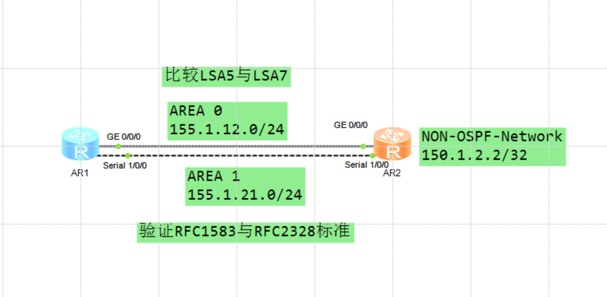

---
# HCIP-OSPF
layout: pags
title: LSA5和LSA7的比较实验
date: 2025-06-25 14:25:54
tags: Network
categories: 
- [HCIP,1.1OSPF基本概念]
---

### LSA5与LSA7比较

- 实验拓扑
  


- 配置
  <!-- more -->
```bash
R1
    ospf 1
        undo rfc1583 compatible
        area 0.0.0.0
        area 0.0.0.1 
            nssa
    interface Serial1/0/0 
        link-protocol ppp
        ip address 155.1.21.1 255.255.255.0
        ospf enable 1 area 0.0.0.1
    interface g0/0/0
        ip address 155.1.12.1 255.255.255.0
        ospf enable 1 area 0.0.0.0
R2
    ospf 1
        import-route direct route-policy DIR->OSPF
        area 0.0.0.0
        area 0.0.0.1
            nssa
    ip ip-prefix NET2 index 10 permit 150.1.2.2 32
    route-policy DIR->OSPF permit node 10
        if-match ip-prefixc NET2
    interface Serial1/0/0
        link-protocol ppp
        ip address 155.1.21.2 255.255.255.0
        ospf enable 1 area 0.0.0.1
    interface g0/0/0
        ip address 155.1.12.1 255.255.255.0
        ospf enable 1 area 0.0.0.0
    interface LoopBack0
        ip add 150.1.2.2 255.255.255.255
```

验证RFC1538

```bash
dis ospf routing
```


验证RFC2328

```BASH
dis ospf routing
```


