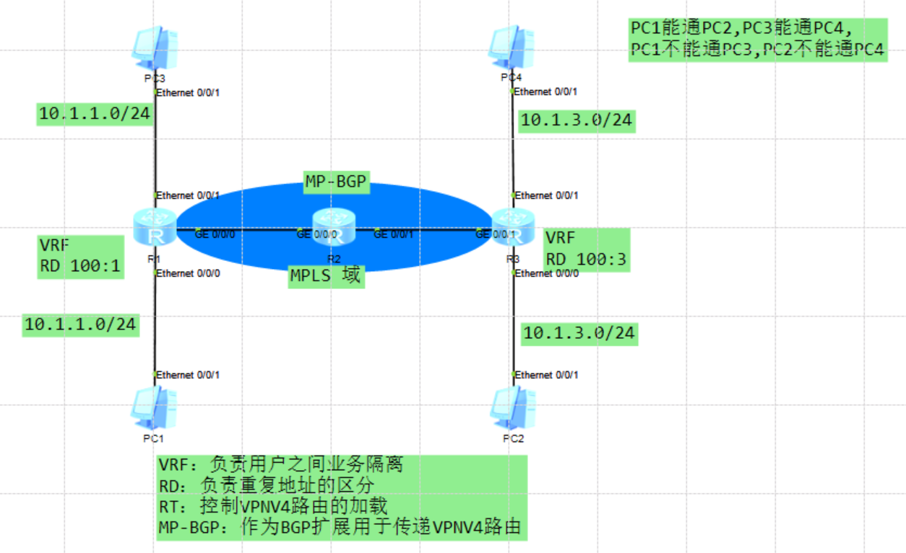
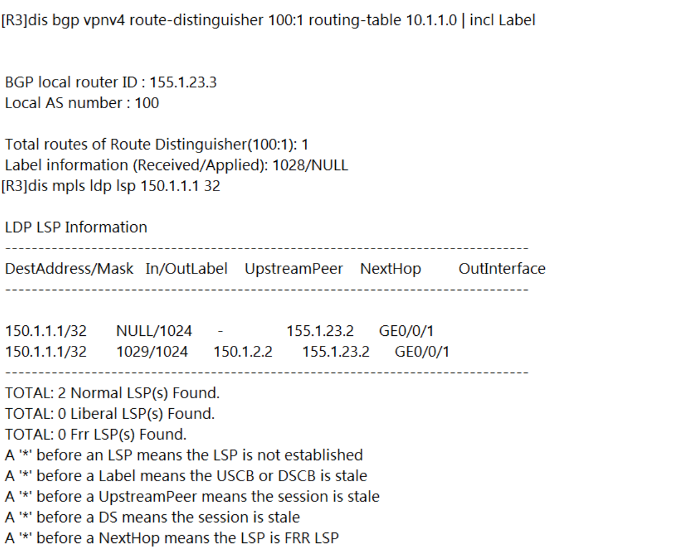
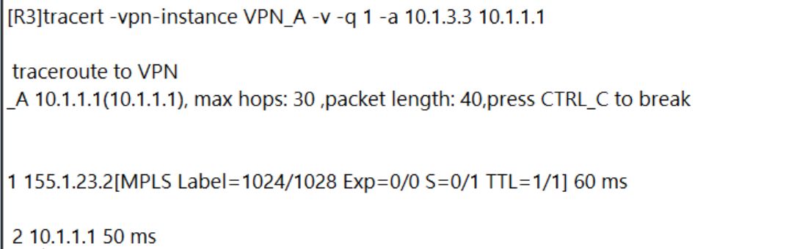
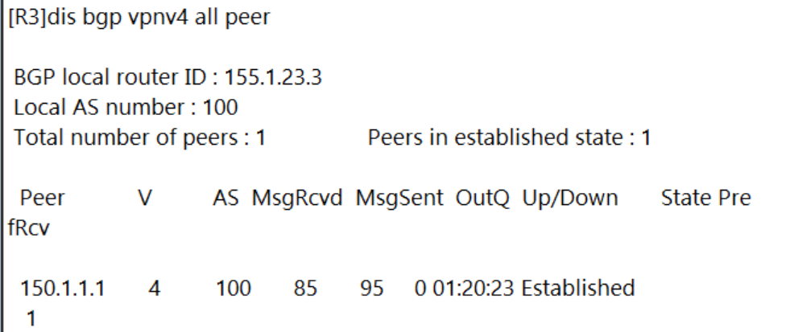
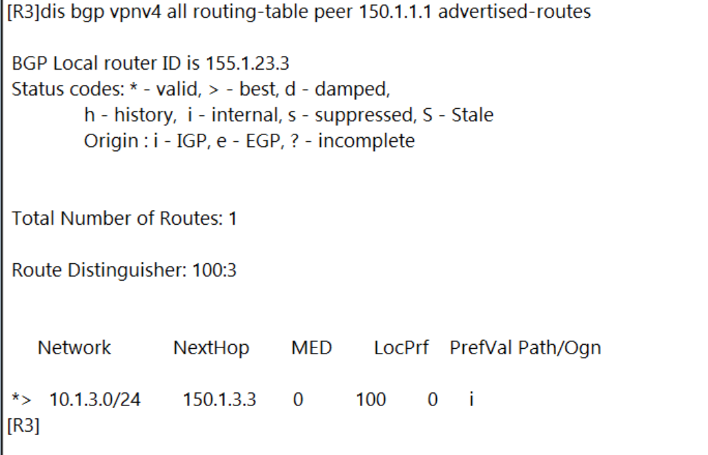

---
# HCIE-MPLS
layout: pags
title: MPLS VPN
date: 2025-07-16 10:29:54
tags: Network
categories: 
- [HCIE,1.1MPLS] 
---

### 基本信息

VPN模型
- Overlay VPN
  - 用户的路由和ISP路由隔离
  - 成本低
  - 网络服务质量得不到保障
- Peer to Peer VPN
  - ISP参与用户的路由
  - ISP可以通过策略控制CE之间的路由得到传输路径
  - 有一定成本
  - 增加ISP的维护难度
  <!-- more -->
技术优势
- 便于维护
  - 基于现有IP网络架构无需额外部署专属基础架构
  - 组网方式灵活，配置简单
- 扩展性好
  - 支持流量工程，提升SP的链路利用率
  - 支持地址重叠，重叠VPN
- 简化管理
  - 用户新增站点，仅需要修改业务边缘节点配置

#### MPLS VPN 组件

1. VRF

- 虚拟路由转发，又称VPN实例，负责用户之间业务隔离
- 每个VPN实例使用独立的路由转发表项，实现VPN之间的逻辑隔离

2. RD（Route Distinguisher，路由标识符）：负责重复地址的区分

- PE收到不同VPN的CE发来的IPv4地址前缀，本地根据VPN实例配置去区分这些地址前缀
- RD长8字节，用于区分使用相同地址空间的IPv4前缀
- PE从CE接收到IPv4路由后，在IPv4前缀前加上RD，转换为全局唯一VPN-IPv4路由

3. RT：控制VPNV4路由的加载

4. MP-BGP（多协议扩展）：作为BGP扩展用于传递VPNV4路由

- 传统的BGP-4不支持处理VPNv4路由
- MP-BGP新增了两种路径属性：
  - MP_REACH_NLRI：多协议可达NLRI。用于发布可达路由及下一跳信息。
  - MP_UNREACH_NLRI：多协议不可达NLRI。用于撤销不可达路由

5. VPNv4：

6. CE：用户网络边缘设备

7. PE：是服务提供商网络的边缘设备

8. P：服务提供商网络中的骨干设备

#### MCE(多实例CE)  

1. MCE 的基本概念

- 背景：传统CE设备仅维护一张全局路由表，无法区分不同VPN的流量。MCE通过在CE设备上创建多个VRF实例，为每个VPN提供独立的路由和转发平面，实现逻辑隔离
- 目标：允许单个物理CE设备同时为多个客户或服务提供隔离的网络环境，节省硬件成本并简化网络架构

2. 核心工作原理
   
- VRF 实例的创建与隔离
  - 多VRF：在MCE上为每个VPN创建一个独立的VRF实例，每个VRF包含自己的路由表、转发表及策略（如ACL、路由协议）
  - 接口绑定：将物理接口或子接口（如VLAN、子接口）绑定到不同的VRF，确保流量进入对应实例进行处理。

- 流量的分类与转发
  - 入站流量 
    - 根据流量来源的接口或VLAN标签，分配到对应的VRF
    - 在VRF内部执行路由查找，决定下一跳（如通过静态路由或动态协议学习）
  - 出站流量
    - 发往PE的流量根据VRF路由表，通过不同子接口或标签封装（若支持MPLS）传输。  
    - PE根据接收接口的VRF信息继续处理，确保流量进入正确的MPLS VPN隧道

- 与PE的交互
  - 路由交换
    - 使用 BGP扩展（MP-BGP） 传递VPNv4路由（含RD/RT标识）
    - 不同VRF的路由通过独立进程或路由上下文区分
  - 标签处理

3. MCE 的典型应用场景

- 企业多租户接入：企业分支机构通过单台CE设备接入多个云服务商（如AWS、Azure），各云服务流量完全隔离
- 服务提供商共享接入：运营商为多个客户提供VPN服务时，无需为每个客户部署独立CE设备，降低成本
- 内部业务隔离：企业内部不同部门（如财务、研发）通过同一CE设备接入，但路由和策略互相独立

4. 与传统CE的对比


5. 配置要点

- VRF定义：为每个VPN创建VRF，分配唯一的Route Distinguisher (RD) 和 Route Target (RT)。
- 接口绑定：将物理接口或子接口关联到对应VRF（如Cisco的 ip vrf forwarding <vrf-name>）
- 路由协议配置：为每个VRF独立配置路由协议或静态路由
- 安全策略：在VRF间启用策略隔离（如ACL、防火墙规则）。

#### 总结

MCE通过虚拟化技术（多VRF）在单台CE设备上实现多VPN的逻辑隔离，是MPLS网络中灵活扩展客户接入的关键技术。其核心在于路由实例的独立管理与流量的分类转发，适用于需要经济高效的多租户接入场景。

### MPLS VPN 实验

实验拓扑



### 基础配置

```bash
R1
  inter g0/0/0
    ip add 155.1.12.1 24
   inter loo0
    ip add 150.1.1.1 32
quit
    isis
       net 49.0000.0000.0000.0001.00
        is-level level-2
    inter g0/0/0
        isis en
    inter loo0
        isis en
quit
mpls lsr-id 150.1.1.1
    mpls
    mpls ldp
quit
    inter g0/0/0
     mpls
      mpls ldp

R2
   inter g0/0/0
      ip add 155.1.12.2 24
    inter g0/0/1
       ip add 155.1.23.2 24
    inter loo0
        ip add 150.1.2.2 32
    isis
       net 49.0000.0000.0000.0002.00
        is-level level-2
    inter g0/0/0
        isis en
    inter g0/0/1
        isis en
    inter loo0
        isis en
mpls lsr-id 150.1.2.2
  mpls
    mpls ldp
    inter g0/0/0
      mpls
      mpls ldp
    inter g0/0/1
       mpls
        mpls ldp

R3
    inter g0/0/1
       ip add 155.1.23.3 24
    inter loo0
       ip add 150.1.3.3 32
    isis
       net 49.0000.0000.0000.0003.00
       is-level level-2
    inter g0/0/1
         isis en
    inter loo0
         isis en
mpls lsr-id 150.1.3.3
    mpls
       mpls ldp
    inter g0/0/1
      mpls
       mpls ldp

```

验证上面基础配置
```bash
display mpls ldp peer verbose  //查看LDP协商参数
dis mpls ldp session verbose  //查看LDP会话信息
dis mpls ldp adjacency   //查看LDP邻居发现
dis mpls ldp lsp 150.1.3.3 32 //查看标签信息
```

环境起好后执行下面配置

```bash
R1
 ip vpn-instance VPN_A
    ipv4-family
    route-distinguisher 100:1      //设置RD
    vpn-target 100:1 export-extcommunity  //设置ERT
    vpn-target 100:3 import-extcommunity  //设置IRT
#
    interface Ethernet0/0/0
        ip binding vpn-instance VPN_A
        ip address 10.1.1.1 255.255.255.0
#
    bgp 100
        timer connect-retry 10
        peer 150.1.3.3 as-number 100
        peer 150.1.3.3 connect-interface LoopBack0
        ipv4-family unicast
            undo synchronization
            undo peer 150.1.3.3 enable

        ipv4-family vpnv4
            policy vpn-target
            peer 150.1.3.3 enable

        ipv4-family vpn-instance VPN_A
            network 10.1.1.0 255.255.255.0

R3
    ip vpn-instance VPN_A
        ipv4-family
        route-distinguisher 100:3     //设置RD
        vpn-target 100:3 export-extcommunity  //设置ERT
        vpn-target 100:1 import-extcommunity  //设置IRT
#
    interface Ethernet0/0/0
        ip binding vpn-instance VPN_A
        ip address 10.1.3.3 255.255.255.0
#
     bgp 100
             timer connect-retry 10
             peer 150.1.1.1 as-number 100
             peer 150.1.1.1 connect-interface LoopBack0

              ipv4-family unicast
                     undo synchronization
                     undo peer 150.1.1.1 enable

             ipv4-family vpnv4
                      policy vpn-target
                      peer 150.1.1.1 enable

             ipv4-family vpn-instance VPN_A
                      network 10.1.3.0 255.255.255.0
```

验证配置












如果你看到这里， 可能会存在疑问，不理解为什么用ISIS来部署，其实主要是为了实验方便，现网场景是不可能出现ISIS，我大部分实验都是为了减少配置量而部署ISIS，弄清楚原理不管底层跑什么协议都不影响结果的

------------------------------------------------------------------------------