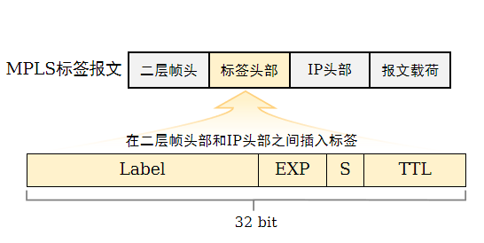

---
# HCIE-MPLS
layout: pags
title: MPLS基本概念
date: 2025-07-15 14:29:54
tags: Network
categories: 
- [HCIE,1.1MPLS] 
---

针对这是IE的第一篇文章，这里说下，IE不能像IP那样详细讲解了，主要是很多技术涉及面很广，一般实际生活中也用不上，所谓高级技术就是不经常使用的技术，整个IE文档只是单纯的笔记加实验，同时也希望大佬能指出问题。

### 基本概念

概述
- MPLS（Multi-Protocol Label Switching，多协议标签交换）
- MPLS在数据转发时，只在网络边缘分析IP报文头，在网络内部采用更为高效的标签转发，节约处理时间
- MPLS位于TCP/IP协议栈中的数据链路层和网络层之间，可以向所有网络层提供服务。
- 传统IP路由转发的特点：
  - 所有路由器需要知道全网的路由
  - IP头部不定长，处理效率低
  - 传统IP转发是面向无连接的，无法提供较好的端对端Qos保证
  <!-- more -->
MPLS术语介绍
- MPLS域（MPLS Domain）：一系列连续的运行MPLS的网络设备构成了一个MPLS域。
- LSR（Label Switching Router，标签交换路由器）：支持MPLS的路由器（实际上也指支持MPLS的交换机或其他网络设备）。位于MPLS域边缘、连接其它网络的LSR称为边沿路由器LER（Label Edge Router），区域内部的LSR称为核心LSR（Core LSR）
- LSR的分类
  - 入站LSR（Ingress LSR）：通常是向IP报文中压入MPLS头部并生成MPLS报文的LSR
  - 中转LSR（Transit LSR）：通常是将MPLS报文进行例如标签置换操作，并将报文继续在MPLS域中转发的LSR
  - 出站LSR（Egress LSR）：通常是将MPLS报文中MPLS头部移除，还原为IP报文的LSR
- LSP（Label Switched Path，标签交换路径）是标签报文穿越MPLS网络到达目的地所走的路径
- 同一个FEC的报文通常采用相同的LSP穿越MPLS域，所以对同一个FEC，LSR总是用相同的标签转发  

MPLS标签



- 标签（Label）：用于携带标签值，长度20 bit。
- EXP（Experimental Use）：主要用于CoS（Class of Service），长度3 bit。
- S（Bottom of Stack）：栈底位，用于指示该标签头部是否为最后一层标签，长度1 bit。如果该字段为1，则表示当前标签头部为栈底；如果该字段为0，则表示当前标签头部之后依然还有其他标签头部
- TTL（Time To Live）：用于当网络出现环路时，防止标签报文被无限制转发，与IP报文头部中的TTL具有相同的意义，长度8 bit。
- 标签值的范围及规划如下：


- MPLS标签的处理
  - LSR对标签的操作类型包括标签压入（Push）、标签交换（Swap）和标签弹出（Pop）
- MPLS转发概述
  - MPLS转发的本质就是将数据归到对应的FEC并按照提前建立好的LSP进行转发
    - 对于整个MPLS域，LSP是某一给定的FEC进入域和离开域的路径，可以看成是LSR的有序集合
    - 对于单台LSR，需要建立标签转发表，用标签来标识FEC，并绑定相应的标签处理和转发等行为
  - LSR处理报文时主要根据FTN、 NHLFE和ILM
  - FTN
    - FTN（FEC-to-NHLFE）：当LSR收到IP报文并需要进行MPLS转发时使用，FTN只在Ingress存在。
    - FTN包括：Tunnel ID、FEC到NHLFE的映射信息
  - NHLFE:
    - 下一跳标签转发表项（Next Hop Label Forwarding Entry）：LSR对报文（MPLS或IP报文）进行MPLS转发时使用，NHLFE在Ingress和Transit存在
  - ILM：
    - 入标签映射：用于指导MPLS报文的转发（MPLS或IP转发），ILM只在Transit和Egress存在。
    -  ILM包括：Tunnel ID、入标签、入接口、标签操作类型等信息
  - 当IP报文进入MPLS域时，首先查看FIB表，检查目的IP地址对应的Tunnel ID值是否为0x0
    - 如果Tunnel ID值为0x0，则进入正常的IP转发流程
    - 如果Tunnel ID值不为0x0，则进入MPLS转发流程

#### MPLS体系结构

MPLS的体系结构由控制平面（Control Plane）和转发平面（Forwarding Plane）组成


控制平面：
-  负责产生和维护路由信息以及标签信息
-  控制平面包括IP路由协议和路由信息表，标签分发协议和标签信息表

转发平面：
- 也称数据平面（Data Plane），负责普通IP报文的转发以及带MPLS标签报文的转发。
- 转发平面包括IP转发信息表和标签转发信息表

#### LSP建立方式

MPLS需要为报文事先分配好标签，建立一条LSP，才能进行报文转发。LSP分为静态LSP和动态LSP两种

1. 静态LSP（基本不使用）

基本概念
- 静态LSP是用户通过手工为各个FEC分配标签而建立的。
- 静态LSP不使用标签发布协议，不需要交互控制报文，因此消耗资源比较小。
- 通过静态方式建立的LSP不能根据网络拓扑变化动态调整，需要管理员干预。

应用场景
- 适用于拓扑结构简单并且稳定的小型网络

标签分配原则
- 前一节点出标签的值等于下一个节点入标签的值

2. 动态LSP

动态LSP通过标签发布协议动态建立     
标签发布协议是MPLS的控制协议，负责FEC的分类、标签的分发以及LSP的建立和维护等一系列操作      
常用标签发布协议：标签分发协议（LDP）       
- 全称：Label Distribution Protocol。
- 定义：LDP是多协议标签交换MPLS的一种控制协议，负责转发等价类FEC的分类、标签的分配以及标签交换路径LSP的建立和维护等操作。LDP规定了标签分发过程中的各种消息以及相关处理过程
- 应用场景：LDP广泛地应用在VPN服务上，具有组网、配置简单、支持基于路由动态建立LSP、支持大容量LSP等优点


### LDP

LDP是MPLS的一种控制协议，相当于传统网络中的信令协议，负责FEC的分类、标签的分配以及LSP的建立和维护等操作

####  标签分发协议

在MPLS网络中，下游LSR决定标签和FEC的绑定关系，并将这种绑定关系发布给上游LSR。       
LDP通过发送标签请求和标签映射消息，在LDP对等体之间通告FEC和标签的绑定关系来建立LSP     
标签的发布和管理由标签发布方式、标签分配控制方式和标签保持方式来决定


1. 标签分发方式

DU模式
- 对于一个特定的FEC，LSR无需从上游获得标签请求消息即进行标签分配与分发
- LSR会主动将自己为FEC捆绑的标签通告给上游邻居，无需邻居先发起请求再通告

DoD模式
- 对于一个特定的FEC，LSR获得标签请求消息之后才进行标签分配与分发
- 一般情况下，对特定FEC的访问需求会触发标签请求消息

2. 标签分配控制方式

独立模式
- 本地LSR可以自主地分配一个标签绑定到某个FEC，并通告给上游LSR，而无需等待下游的标签。

有序模式
- 对于LSR上某个FEC的标签映射，只有当该LSR已经具有此FEC下一跳的标签映射消息、或者该LSR就是此FEC的出节点时，该LSR才可以向上游发送此FEC的标签映射。
  
3. 标签保留

自由模式：
- LSR收到的标签映射可能来自下一跳，也可能来自非下一跳。
- 对于从邻居LSR收到的标签映射，无论邻居LSR是不是自己的下一跳都保留。

保守模式：
- 对于从邻居LSR收到的标签映射，只有当邻居LSR是自己的下一跳时才保留

配置LDP标签分配控制方式

[Huawei-mpls-ldp] label distribution control-mode { independent | ordered }  // 缺省情况下，LDP标签分配控制方式为有序标签分配控制（Ordered）

#### 工作原理

LDP的工作过程主要分为两部分：

- LSR之间建立LDP会话。
- LSR之间基于LDP会话动态交换标签与FEC的映射信息，并根据标签信息建立LSP。

LDP会话状态机


LDP会话建立


LDP邻居状态查询

```bash
display mpls ldp peer
```

LDP会话状态查询

```bash
display mpls ldp session
```

#### 倒数第二跳弹出

PHP特性
- PHP（Penultimate Hop Popping，次末跳弹出），如果激活了PHP特性，那么egress节点在为本地路由分配标签的时候，会分配一个特殊标签（3），该标签被称为隐式空标签（Implicit NULL Label）。当LSR转发一个标签报文时，如果发现对应的出标签值为3，则LSR会将栈顶标签弹出，并将里面所封装的数据转发给下游LSR。
- 隐式空标签与显式空标签
  - 缺省情况下，Egress节点向倒数第二跳分配隐式空标签（implicit-null），即特殊标签3
- 显式空标签机制，Egress节点向倒数第二跳分配特殊标签0
  - R3在转发标签报文时，若出标签封装为0，则不会将标签头部弹出，标签头部中的QoS信息得以保存。R4在收到带0标签的报文时，直接弹出标签，不用去查找ILM表项
  - 缺省情况下，Egress分配的是隐式空标签

配置PHP特性

```bash
[Huawei-mpls] label advertise { explicit-null | implicit-null | non-null }
缺省情况下，出节点向倒数第二跳分配隐式空标签（implicit-null）。
explicit-null：出节点向倒数第二跳分配显式空标签。
implicit-null：出节点向倒数第二跳分配隐式空标签。
non-null：出节点向倒数第二跳正常分配标签。
```

#### MPLS TTL处理方式

1. Uniform模式
   
统一模式：默认模式    


- 数据包进入MPLS网络，拷贝IP TTL到MPLS TTL
- 数据包离开MPLS网络，拷贝MPLS TTL到IP TTL 

2. Pipe模式


- 进入MPLS网络与统一模式相同
- 离开MPLS网络，不会拷贝MPLS TTL到IP TTL
- 此模式可以隐藏SP中间节点

配置

```bash
 Ingress设备上配置
  ttl propagate/统一模式
  undo  ttl propagate  /管道模式
```

#### LDP会话高可用

1. LDP与IGP联动

- LDP与IGP联动通过抑制IGP发布正常路由，来保证LDP与IGP联动完成收敛，使得IGP和LDP流量保持一致，最大限度减少流量的丢失，从而提高整网的可靠性
- LDP与IGP联动包括三个定时器
  - Hold-down timer：用于抑制IGP邻居建立的时长。
  - Hold-max-cost timer：用于控制通告接口链路的最大cost值的时长。
  - Delay timer：用以控制等待LSP建立的时间


- 主链路物理故障后恢复
  - LSR_2与LSR_3之间链路故障后恢复；
  - LSR_2与LSR_3之间建立LDP会话，同时IGP抑制邻居关系的建立并根据情况启动Hold-down timer；
  - 流量仍然会按照原来的LSP转发；
  - 链路故障恢复后，LSR2与LSR3可以相互发现LDP邻居，LDP会话建立（LSR2-LSR3的路由存在，路由路径：LSR2-LSR4-LSR5-LSR3），LSR2与LSR3相互发送mapping消息建立LSP，通告IGP启动同步；
  - IGP启动邻居关系建立，IGP收敛到主链路上，LSP重新建立并收敛到主链路上。

配置

```bash
进入接口下
ospf ldp-sync //使能接口的LDP与OSPF联动
isis ldp-sync  //使能接口的LDP与ISIS联动
```

2. LDP FRR

- LDP FRR（Fast Reroute）为MPLS网络提供快速重路由功能，实现了链路备份；当主LSP故障时，流量快速切换到备份路径，从而最大程度上避免流量的丢失
- LDP FRR通过LDP信令的自由标签保持方式（Liberal），先获取Liberal Label，为该标签申请转发表项资源，并将转发信息下发到转发平面作为主LSP的备用转发表项。当接口故障（接口自己感知或者结合BFD检测）或者主LSP不通（结合BFD检测）时，可以快速的将流量切换至备份路径，从而实现了对主LSP的保护。

配置

```bash
进入接口下
mpls ldp frr nexthop nexthop-address //在接口上使能LDP FRR
```

3. 本远端LDP会话共存

- 本远端LDP会话共存，其本质是LDP的本地邻接体和远端邻接体可以同时绑定到同一个对等体上，也就是说该对等体同时由本地、远端两种邻接体来维持。
-  远端LDP会话两端LSR上指定远端对等体及IP地址
-  

配置

```bash
[HuaweiA] mpls ldp remote-peer lsrc
[HuaweiA-mpls-ldp-remote-lsrc] remote-ip 10.1.x.x
[HuaweiA-mpls-ldp-remote-lsrc] quit       
#
[HuaweiB] mpls ldp remote-peer lsrc
[HuaweiB-mpls-ldp-remote-lsrc] remote-ip 10.1.x.x
[HuaweiB-mpls-ldp-remote-lsrc] quit     
验证配置
    display mpls ldp session   //查看远端会话状态
    display mpls ldp remote-peer   //查看远端对等体信息
```

