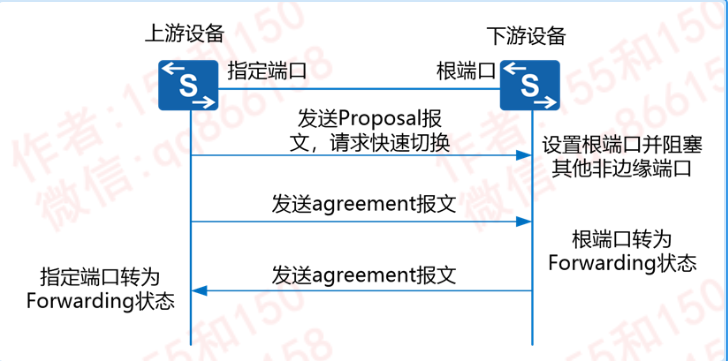
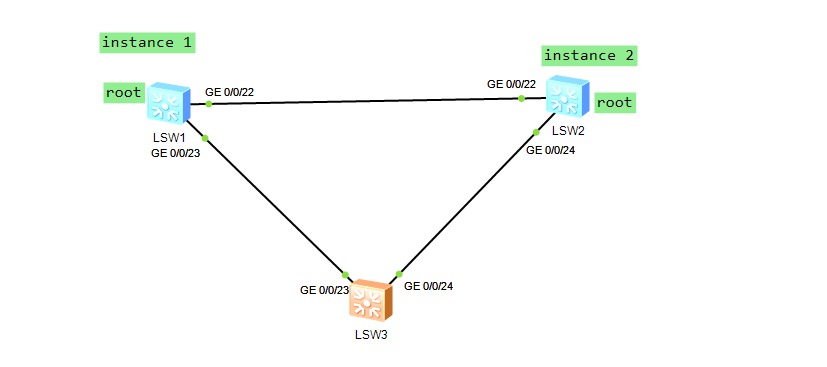
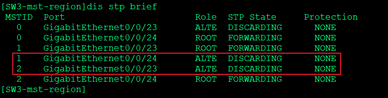
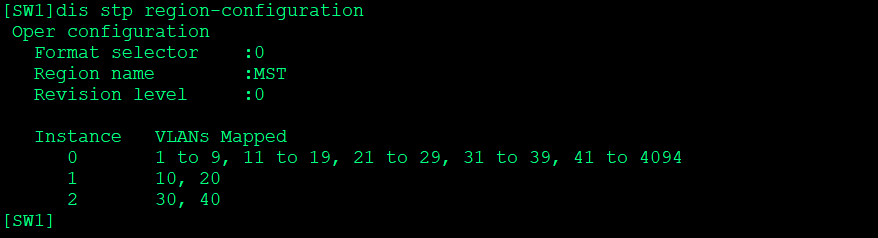
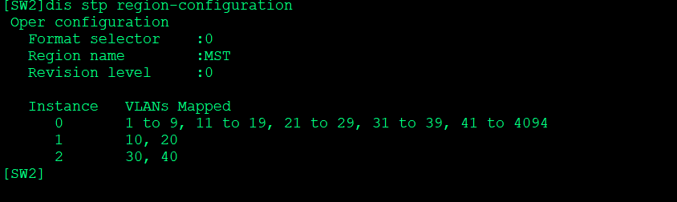
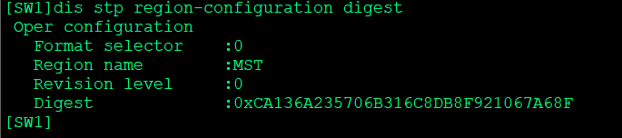
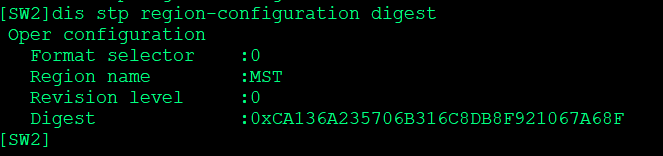
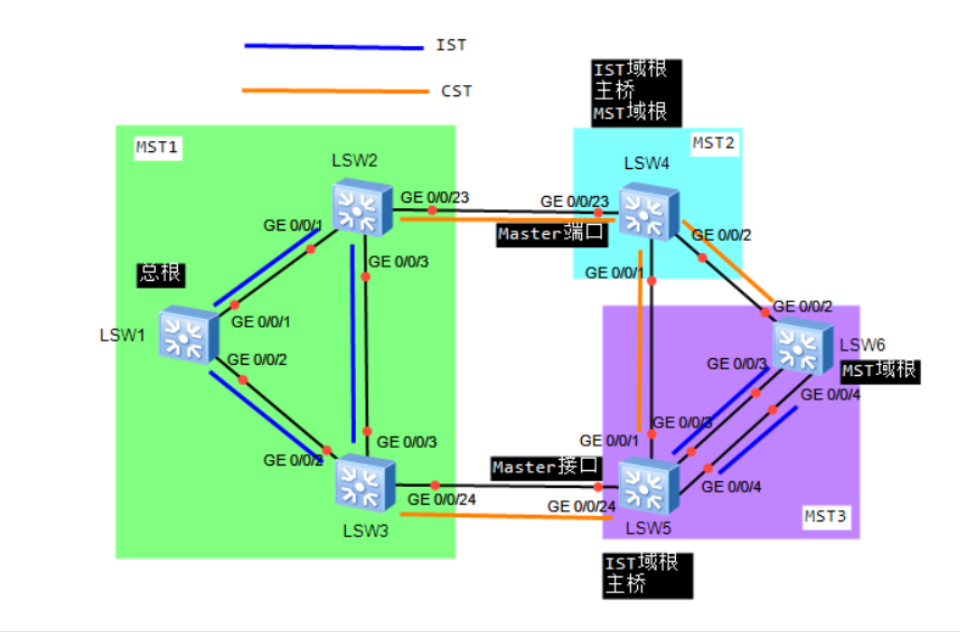

---
# HCIP-STP
layout: pags
title: MSTP
date: 2025-07-07 13:24:40
tags: Network
categories: 
- [HCIP,7.1STP]
---

### MAST(802.1s)

#### 基本信息

- STP/RSTP的缺陷----局域网内所有的VLAN共享一颗生成树，不支持负载分担
- 多颗生成树在VLAN间实现负载均衡，不同VLAN的流量按照不同的路径转发    
- MST实例
  - 实例就是多个VLAN的一个集合
  - 通过将多个VLAN捆绑到一个实例，可以节省通信开销和资源占用率
  - 实例上限：65
- MST域
  - 同一物理位置的交换机集合
  - 每个域内形成多颗生成树，生成树之间彼此独立
  - 同一个域内的设备
    - 相同的域名-----默认使用MAC地址
    - 相同的VLAN到生成树实例映射
    - 相同的MSTP修订级别配置-----参与摘要信息的计算参数，缺省为0
    - MST摘要配置-----摘要为VLAN映射信息的MD5值
  - 大型网络使用
- MSTP的端口状态-----MSTP定义的端口状态域RSTO协议中定义相同
- 端口角色
  - 根端口，指定端口，Alternate端口，Backup端口和边缘端口的作用同RSTP协议中定义  
  - 默认启用边缘端口自动探测
    - 2*2s+1时间内未收到BPDU，自动设置为EP
 <!-- more -->
MSTP的快速收敛机制



- 上游设备额外通告A置外的BPDU加速下游设备接口成为FWD
- MSTP自动发现边缘端口
  - 三次发送BPDU，无响应自动设置为边缘端口
- MSTP对拓扑变化的处理----参考RSTP

#### MSTP配置

```bash
stp enable //使能交换设备的MSTP功能
stp mode mstp  //配置交换设备的MSTP工作模式
stp  region-configuration  //MST域视图
    region-name name  //配置MST域的域名
    instance instance-id vlan { vlan-id1 [ to vlan-id2 ] } & <1-10>  //配置多生成树和VLAN的映射关系
    缺省情况下，MST域内所有的VLAN都映射到生成树实例0
    revision-level level  //配置MST域的MSTP修订级别（可选）缺省情况下，MST域的MSTP修订级别为0。
    check region-configuration //确定未生效的域参数是否正确
    active region-configuration //激活新的MST域配置
stp [ instance instance-id ] root primary / secondary  //配置根桥和备份根桥
stp [ instance instance-id ] priority priority //配置交换设备在指定生成树实例中的优先级 
配置端口在指定生成树实例中的路径开销
stp pathcost-standard { dot1d-1998 | dot1t | legacy } 
interface interface-type interface-number
     stp instance instance-id cost cost
配置端口在指定生成树实例中的优先级
interface interface-type interface-number
    stp instance instance-id port priority priority
设置端口回退到MATP
 interface g0/0/1 
    stp mcheck
验证配置
     display stp region-configuration //查看已经生效的MST域的配置信息  
     display st [ instance instance-id ] [ interface interface-type interface-number | slot slot-id ] [ brief ]  // 看生成树的状态信息与统计信息
```

#### 单域MST

实验拓扑



实验配置

```bash
SW1
    vlan batch 10 20 30 40 
    interface g0/0/22 
        port link-type trunk
        port trunk allow-pass vlan 2 to 4096
    interface g0/0/23 
        port link-type trunk
        port trunk allow-pass vlan 2 to 4096
    stp region-configuration
        region-name MST
        instance 1 vlan 10 20
        instance 2 vlan 30 40 
        active region-configuration
    stp instance 1 priority 8192
    stp instance 2 priority secondary 
SW2
    vlan batch 10 20 30 40
    interface g0/0/22 
        port link-type trunk
        port trunk allow-pass vlan 2 to 4094
    stp region-configuration
        region-name MST
        instance 1 vlan 10 20 
        instance 2 vlan 30 40 
        active region-configuration
    stp instance 1 priority 16384
    stp instance 2 priority priority
SW3
    vlan batch 10 20 30 40
    interface G0/0/23 
        port link-type trunk
        port trunk allow-pass vlan 2 to 4094
    interface g0/0/24 
        port link-type trunk
        port trunk allow-pass vlan 2 to 4094
    stp region-configuration 
        region-name MST
        revision-level 1
        instance 1 vlan 10 20 
        instance 2 vlan 30 40 
        active region-configuration
```

验证配置

1. 查看负载分担



2. 查看MST实例映射 





3. 查看MST区域摘要信息 





#### 跨域MST



- 基本信息
  - CST（公共生成树）
    - 域间构建的生成树  注：视每个域为单一交换机
    - 橙色线条连接各个域构成CST
  - IST （内部生成树）---域内STP 
    - 域内的实例0的生成树（即MSTI 0 ）
    - 其他实例的生成树为MSTI X
  -  CIST 公共和内部生成树 域内与域间构建STP的综合
  - SST（单生成树）
    - 运行STP或RST的设备，构建的生成树（仅支持单实例）
    - 运行MST，MST域内只有一台设备，构建的生成树
  - CIST ROOT
    - 公共生成树总根  整个交换网络的根网桥  (LSW1)  选择较小BID
  - Region Root
    - 域根  区域内抵达总根最近的设备
  - Master Bridge（主桥）---域内抵达总根最近的网桥

1. MSTP拓扑计算过程
  1. CIST总根选举
  2. 计算每个MST域内的生成树结构（即IST）
  3. 以MST域作为逻辑单台交换机计算CST
  4. CST和IST共同构成CIST   