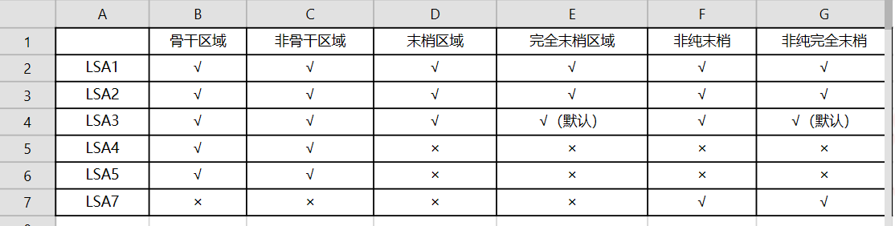

---
# HCIP-OSPF
layout: pags
title: OSPF LSDB优化
date: 2025-06-28 15:23:54
tags: Network
categories: 
- [HCIP,1.3OSPF LSDB优化] 
---

### OSPF区域类型
- 末梢区域Stub
1. 不包含ASBR
2. ABR通告默认LSA3，取代LSA4,LSA5
3. 所有末梢区域内路由器设置为STUB
4. 配置

```bash
ospf 1
    area 1
       stub
```
<!-- more -->
- 完全末梢区域Totally Stub
1. 不包含ASBR
2. ABR通告默认LSA3，取代明细LSA3，LSA4,LSA5
3. ABR设置为完全末梢，区域内其他路由器设置为STUB
4.  配置

```bash
  ospf 1
    area 1
       stub no-sunnary
```

- 非纯末梢区域NSSA
1. 可以包含ASBR
2. ASBR基于LSA7通告外部路由
3. ABR转换LSA7到LSA5,传递到其他OSPF区域 
4. 包含明细LSA3
5. 生成默认路由
6. 配置

```bash
ospf 1
    area 1
       nssa
```

- 非纯完全末梢区域NSSA
1. 可以包含ASBR
2. ASBR基于LSA7通告外部路由
3. ABR转换LSA7到LSA5，传递到其他OSPF区域
4. 使用缺省LSA3，取代明细LSA3
5. 产生缺省LSA7
6. 设置ABR未非纯完全末梢，其他路由器设置为非纯末梢 
7. 配置

```bash
 ospf 
    area 1
        nssa no-summary
```

- OSPF区域类型与LSA关系



- 实验:[特殊区域配置及现象实验]()

### OSPF路由汇总

- 基本信息
1. 减少路由表中的条目
2. 减少对系统资源的占用，不影响系统的性能
3. 提高了网络的稳定性：某条链路频繁UP和DOWN，该变化不会影响聚合路由
4. 所有明显条目消失，聚会路由消失
5. 汇总本区域的LSA1,LSA2的前缀

- 分类
1. 域间路由  
       汇总对象：LSA1,LSA2  
       配置位置：ABR
2. 外部汇总  
       汇总对象：LSA5与LSA7  
       配置对象：ASBR  
       NSSA区域：ASBR或ABR
- 实验：[OSPF路由汇总实验]()

### OSPF路由过滤

实验：[OSPF路由过滤实验]()

### OSPF Database Overflow

- LSA5条目超过限定门限，重置邻居或告警
- 工作原理  
    进入Overflow阶段  
        清除除缺省以外的其他外部路由    
    处于Overflow状态  
        不产生明细的外部路由  
        丢弃其他明细外部路由  
        计算器超算检查外部路由条目  
    退出Overflow状态  
        清除超限计算器  
        产生缺省外部路由  
        接受非缺省外部路由
- ABR部署

```bash
ospf 1
    enable log
        lsdb-overflow-limit 2
```

实验这里就不贴了 一般用不上 