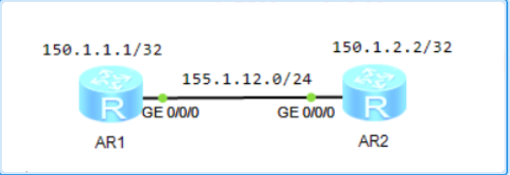
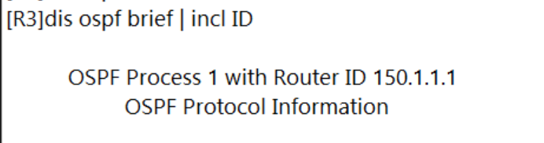
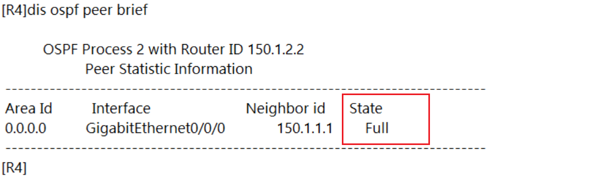
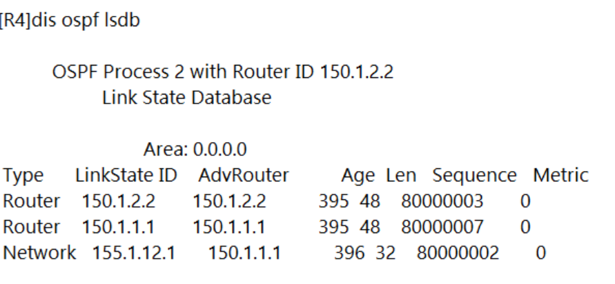
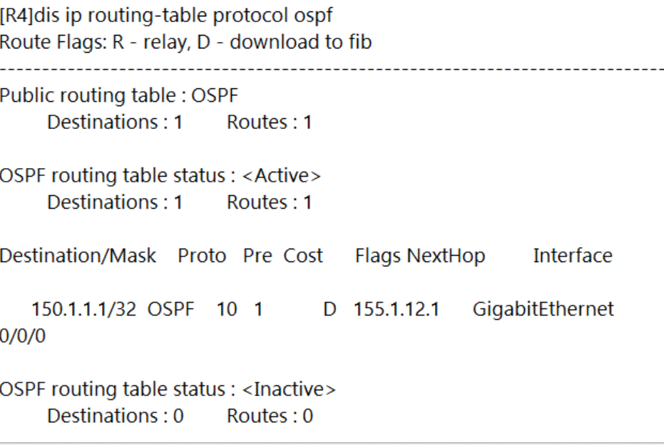
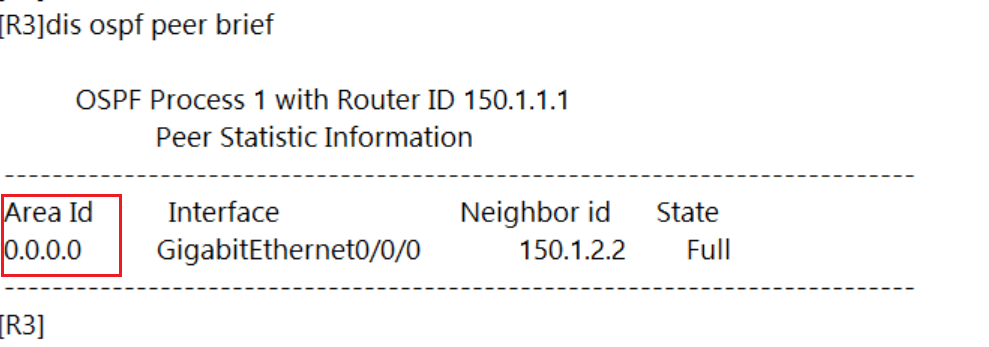
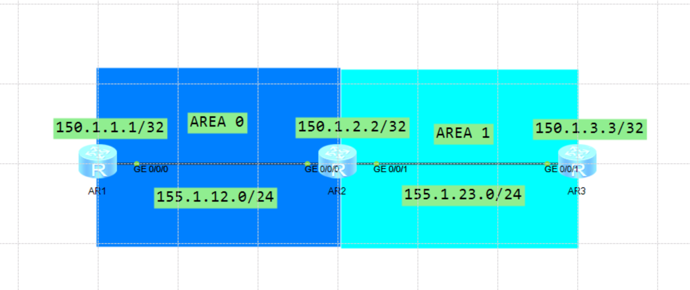
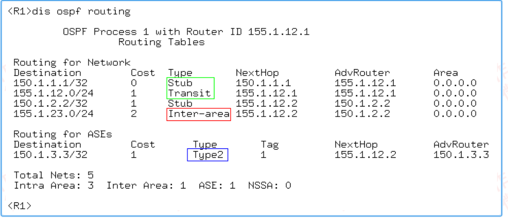
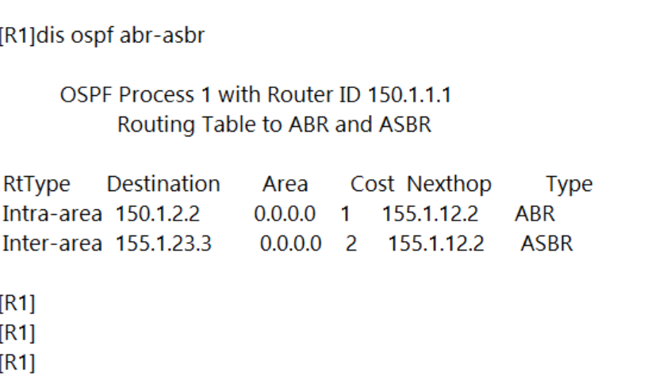

---
# HCIP-OSPF
layout: pags
title: OSPF单/多区域实验
date: 2025-06-25 14:23:54
tags: Network
categories: 
- [HCIP,1.1OSPF基本概念]
---

### OSPF单区域实验

- 实验拓扑
  


- 实验需求
  1. R1使用路由进程配置方式
  2. R2使用接口配置方式
  3. R1,R2使用不同OSPF进程
<!-- more -->
- 配置
```bash
R1
 OSPF 1
    area 0
        network 150.1.1.1 0.0.0.0
        network  155.1.12.0 0.0.0.255
R2
    interface g0/0/0 
        ospf  enable 2 area 0.0.0.0
    interface LoopBcak0
        ospf enable 2 area 0.0.0.0
    ospf 2
        area 0.0.0.0
```

- 查看OSPF信息
   1. 查看router-id

```bash
dis ospf brief | incl ID
```



  2. 查看邻居表

```bash
dis ospf peer brief
```



  3. 查看链路状态数据库

```bash
dis ospf lsdb
```



  4. 查看路由表
``` bash
dis ip routing-table protocal ospf
```



  5. 查看区域ID

```bash
dis ospf peer brief
``` 



### OSPF多区域实验

- 实验拓扑



- 实验需求
  1. OSPF多区域

- 配置
  
```bash
R1
    ospf 1
        area 0.0.0.0
    interface LoopBack0
        ip address 150.1.1.1 255.255.255.255
        ospf enable 1 area 0.0.0.0
    interface g0/0/0 
        ip address 155.1.12.1 255.255.255.0
        ospf enable 1 area o.o.o.o
R2
    interface LoopBack0
        ip address 150.1.2.2 255.255.255.255
        ospf enable 1 area 0.0.0.0
    interface g0/0/0 
        ip address 155.1.12.2 255.255.255.0
        ospf enable 1 area 0.0.0.0
    interface g0/0/1 
        ip address 155.1.23.2 255.255.255.0
        ospf enable 1 area 0.0.0.1
    ospf 1
        area 0.0.0.0
        area 0.0.0.1
R3
    ip ip-prefix NET150 index 10 premit 150.1.3.3 32
    route-policy CONN->OSPF premit node 10
        if-match ip-prefix NET150
    ospf 1
        import-route direct route-policy CONN->OSPF
        area 1
    interface LoopBack0
        ip address 150.1.3.3 255.255.255.255
    interface g0/0/1 
        ip address 155.1.23.3 255.255.255.0
        ospf enable 1 area 0.0.0.1
```

- 验证配置
   查看OSPF路由类型  

```bash
dis ospf routing
```



   查看OSPF路由器类型  
```bash
dis ospf abr-asbr
```



