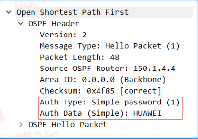
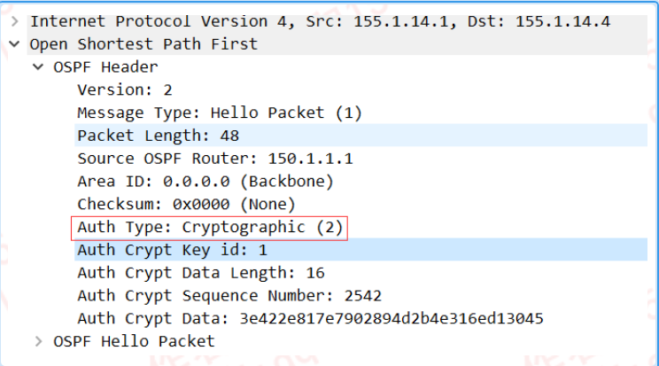
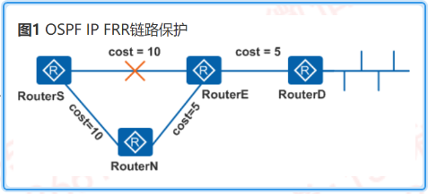
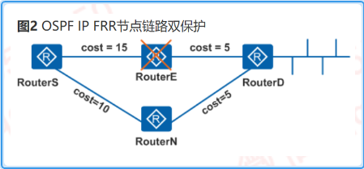
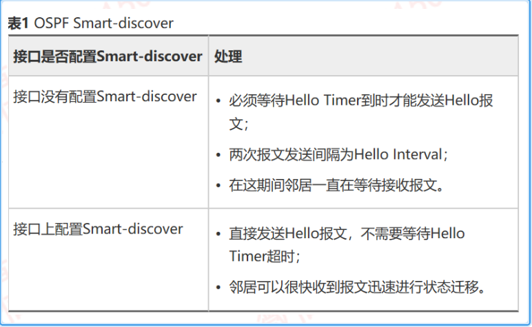

---
# HCIP-OSPF
layout: pags
title: OSPF安全
date: 2025-06-29 15:23:54
tags: Network
categories: 
- [HCIP,OSPF安全] 
---

### OSPF认证

- 部署方式  
 1. 基于接口
 2. 基于路由进程（区域认证）
- 认证方式
 1. 空认证
 2. 明文认证
 3. MD5认证
<!-- more -->
 - 配置
1. 接口配置方式

```bash
   interfaceG0/0/1 
        ospf authentication-mode simple plain HUAWEI
        ospf authentication-mode md5 1 plain HUAWEI
```

2. 进程配置方

```bash
  ospf 1
    area 0.0.0.0
        authentication-mode simple plain HUAWEI
        authentication-mode md5 1 plain HUAWEI   
```
接口配置优先于进程配置

- 验证配置
1. 查看明文认证



2.查看密文认证




- 实验：[OSPF认证实验]()

### OSPF收敛调优

#### OSPF IP FRR
- 基本信息  
   OSPF IP FRR（快速重新路由）利用FLA（无环预备）算法预先计算好备份链路，并与主链路一起加入转发表。  
   当网络故障时，OSPF IP FRR可以在控制平面路由收敛前将流量快速切换到备份链路上，保证流量不中断。  
- 原理
   OSPF IP FRR流量保护  
    1. 链路保护
   
     

链路开销必须满足Distance_opt(N,D)< Distance_opt(N,S)+Distance_opt(S,D)

   2. 节点链路双保护

  

设备的接口开销必须满足Distance_opt(N,D)< Distance_opt(N,E)+Distance_opt(E,D)

####  OSPF BFD

- 基本信息  
     提高链路变化时OSPF的收敛速度  
     BFD检测链路故障，通告故障到路由协议，触发路由快速收敛  

#### OSPF收敛

- 快速收敛机制
 1. 增量最短路径优先算法（ISPF）
 2. 部分路由计算（PRC）
 3. 智能定时器  
- OSPF按优先级收敛  
    在大量路由情况下，能够让某些特定的路由优先收敛的一种技术
- PRC（部分路由计算）  
    当网络上路由发生变化的时候，只对发生变化的路由进行重新计算
-  通过智能定时器控制路由计算  
    通过两个规定来避免网络连接或者路由频繁动荡引起的过多占用设备资源的情况 
- OSPF Smart-discover  
    固定周期发送Hello报文的方式减缓了OSPF邻居关系的建立 

     

 


    


