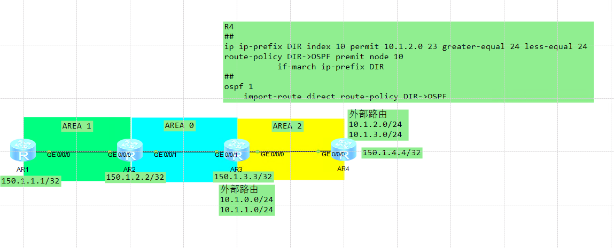
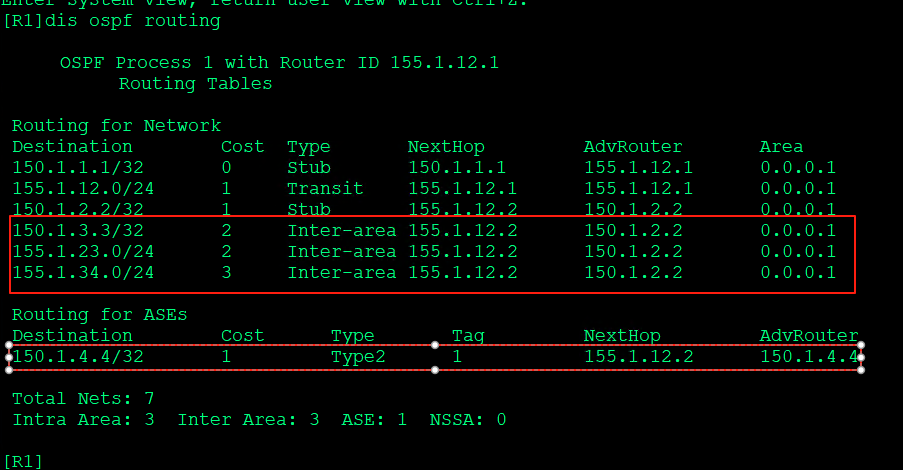
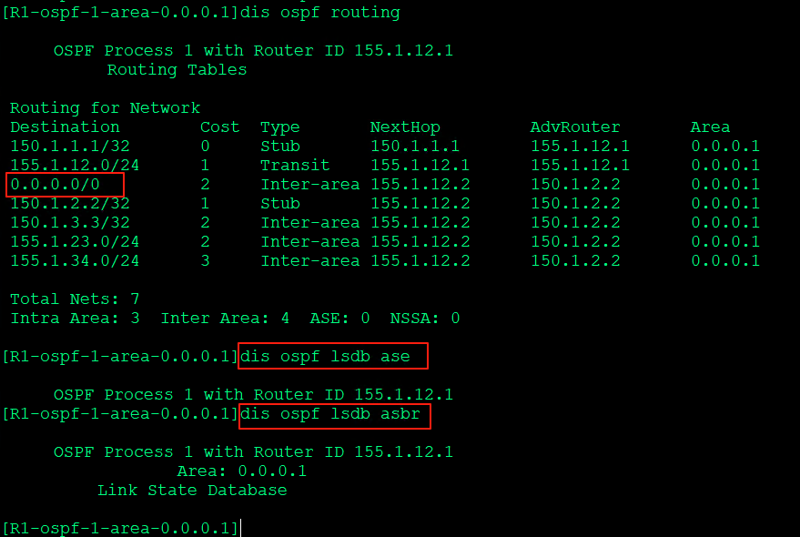
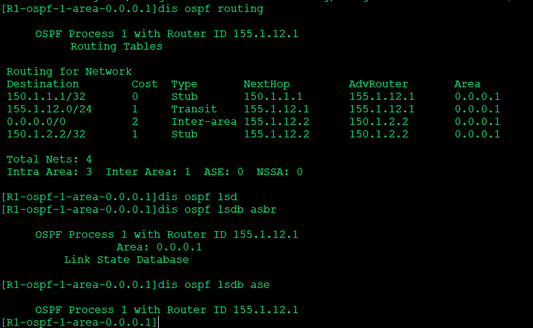
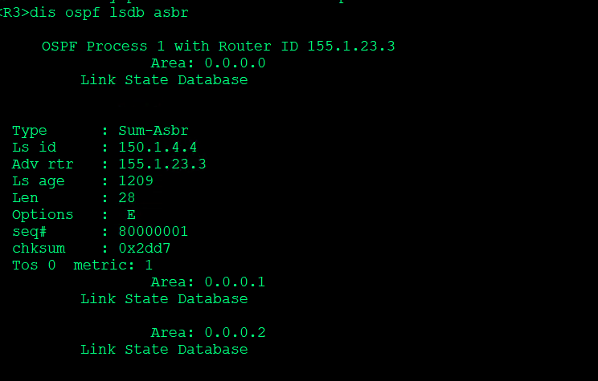
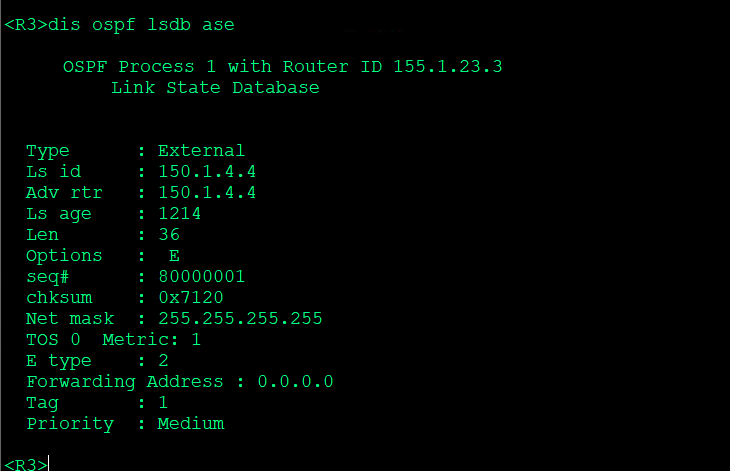
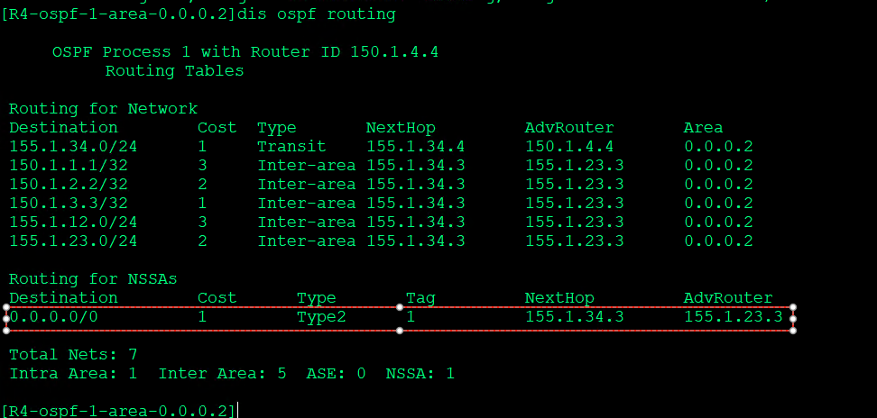
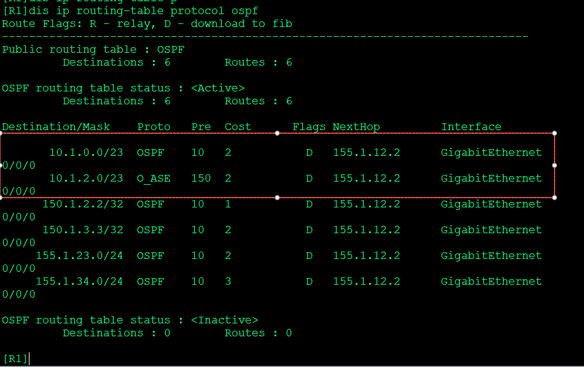

---
# HCIP-OSPF
layout: pags
title: OSPF特殊区域配置及现象实验
date: 2025-06-28 15:23:54
tags: Network
categories: 
- [HCIP,1.3OSPF LSDB优化] 
---

### OSPF特殊区域配置及现象实验

- 实验拓扑



- 实验需求
1. 设置Area 1 为stub区域
2. 设置Area 1为完全末梢区域
3. 设置Area 2为nssa区域
4. 设置Area 2为非纯完全末梢区域
5. 设置Area 2为非纯完全末梢区域
<!-- more -->
- 验证
1. 部署前



- 验证stub  
    消除LSA4,LSA5，使用LSA缺省代替   
    


- 验证Totally Stub  



- 验证NSSA区域  
     存在LSA4,LSA5  





- 验证NSSA

  

### OSPF路由汇总实验

- 实验拓扑 


- 配置OSPF路由汇总
1. 基本OSPF配置
2. R4外部路由引入

```bash
R4 
  ip ip-prefix DIR index 10 permit 10.1.2.0 23 greater-equal 24 less-equal 24
    route-policy DIR->OSPF premit node 10
        if-march ip-prefix DIR
  ospf 1
    import-route direct route-policy DIR->OSPF
R3
    ospf 1
        asbr-summary 10.1.2.0 255.255.254.0
        area 0.0.0.0
        area 0.0.0.2
            abr-summary 10.1.0.0 255.255.254.0
            network 10.1.0.0  0.0.1.255
            nssa
```

- 验证配置
```bash
dis ip route-table protocol ospf
```



