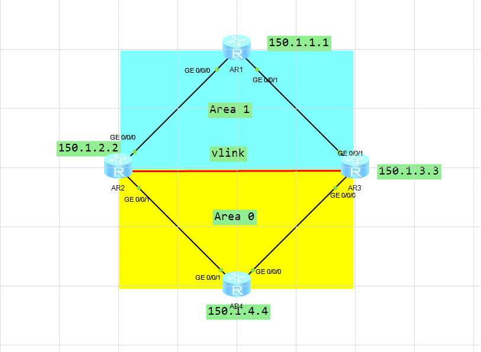
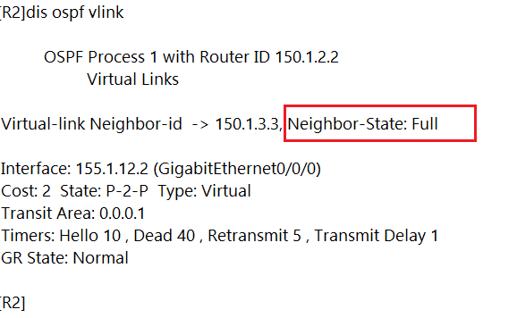
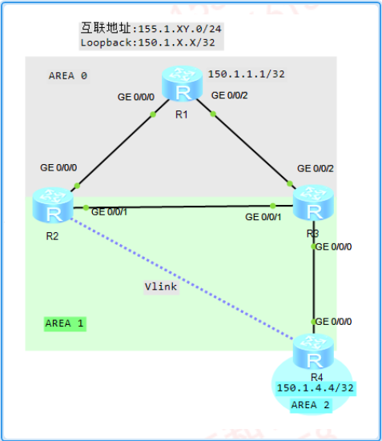
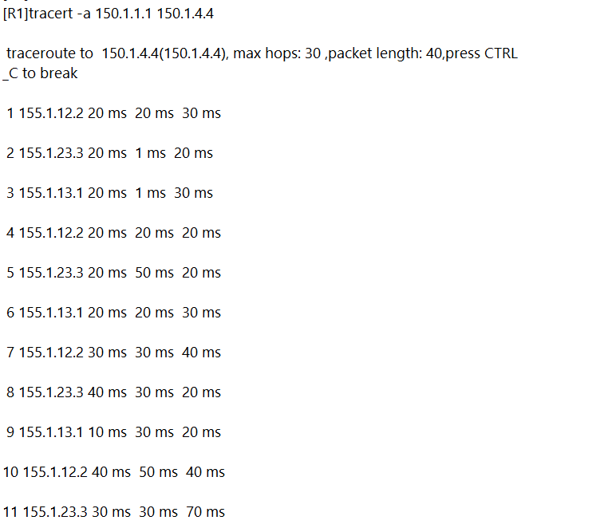
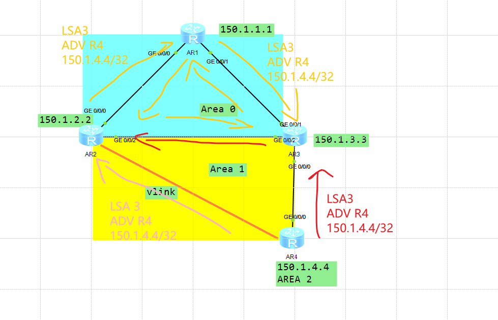

---
# HCIP-OSPF
layout: pags
title: OSPF虚链接实验
date: 2025-06-25 15:23:54
tags: Network
categories: 
- [HCIP,1.1OSPF基本概念]
---

### OSPF虚链接拓扑实验

- 实验拓扑


- 实验需求
1. OSPF区域如图所示
2. R2,R3的Loopback 0 位于区域0  
3. 配置OSPF多区域，实现150.1.x.x/32互通，即使R2,R4互联链路故障 
 <!-- more -->
- 配置
  
OSPF基本多区域配置（详情看多区域实验，这里就不粘出来了）

```bash
R2
    ospf 1 router-id 150.1.2.2
        area 0.0.0.1
        vlink-peer 150.1.3.3
R3
    ospf 1 router-id 150.1.3,3
        area 0.0.0.1
        vlink-peer 150.1.2.2
``` 

- 验证配置
  

### Vlink环路场景

- 实验拓扑
  


- 实验需求
1. 如图所示配置Vlink
2. 分析150.1.1.1与150.1.4.4通信所形成的环路

- 实验配置
基本OSPF多区域配置（略）

```bash
R2
    ospf 1 router-id 150.1.2.2
        area 0.0.0.1
        vlink-peer 150.1.4.4
R4
    ospf 1 router-id 150.1.4.4
        area 0.0.0.1
        vlink-peer 150.1.2.2
```

- 验证配置
   


- 环路原因
  


