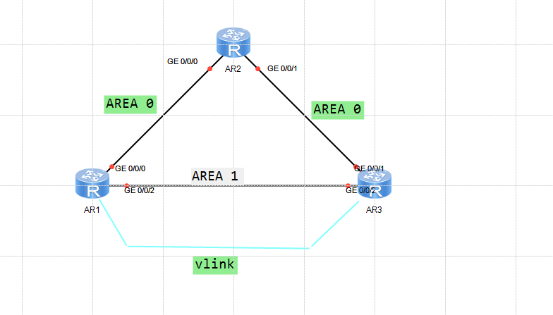
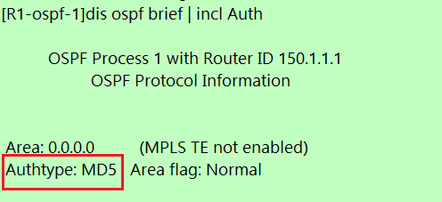
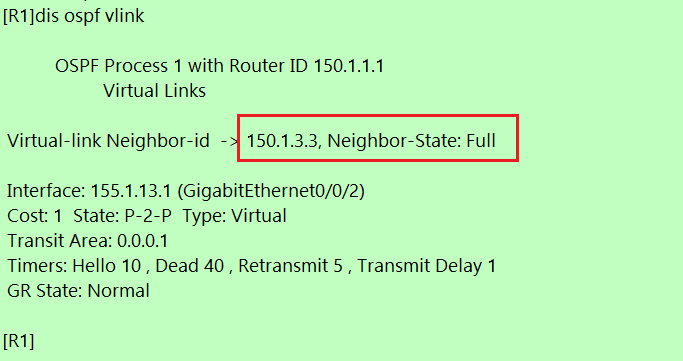

---
# HCIP-OSPF
layout: pags
title: OSPF认证实验
date: 2025-06-29 15:23:54
tags: Network
categories: 
- [HCIP,1.4OSPF安全] 
---

### OSPF认证实验

- 实验拓扑


<!-- more -->
- 实验需求
 1. 配置OSPF区域认证  
       OSPF区域0启用MD5认证  
       R1采用区域方式配置，R3采用接口方式配置  
 2. 若R1,R3互联故障，保障150.1.X.X/32之间通信

 - 配置
 ```bash
 R1
    ospf 1 router-id 150.1.1.1
        area 0.0.0.0
            authentication-mode md5 1 plain HUAWEI
        area 0.0.0.1                             
            vlik-peer 150.1.3.3 authentication-null
R2
    ospf  1 
        area 0.0.0.0
            authentication-mode  md 5 1 paln HUAWEI 
R3
    ospf 1 router-id 150.1.3.3
        area 0.0.0.0
        area 0.0.0.1
                vlink-peer 150.1.1.1
    interface G0/0/1 
        ospf authentication-mode md5 1 plain HUAWEI
```

- 验证配置





