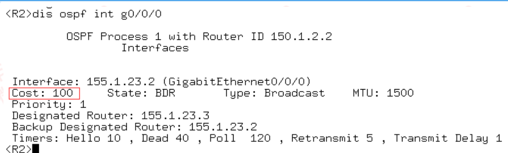
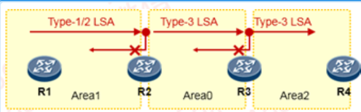
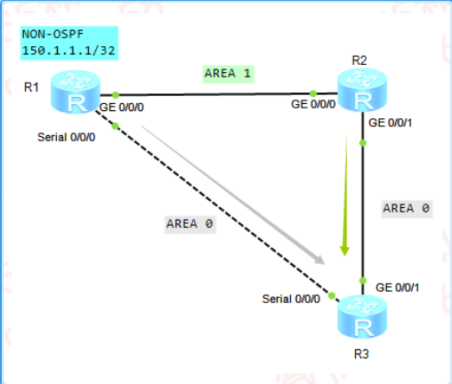
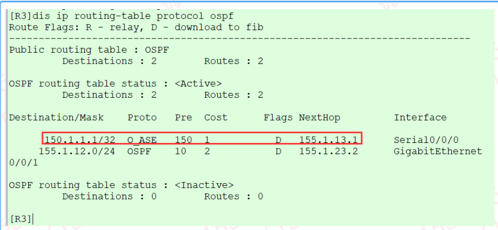
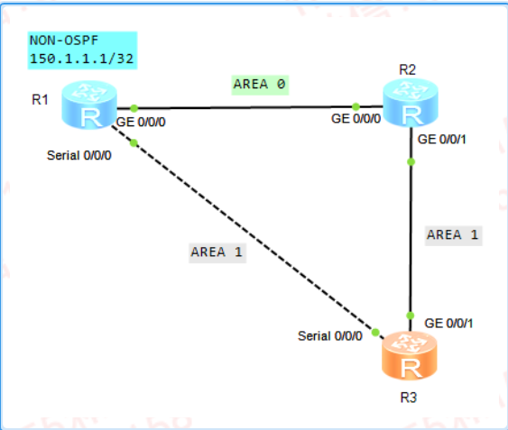
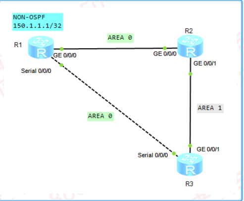
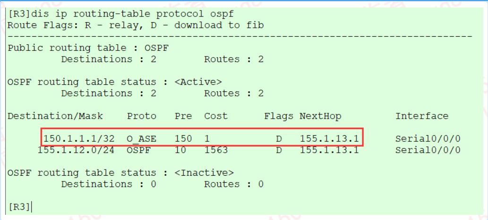
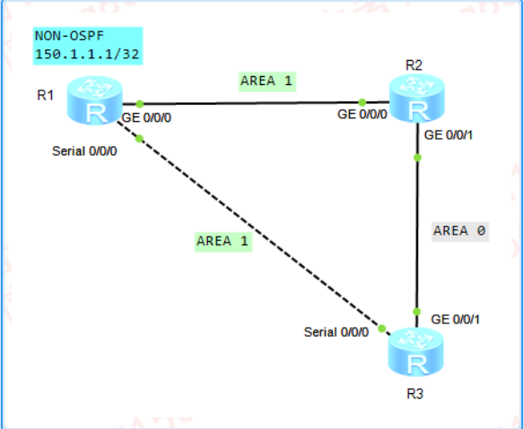
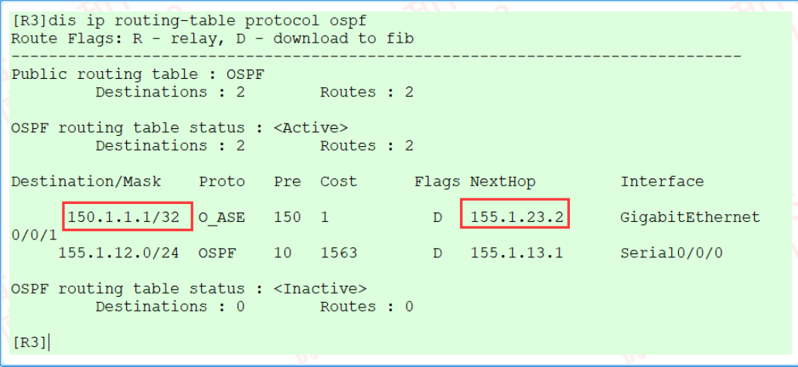

---
# HCIP-OSPF
layout: pags
title: OSPF路径选择
date: 2025-06-27 15:23:54
tags: Network
categories: 
- [HCIP,OSPF路径选择]
---

### OSPF路径选择

- OSP优先级调整
- 调整路径开销
1. 设置接口Cost  

```bash
   interface g0/0/0
       ospf cost 100
```
<!-- more -->
2. 查看接口cost

```bash
dis ospf inter g0/0/0
```



LoopBack接口Cost=0（华为）

- 度量值=沿途路径之和
- 实验：验证优先级与开销修改
   1. 修改优先级与开销实现路径控制：[优先级与开销修改实验]()

- OSPF转发地址
1. 影响转发路径与开销
2. 转发地址必须OSPF路由可达，相关前缀才能生效
3. 转发地址选举原则：1） P2P：外网接口  2） MA：外网接口对应的下一跳
4.  以本地环回接口IP较小为准
5.  以本地物理接口IP较小为准（加入OSPF网络的接口）
6.  LSA5 FA地址填充规则   
     下一跳对应出接口网络类型为BMA，NBMA  
     下一跳对应出接口接入OSPF进程  
     下一跳对应出接口不能使能silent接口  
7.  LSA 7 FA地址填充规则  
     自动填充FA地址  
     填充地址一定属于OSPF进程
-  FA地址填充意义  
     优化选路场景  
     防环场景  
- OSPF转发地址实验：[OSPF转发地址实验]()  

### OSPF防环机制

- 非骨干区域必须通过骨干区域实现通信
- ABR防环机制  
    ABR通告所连接的区域内的路由到区域0  
    ABR通告区域内的路由以及区域间的路由到非骨干区域
    ABR不使用从非骨干区域收到的LSA3作为区域间路由计算  
- ABR不会将Area内部的路由信息的Type-3 LSA再注回该区域中



- 验证LSA3防环机制：[验证LSA3防环机制实验]()

- LSA1与LSA4比较机制
1. 场景1：同区域（骨干与非骨干）内LSA1与LSA4比较  
    骨干区域场景  





     非骨干区域场景




2. 场景2：外部路由由于骨干区域引入





3. 场景3：外部路由由非骨干区域引入





