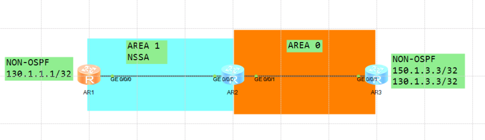
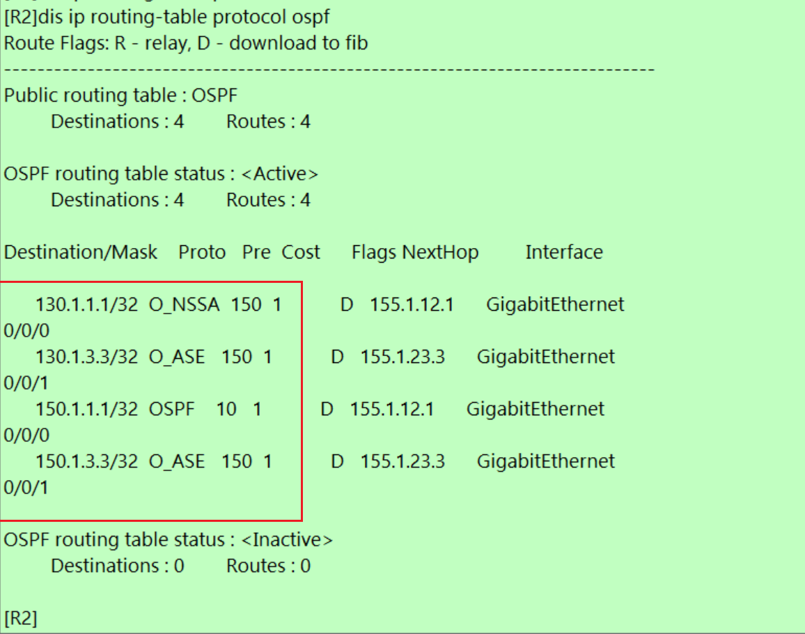
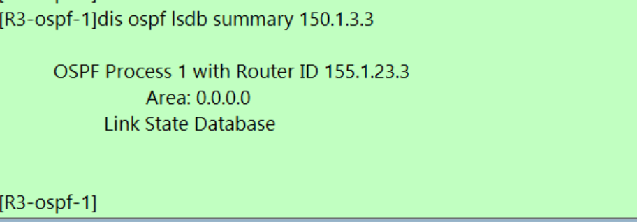
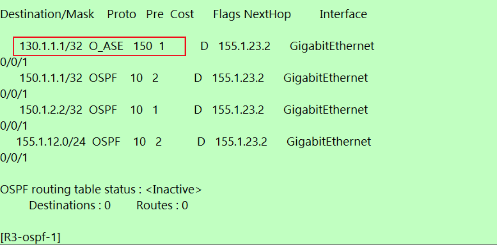
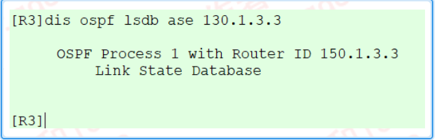

---
# HCIP-OSPF
layout: pags
title: OSPF路由过滤实验
date: 2025-06-28 15:23:54
tags: Network
categories: 
- [HCIP,OSPF LSDB优化] 
---

### OSPF路由过滤实验

- 实验拓扑



- 环境描述
1. R1,R3引入外部路由
<!-- more -->


- 实验需求 
1. LSA3过滤（配置位置ABR）
2. R2部署LSA3过滤150.1.1.1到区域
3. 保障访问130.1.1.1/32不受影响

- 实验配置

```bash
R2
    ip ip-prefix DENY_NET1 index 10 deny 150.1.1.1 32
    ip ip-prefix DENY_NET1 index 20 permit 0.0.0.0 less-equal 32  
    ospf 1
        area 0.0.0.0
        area 0.0.0.1
            filter ip-prefix DENT_NET1 export
            nssa suppress-fprwarding-address
```
- 验证配置





- 实验需求  
    R3仅引入150.1.3.3/32  
- 实验配置

```bash
 R3
    ip ip-prefix NET_HOST index 10 permit 0.0.0.0 0 greater-equal 32 less-equal 32
    ip ip-perfix NET3 index 10 permit 150.1.3.3 32
    route-policy DIR->OSPF premit node 10
        if-match ip-prefix NET_HOST
    ospf 1
        filter-policy ip-prefix NET3 export
        import-route direct route-policy DIR->OSPF
```



