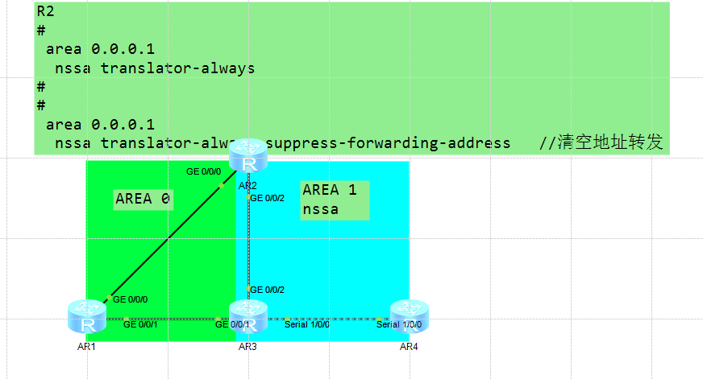
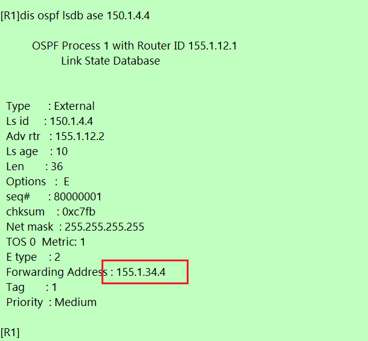
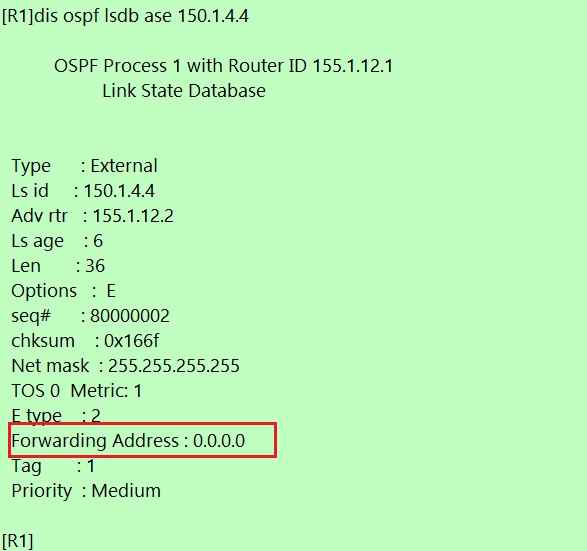
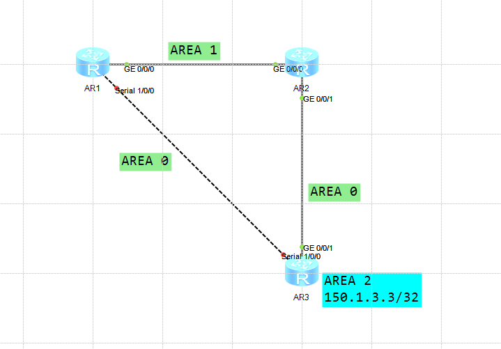
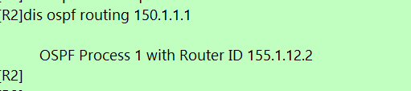
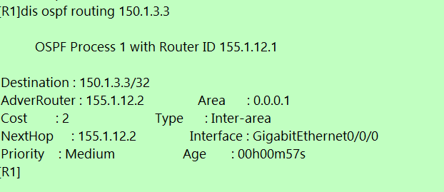

---
# HCIP-OSPF
layout: pags
title: OSPF转发地址实验
date: 2025-06-27 15:23:54
tags: Network
categories: 
- [HCIP,1.2OSPF路径选择]
---

### OSPF转发地址实验

- 实验拓扑
  


- 实验需求
  1. 配置R2执行LSA7->LSA5
  2. 查看150.1.1.1与150.1.4.4通信路径
  3. 验证OSPF地址路径优化
<!-- more -->
- 实验配置  
  
基础配置查看之前文档
```bash
R2
    ospf 1 
        area 0.0.0.1
            nssa translator-always
```

- 验证配置  
查看FA地址



清空FA地址

```bash
R2 
  ospf 1
    area 0.0.0.1
        nssa translator-always suppress-forwarding-address
```


### LSA3防环机制实验

- 实验拓扑



- 实验需求
 1. 查看150.1.1.1与150.1.3.3的路径
 2. 若R1，R3互联链路故障，150.1.1.1与150.1.3.3是否互通？原因？

- 实验配置  
    OSPF多区域配置

- 验证配置
1. 关闭R1,R3互联后,触发LSA3防环 
 


伪ABR效果

  


