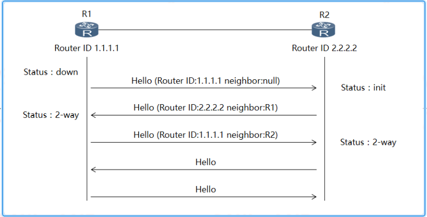
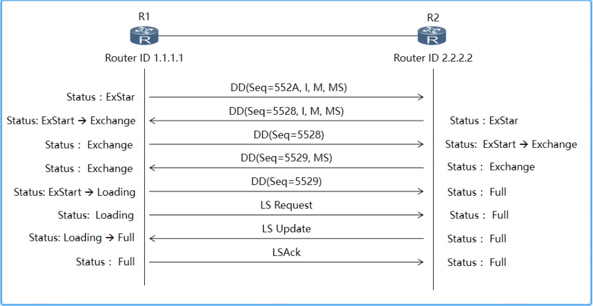

---
# HCIP-OSPF
layout: pags
title: OSPF邻居和邻接建立过程详解
date: 2025-06-25 15:23:54
tags: Network
categories: 
- [HCIP,OSPF基本概念]
---

### 邻居建立过程详解 

- Down:接口首次激活OSPF进程
- Attempt：仅NBMA网络中出现，延长Hello发送间隔  
           发送Hello，但未收到邻居的Hello的状态
- Init：邻居首次收到本地产生的Hello  
        描述对端信息
        <!-- more -->        
- 2-way：接收的HELLO报文中包含自身的Router-id  
          router-id确认方式：基于手工指定，基于本地环回，基于本地物理接口
        基于网络类型DR/BDR选举

### 邻接建立过程详解

- Exstart：选择DD的优先发送者  
           Master与Slave选举  
               选举参数：Router-id    
                    较大router-id的为Master  
                选举意义：基于DD序列号提供隐式确认  
                    Slave先发送DD
- Exchange：交互DBD报文，既链路状态概述信息
- Loading：基于LSR（链路状态请求）请求对方的链路状态数据库中的详情信息  
   报文结构-----链路状态请求
- Full：双方链路状态数据库一致  
    即将开始SPF计算  
Exstart与Exchange无明显边界，提示收敛效率               