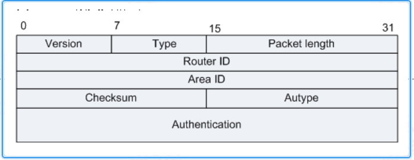

---
# HCIP-OSPF
layout: pags
title: OSPF信息类型详解
date: 2025-06-23 15:23:54
tags: Network
categories: 
- [HCIP,OSPF基本概念]
---

### Hello

发现与维护邻居关系  
Hello通告方式：组播（224.0.0.5.224.0.0.6）  
OSPF通用报文格式

包含OSPF版本信息  
-  OSPF信息类型（Hello，DD,LSR,LSU,LSAck）
-  数据包长
-  路由器ID
-  区域ID
-  校验和
-  认证类型
-  认证数据

头部结构

包含掩码
- Hello通告间隔
- Options
  1. DN：防环
  2. O: 用于支持LSA6,LSA9,LSA11（流量工程场景使用）
  3. DC：按需链路功能
  4. EA：支持外部属性
  5. N/P：LSA7处理能力标识----NSSA标识，LSA7转5标识
  6. MC：转发IP组播报文（支持LSA6）
  7. E：LSA5处理能力标识
  8. MT：支持多拓扑的OSPF
- 路由器优先级
- DR/BDR
- 邻居router-id 
  
### DD

数据库描述报文  
LSDB摘要信息  
DD头部结构:LSDB（链路状态数据库）描述报文-----拓扑概述信息  

- 接口MTU：接口MTU检测
- Option
   I: 首次发送DD为1 ------此DD不含LSA,用于选举Master与Slave  
   M：是否后续还存在DD------交互直到该位置位0结束  
   M/S：设备角色：Master/Slave  
   DD序列号：基于DD序列号提供隐式确认机制  
- LSA头部
   

- Options: 和hello的Options一样
- LS age: LAS生存时间：上限3600s
- LS type：LSA1，2，3，4，5，7
- LSA标识符：用于区分不同LSA，LSA类型，LSA ID,通告者
-  LSA新旧参考：LSA序列号，LSA校验和，LSA生存时间
-  LSA长度
  
### LSR

- 仅包含LSA标识信息
  
### LSU

- LSA数量与LSA内容详情（参考LSA详解）
  
### LSACK

- 仅包含LSA头部

### 报文发送方式

