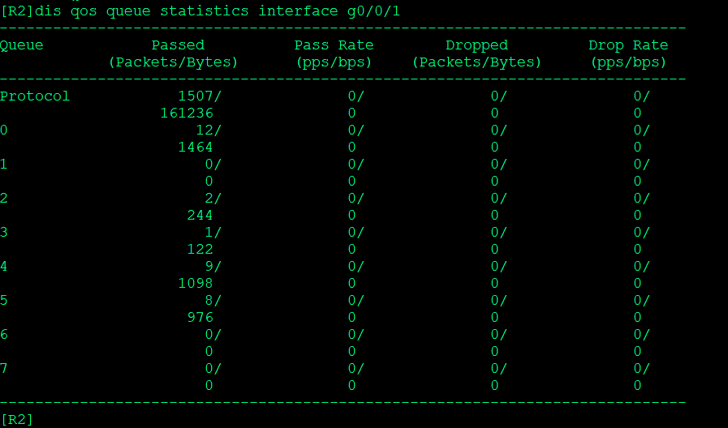

---
# HCIE-QOS
layout: pags
title: QOS优先级映射
date: 2025-07-30 19:29:54
tags: Network
categories: 
- [HCIE,4.2QOS优先级映射] 
---

### 拥塞管理

#### 基本信息

提供管理拥塞与带宽延迟的保障
- 进出带宽不匹配产生拥塞

使用场景
- 针对已拥塞的网络
<!-- more -->
#### 队列分类

硬件队列（不可控）      
软件队列
- 仅硬件队列Full生效
- 默认设备存在队列：8 
      
基于报文携带的LP与本地队列索引对应

队列组件
- 报文加入队列机制
  - 优先级映射
    - 建立报文携带优先级与设备内部优先级的映射
    - 根据内部优先级与队列之间的映射关系确定报文进入的队列
    - 对于进入设备的报文
    - 针对队列进行流量整形、拥塞避免、队列调度等处理
  - 配置优先级映射
  
```bash
qos map-table dot1p-dscp
    input 0 output 5
    input 1 output 3
```

队列分类机制
- 使用本地队列索引

队列实验

实验拓扑


验证策略是否生效


验证默认配置


默认情况下所有流量进0号队列，ping了10个包都在队列0

添加信任接口

```bash
inter g0/0/0
  trust dscp
```


根据策略10.1.1.1 的包会进5号队列，10.1.2.1的包会进4号队列

```bash
qos map-table dscp-lp   //修改优先级映射关系
input 46 output 3 
```

默认46进5号队列，修改后进入3号队列


查看优先级映射


#### 队列调度机制

1. FIFO
 
- 先入先出
  - 无队列分类
  - 报文入队机制
    - 先入先出
  - 队列数目：1
  - 丢弃机制：尾部丢弃 


2. PQ（优先级队列）

- 针对于关键业务类型应用设计，PQ调度算法维护一个优先级递减的队列系列并且只有当更高优先级的所有队列为空时才服务低优先级的队列
- 将关键业务的分组放入较高优先级的队列，将非关键业务（如E-Mail）的分组放入较低优先级的队列，可以保证关键业务的分组被优先传送，非关键业务的分组在处理关键业务数据的空闲间隙被传送
- 缺点：PQ调度机制会使低优先级队列中的报文得不到调度机会 


3. RR

- WRR调度
  - 加权循环调度WRR（Weight Round Robin）在循环调度RR（Round Robin）的基础上演变而来
  - 各队列中的报文流被调度的次数与该队列的权值成正比，权值越大被调度的次数相对越多。由于WRR调度的以报文为单位，因此每个队列没有固定的带宽，同等调度机会下大尺寸报文获得的实际带宽要大于小尺寸报文获得的带宽
  - WRR调度避免了采用PQ调度时低优先级队列中的报文可能长时间得不到服务的缺点。WRR队列还有一个优点是，虽然多个队列的调度是轮询进行的，但对每个队列不是固定地分配服务时间片——如果某个队列为空，那么马上换到下一个队列调度，这样带宽资源可以得到充分的利用。但WRR调度无法使低延时需求业务得到及时调度

- DRR调度
  - DRR（Deficit Round Robin）调度同样也是RR的扩展，相对于WRR来言，解决了WRR只关心报文，同等调度机会下大尺寸报文获得的实际带宽要大于小尺寸报文获得的带宽的问题，在调度过程中考虑包长的因素以达到调度的速率公平性
  - DRR调度中，Deficit表示队列的带宽赤字，初始值为0。每次调度前，系统按权重为各队列分配带宽，计算Deficit值，如果队列的Deficit值大于0，则参与此轮调度，发送一个报文，并根据所发送报文的长度计算调度后Deficit值，作为下一轮调度的依据；如果队列的Deficit值小于0，则不参与此轮调度，当前Deficit值作为下一轮调度的依据

4. WFQ（加权公平队列）


- 不同的队列获得公平的调度机会，从总体上均衡各个流的延迟
- 短报文和长报文获得公平的调度:如果不同队列间同时存在多个长报文和短报文等待发送，让短报文优先获得调度，从而在总体上减少各个流的报文间抖动

分类方式
- 按流的“会话”信息分类
  - 根据数据流对业务分类并放入不同队列
  - 数据流分类参数
    - 源目IP
    - 源目端口
    - 协议ID
    - 服务类型（TOS）
  - 出队的时候，WFQ按流的优先级来分配每个流应占用的带宽 
  - 不支持自定义分类
- 按优先级分类
  - 通过优先级映射把流量标记为本地优先级，每个本地优先级对应一个队列号
  - 报文根据队列号引进队列
  - 通过配置修改权重，高优先权和低优先权按权重比例分配带宽

扩展 
- WFQ调度图


1. CBQ（基于类加权公平队列）

- CBQ（Class-based Queueing）基于类的加权公平队列是对WFQ功能的扩展，为用户提供了定义类的支持。CBQ首先根据IP优先级或者DSCP优先级、输入接口、IP报文的五元组等规则来对报文进行分类，然后让不同类别的报文进入不同的队列。对于不匹配任何类别的报文，送入系统定义的缺省类


- EF队列：满足低时延业务
- AF队列：满足需要带宽保证的关键数据业务
- BE队列：满足不需要严格QoS保证的尽力发送业务

现网中调度策略一般混合使用

#### 实验：PQ+WFQ（IE考试题）基于优先级方式

实验拓扑


配置

```bash
R1
#
interface GigabitEthernet0/0/0
 ip address 155.1.12.1 255.255.255.0 
 traffic-policy SYS outbound
 #
interface LoopBack100
 ip address 10.1.0.1 255.255.255.0 
#
interface LoopBack101
 ip address 10.1.1.1 255.255.255.0 
#
interface LoopBack102
 ip address 10.1.2.1 255.255.255.0 
#
interface LoopBack103
 ip address 10.1.3.1 255.255.255.0 
#
acl number 2000  
 rule 5 permit source 10.1.0.0 0.0.0.255 
acl number 2001  
 rule 5 permit source 10.1.1.0 0.0.0.255 
acl number 2002  
 rule 5 permit source 10.1.2.0 0.0.0.255 
acl number 2003  
 rule 5 permit source 10.1.3.0 0.0.0.255 
#
traffic classifier SHIYU_NET1 operator or
 if-match acl 2001
traffic classifier SHIYU_NET2 operator or
 if-match acl 2002
traffic classifier SHIYU_NET0 operator or
 if-match acl 2000
traffic classifier SHIYU_NET3 operator or
 if-match acl 2003
 #
traffic behavior SY_NET0
 remark dscp ef
 statistic enable
traffic behavior SY_NET1
 remark dscp cs4
 statistic enable
traffic behavior SY_NET2
 remark dscp cs2
 statistic enable
traffic behavior SY_NET3
 remark dscp default
 statistic enable
#
traffic policy SYS
 classifier SHIYU_NET1 behavior SY_NET1
 classifier SHIYU_NET2 behavior SY_NET2
 classifier SHIYU_NET0 behavior SY_NET0
 classifier default-class behavior SY_NET3
 #
 
 R2
#
  interface GigabitEthernet0/0/0
 ip address 155.1.12.2 255.255.255.0 
 trust dscp
#
interface GigabitEthernet0/0/1
 ip address 155.1.23.2 255.255.255.0 
 qos queue-profile SHIYU
#
qos queue-profile SHIYU
  queue 0 weight 20  //队列0设置权重20
  queue 2 weight 40  //队列2设置权重40
  queue 4 weight 60  //队列4设置权重60
  schedule wfq 0 to 4 pq 5 to 7  //0至4队列添加至WFQ，5-7添加至PQ
  #
```

验证权重设置


验证队列设置




至于如何验证权重模拟器实现不了 可能需要在现网中网管设备上才能看到权重比例

基于流的QOS实验这里就不做了 贴个图 配置在图中 感兴趣的同学可以做做


----------------------------------------------------------------
