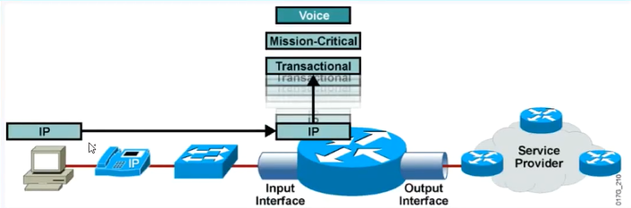

---
# HCIE-QOS
layout: pags
title: QOS基础
date: 2025-07-28 19:29:54
tags: Network
categories: 
- [HCIE,4.1QOS基础] 
---

### 基本信息

#### 服务质量 
  
Qos部署场景
- 高速链路到低速链路的传递
- 多条链路汇聚到单一链路

注：QOS本身不能增加网络带宽资源     
Qos提供关键业务流量提供保障     
Qos仅在网络拥塞时生效       
<!-- more -->
#### 部署需求

网络性能参数

1. 可用带宽
  
- 基于沿途路径最小带宽
- 带宽决定因素
  - 物理时钟---物理接口实际支持的传输速率
  - 承诺信息速率（CIR）---ISP提供的带宽服务（带宽资源）

2. 端到端延迟

- 沿途路径延迟之和
- 延迟分类
  - 进程延迟（转发延迟）
    - 路由表查询
    - ARP查询
    - 帧重写
  - 队列延迟
    - 硬件队列延迟---硬件队列buffer中处理延迟
    - 软件队列（可配置）延迟--- 注：仅拥塞场景存在
  - 串行化延迟
    - 转化数据为比特转化的延迟---由接口带宽决定
  - 传递延迟
    - 链路介质传递过程中产生的延迟 

3. 抖动--延迟的变化

数据抵达的时间不一致

4. 丢包

- 丢弃位置
  - 软件队列
  - 链路质量
  - 外界环境干扰
  - 设备过载
- 丢弃方式
  - 尾部丢弃（默认）

常见应用的服务质量需求
  
- 网络资源使用方式：复用
- 业务资源需求对网络需求不同
-  常见应用需求


 提升服务质量解决方案
 - 提升链路带宽
 - 报文头部或负载压缩
   - 低速广域网链路使用BW<2.048MB
   - 仅支持逐链路部署
   - 负载较小的应用建议部署，例如Telent
- 利于Qos技术
  - 高级队列技术
    - WFQ
    - CBQ
    - LLQ
  - 早期随机丢弃
    - WRED

#### 服务质量模型

尽力而为
- 高扩展性
- 配置简单
- 无任何服务质量策略

综合服务模型
- 端到端QOS模型
- 通信双方基于信令（RSVP资源预留协议）沿途申请资源预留
  - 基于数据流预留带宽
- 网络资源预留，服务质量得到保障
- 工作原理：沿途申请带宽资源，沿途反馈资源预留请求
- 扩展性有限
  - 不支持网络资源复用
    - 无相关业务，预留资源不释放
  - 需要传输路径上的沿途设备支持RSVP
  - RSVP协议占用设备资源与网络资源

差分模型
- 技术优势与限制
  - 无资源预留机制
  - 高扩展性
  - 基于等级的服务质量
  - 配置复杂

差分模型组件

1. 流量分类



- 分类方式（后续介绍）
  - 基于MAC、IP、服务等

2. 流量标记


3. 流量监管


- 超速流量被丢弃

4. 拥塞避免


5. 拥塞管理


6. 流量整形


- 提供传输速率限制
- 超速流量保存到Buffer

7. 压缩

头部压缩减少转发延迟


8. 链路分开与交互离开  

- 广域网低速链路使用
- 工作原理
  - 切片较大数据，插入高优先队列减少串行化延迟   


#### QOS数据处理模型（DiffServ模型）


### 分类与标记

#### 基本信息

简化流量类型区分与管理

#### 流量分类方法

1. 简单流分类
  - 基于QOS标签进行分类
  
```bash
traffic classifier SHIYU
  if-match dscp cs2
```

2. 复杂流分类
- 基于ACL
- 基于入接口
- 基于MAC
- 基于IP
- 基于TCP/UDP端口 
- 基于协议ID
-  组合简单流分类

3. 支持的分类方式


#### 流量标记位置

1. 2层标记位置

- 以太网
  - 802.1q TAG PRI字段（3bit） 
  


- MPLS EXP
- Frame-Relay
- 注：二层标可能无法全网携带
  - 使用2层与3层标记映射
    - CoS到ToS映射
    - 实现端到端Qos设置一致

2. 3层标记位置

- Tos字段（8bit）


- D比特表示延迟要求（Delay,0代表正常延迟，1代表低延迟）
- T比特表示吞吐量（Throughput,0代表正常吞吐量，1代表高吞吐量需求）
- R比特表示可靠性（Reliability，0代表正常可靠性，1代表高可靠性）
- 保留位6-7bit：ENC 显示拥塞通知

IP优先级
- 使用前3bit
- 范围：0-7
- 分类方法：
  - routine
  - priority
  - immediate
  - Flash
  - Flash-override
  - critical
  - internet
  - network---系统流量

#### DSCP

区分服务编码点---使用前6bit     
表现形式        
- 数据标识
- 基于关键字标识（PHB方式）

逐跳行为（PHB） 


- EF（快速转发）
  - 101 110
  - 处理机制：最小延迟，带宽保障，拥塞启用流量监管

-  AF（保障转发）
  - 转发可能性（001-100）
    - 数字越大，越优先
  - 丢弃可能性（01-11）
    - 数字越大丢弃概率越高
  - 保留字段--最后一位：0  


- BE
  - Default分类
  - 前三位：000
  - 使用FIFO队列机制：尾部丢弃

- CS（兼用IP优先级）
  - 前三位：001-111
  - 后三位：000

支持的标记类型和DSCP    


#### 实验：二层标记和三层标记

实验拓扑


实验配置

底层配置略      

```bash
ACL 3000
 rule 5 permit icmp source 150.1.1.1 0 destination 150.1.3.3 0 (1 matches)
ACL 3001
 rule 5 permit tcp source 150.1.1.1 0 destination 150.1.3.3 0 destination-port e
q telnet 
#
traffic classifier TCP operator or
 if-match acl 3001
traffic classifier ICMP operator or
 if-match acl 3000
traffic classifier shiyu operator or
#
traffic behavior ICMP-1
 remark 8021p 5
traffic behavior TCP-1
 remark dscp cs4
 #
 traffic policy shiyu
 classifier TCP behavior TCP-1
 classifier ICMP behavior ICMP-1
#
interface GigabitEthernet0/0/1.23
 dot1q termination vid 23
 ip address 155.1.23.2 255.255.255.0 
 traffic-policy shiyu outbound
 arp broadcast enable
 #
 ```

验证二层标记


验证三层标记


-----------------------------------------------------------------------------------------------------------------------------------