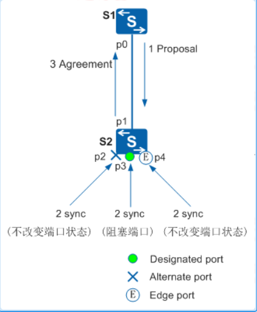

---
# HCIP-STP
layout: pags
title: RSTP
date: 2025-07-06 10:29:40
tags: Network
categories: 
- [HCIP,7.2RSTP]
---

### RSTP（802.1W）

STP不足
1. STP算法是被动的算法，依赖定时器等待的方式判断拓扑变化，收敛速度慢
2. STP算法要求在稳定的拓扑中，根桥主动发出配置BPDU报文，而其他设备进行处理，传遍整个STP网络
3. STP没有细致区分端口状态和端口角色
   1. Listening,Learning和Blocking状态并没有分别，都同样不转发用户流量
   2. 端口之间最本质的区别并不在于端口状态，而是在于端口角色  
 <!-- more -->
#### RST优化选项

1. 端口类型变化

- 根端口(RP)
- 指定端口（DP）
- 替代端口（AP）接收BPDU中的BID≠本地BID
  - 根端口Fail，替代端口立即切换根端口
- 备份端口（Backup Port）   接收BPDU中的BID=本地BID 
  - 指定端口Fail，替代端口切换指定端口


2. BPDU类型

- RST BPDU

3. 端口状态变化

- Discarding-----不转发用户流量也不学习MAC地址，仅接收BPDU
- Learning--------不转发用户流量但是学习MAC地址，接收或发送BPDU
- Forwarding--------既转发用户流量又学习MAC地址，接收或发送BPDU

4. 链路状态变化
   
- 点对点链路（全双工）-----支持P/A机制
- 共享类型链路（半双工）------按照传统STP计算

5. BPDU中的Flag使用变化

- Type字段，配置BPDU类型2，所以运行STP的设备收到RSTP配置的BPDU时会丢弃
- Flags字段，使用了原来保留的中间6位，这样改变的配置BPDU叫做RST BPDU


6. 拓扑稳定后，配置BPDU报文的发送方式

- STP-------拓扑稳定后，仅根网桥发送配置BPDU。其他非根桥设备转发BPDU，收敛缓慢
- RSTP------在拓扑稳定后，所以端口（DP,RP）发送配置BPDU

7. 配置BPDU的处理变化  

- 更短的BPDU超时计时
  - STP----老化时间Max Age 20S
  - RSTP---如果交换设备在超时时间（超时时间=Hello Time × 3 ×TimeFactor）内没有收到上游设备发送的BPDU
    - 则生成树重新进行计算，时间因子默认：3 
  - 处理次等BPDU
    - STP---等待接口BPDU计时器超时
    - RSTP-----无需BPDU超时，接收到次等BPDU，丢弃并回复更优的BPDU 

8. 边缘端口的引入

- 需要手动配置
- 接口UP直接迁移到FWD，避免30S转发延迟
- EP端口不参与RSTP拓扑计算
  - EP状态迁移到FWD不产生TCN
  - 不参与P/A 同步机制
- EP端口不参与MAC地址刷新
  - EP端口不发送TC
  - EP端口接收到TC，不刷新MAC地址表
- EP端口通告BPDU-----环路检测机制
- 收到BPDU成为普通端口
- 使用场景-----用于连接不参与STP计算的设备，列如路由器，终端

9. BPDU通告机制

- RSTP收敛前----P/A机制期间RP，DP发送BPDU
- RSTP收敛后-----仅DP发送BPDU
- 拓扑变更---RP发送BPDU

10. 根端口快速切换

11. RSTP拓扑变更

- 一个非边缘端口（AP,BP,DP UP,RP Down）迁移到Forwarding状态
- 本设备启动TC While Time（4S）
  - 在此期间，清空所有端口上学习到的MAC地址
  - DP和RP向外发送RST TC置位的BPDU
  - TC While Time超时，则停止发送RST BPDU
- 其他交换机设备接收到TC置位的BPDU后，清空所有端口学习到MAC地址（不含接收端口和EP口）
- 然后也为自己所有的非边缘指定端口和根端口启动TC while Time，重复上述过程
  - 端口MAC地址老化时间为15S

12. P/A机制 

- 提议/同意机制
  - 仅支持点对点链路类型
- 注意事项
  - 链路类型：点对点
  - 接口物理属性：全双工
  - 仅DP与RP之间支持P/A机制



SW1通告的BPDU优于SW2通告的BPDU

- 初始阶段
  - SW1，SW2假设接口均为DP，通告RST BPDU
    - 其中BPDU Flag中P=1，A=1
  - 端口状态：Discarding

- 同步时期
  - SW2-p1端口接收到更优BPDU停止发送RST BPDU
  - SW2-p1设置端口（接收更优BPDU的端口）角色为RP  -----端口状态：discarding
  - SW2-p3（本地DP）状态为discarding
    - AP,BP状态不变--状态为discarding
    - EP状态不变------状态为FWD

- 响应建议阶段
  - SW2响应A置位的RST BPDU----P=0,A=1
  - SW2的RP接口状态迁移为FWD
  - SW1-p0接收RST BPDU切换端口为Forwarding

13. 安全加固

- BPDU Protection
  - 防止edge port接收BPDU转换为普通端口影响STP计算
  - stp bpdu-protection
    - edge port端口接收BPDU，接口置为err-down,建议设置自动恢复
    - error-down auto-recovery cause bpdu-protection interval 300s
  - 验证BPDU Protection


- 保护对象：仅限边缘端口
- Root Protection 
  -  配置根保护
    - DP收到比根网桥更优的BPDU，端口置为discarding,防止接入设备修改STP结构
    - stp root-protection
- TC Protection
  - 减少TC更新，频繁刷新MAC表项引起的系统资源消耗
  - 单位时间内限制交换机处理的TC数量，减少性能消耗
    - 缺省单位时间：2S
    - 处理门限：3
    - 超额TC-BPDU处理次数：1
  - stp tc-protection
- Loop Protection
  - SW2-G0/0/15配置BPDU Filter查看CE1-G1/0/15Z状态
  - stp bpdu-filter enable  //  端口不接受也不发送BPDU

#### RSTP与STP兼容性

- 端口接收到2份STP BPDU，切换RSTP到STP
- 4s未收到STP BPDU恢复RSTP功能

配置

```bash
stp mode rstp  //配置交换设备的STP/RSTP工作模式
stp root primary  //配置当前设备为根桥设备  配置后该设备优先级数字自动为0，并且不能更改设备优先级
stp pathcost-standard { dot1p-1998 | dot1p | legacy }  // 配置端口路径开销计算方法  缺省IEEE 802.1t（dot1t）标准方法
interface interface-type interface-number
    stp cost cost  //配置端口路径开销
interface interface-type interface-number
    stp port priority priority //配置端口优先级，交换机端口的优先级取值是128
 interface interface-type interface-number
    stp point-to-point { auto | force-false | force-true },  // 配置链路类型。点对点链路可帮助实现快速收敛
```

配置STP定时器

```bash
stp timer forward-delay forward-delay
stp timer hello hello-time
stp timer max-age max-age
```

端口配置成边缘口

```bash
interface interface-type interfac-number
    stp edged-port enable
```

验证配置

```bash
display stp brief 
```


