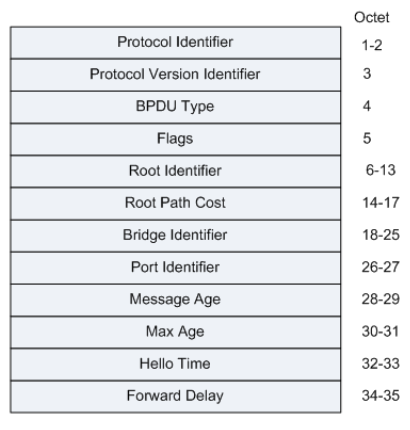
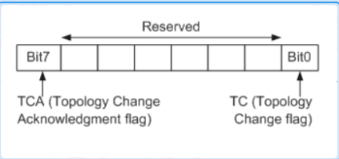
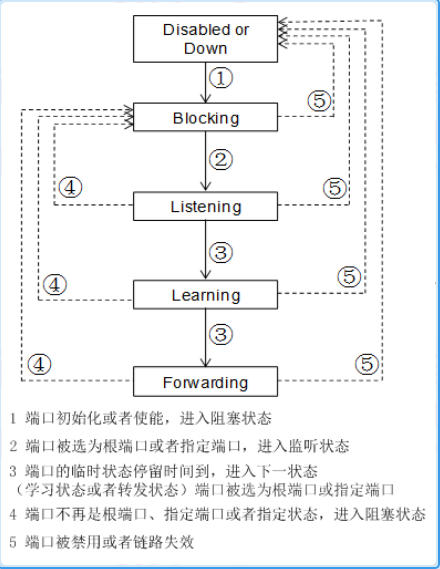
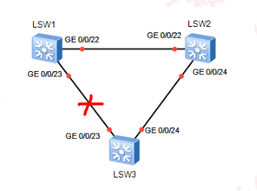
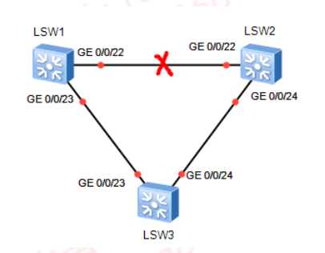
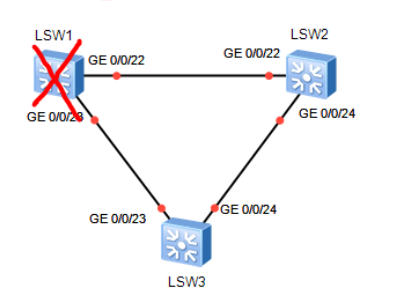
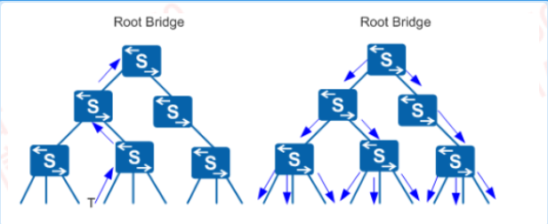
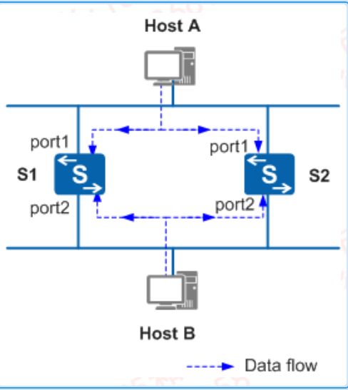

---
# HCIP-STP
layout: pags
title: STP
date: 2025-07-05 11:29:54
tags: Network
categories: 
- [HCIP,7.1STP]
---

### STP

#### STP基本信息

- 基本信息
  - 生成树协议
  - 逻辑阻塞冗余路径
- STP报文类型
  - 桥协议数据单元（BPDU）
  - 组播通告
    - 组播地址：01-80-C2-00-00-00
    - 封装格式：802.3  

#### STP报文类型

BPDU报文结构
 <!-- more -->

BPDU标识部分        
- 协议ID：0       
- 版本        
- 信息类型：配置BPDU,配置BPDU是一种心跳报文
   - 提供保活机制
   - 通告周期：2S 
- 拓扑变更BPDU（TCM）
  - 在设备检测到网络拓扑发生变化时才发出
  - 触发条件 
    - 端口状态变为Forwarding状态
    - 指定端口收到TCN BPDU,复制TCN BPDU发往根桥

BPDU扩展字段
- 标识Flag（见RSTP）
- STP中只使用了其最高位和最低位

- TCN（拓扑变化确认）标志
  - 拓扑变更通告信息确认信息
  - 通知下游设备停止发送TCN BPDU报文
- TC（拓扑变化）标志
  - 主要是上游设备用来告知下游设备拓扑发生变化，请下游设备直接删除桥MAC地址表项，从而达到快速收敛的目的

STP选举参数
- 根网桥ID
- 路径开销
  - 计算方式：参考BPDU接收端口带宽
  - 10M | 100
  - 100M | 19
  - 1G | 4
  - 10G | 2
- 网桥ID
  - 长度8字节
  - 优先级（2字节）
    - 默认32768
    - 范围1-65535
  - MAC地址：6字节
- 端口ID
  - 端口优先级：默认128
  - 端口编号

STP计时器
- 生存时间
  - 每穿越设备累计加1
  - 正常时间推移累加
- 最大老化时间：20S
- BPDU更新周期：2S
- 转发延时：15S

#### 工作原理

STP选举
- 构建无环的转发路径
- 选举原则
  - 选举根网桥
    - 一个广播域仅一个
    - 比较网桥ID
  - 选举结果
    - 仅根桥发送BPDU
  - 选举根端口
    - 非根网桥抵达根网桥开销最小的端口
  - 选举标准
    - 每个非根网桥有且仅有一个
    - 比较低的根网桥的路径开销（Root Path Cost）-(RPC) 
- 选举过程（这里就不进行实验比较了，直接讲述原理）
  - 所有交换机默认本地为根网桥
  - 接收到更优的BPDU接口停止发送本地BPDU，并转发更优的BPDU
  - 转发更优BPDU期间跟新BPDU以下参数
    - 根路径成本
    - 网桥ID
    - 端口ID

STP端口状态迁移

- *Block->Listening
  - 收到根网桥TC----立即
  - 未收到根网桥的TC---->20S
  - 仅接收BPDU
- Listening-->Learning
  - 15S
  - 接收与发送BPDU
- Learning--->Forwarding
  - 15S
  - 接收与发送BPDU
  - MAC地址学习
  
场景一：直连链路故障 

AP端口恢复时间：30S

场景二：非直连链路故障

AP端口恢复时间：50S

场景三：根网桥故障

堵塞端口恢复时间：30S

STP拓扑变化

MAC地址未老化导致流量丢失       
TCN的发送和TC的泛洪

说明：
- TCN用来向上游设备通知拓扑变化
- TCA通知下游设备停止发送TCN BPDU报文
- TC BPDU报文告知下游设备直接删除桥MAC地址表项

1. T点接口发生变更后，下游设备向上游设备发送TCN BPDU报文
2. 上游设备收到TCN BPDU后，仅指定端口出来TCN BPDU报文。其他端口不会处理
3. 上游设备会把配置BPDU报文中的Flags的TCA位置位，然后发送给下游设备告知下游设备停止发送TCN BPDU报文
4. 上游设备复制一份TCN BPDU报文，向根桥方向发送
5. 重复步骤1，2，3，4，直到根桥收到TCN BPDU报文

配置BPDU报文中Flags的TC位和TCA位同事置1后发送，TC位置1是为了通知下游设备直接删除桥MAC地址表项，TCA位置1是为了通知下游设备停止发送TCN BPDU报文

#### 技术背景

二层冗余网络

存在的问题
- 广播风暴
- MAC地址漂移
- 重复帧

STP功能列表
- 消除环路
  - 通过阻塞冗余链路消除网络中可能存在的网络通信环路
- 链路备份
  - 当前活动的路径发生故障时，激活冗余备份链路，恢复网络连通性

    