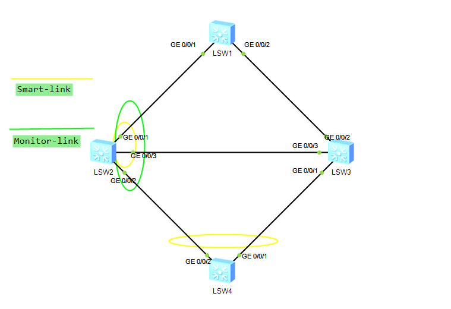

---
# HCIP-STP
layout: pags
title: Smart Monitor Link
date: 2025-07-08 11:24:40
tags: Network
categories: 
- [HCIP,7.1STP]
---

### Smart Link

#### 基本信息

- Smart Link，又叫备份链路。一个Smart Link由两个接口组成，其中一个接口作为另一个接口的备份Smart Link技术特点
- Smart Link技术特点
  - Smart Link常用于双上行组网，提供可靠高效的备份和快速的切换机制
  - 能够实现在双上行组网的两条链路正常情况下，一条链路处于转发状态，而另一条处于阻塞待命状态，从而可避免环路的不利影响
  - 配置和使用更为简洁，便于用户操作 
  - 单主用链路发生故障后，流量会在毫秒级的时间内迅速切换到备用链路上，极大限度的保证了数据的正常转发
- Smart Link基本原理
  - 链路正常工作原理
    - 双上行链路都正常的情况下，主接口处于转发状态，所在的链路是主用链路
    - 从接口处于待命状态，所在链路是备用状态
 <!-- more -->
 

- 链路故障处理原理
  - 通过Flush报文通知设备更新表项
    - 这种方式适用于上游设备支持Smart Link功能，能处理Flush报文
    - 刷新MAC与ARP表项
  - 自动更新流量更新表项
    - 这种方式适用于与不支持Smart Link功能的设备（包括其他厂商）对接的情况，需要上行流量触发


- 链路恢复处理原理
  - 当原主用链路故障恢复时，Interface1将维持在阻塞状态，不进行抢占，从而保持流量稳定
  - 使用Smart Link 组回切功能，需要使用回切功能。当原主用链路故障恢复后，经过回切定时器设定的时间，Smart Link 会自动将流量切换到原主用链路上
  - 使用配置命令强制让Smart Link 立即将流量切换到原主用链路上。


### Monitor Link

#### 基本信息

- Monitor Link是一种接口联动方案，它通过监控设备的上行接口，根据其UP/DOWN状态的变化来触发下行接口UP/DOWNN状态的变化，从而触发下游设备上的拓扑协议进行链路的切换
- Monitor Link 通过监控上行接口所在的链路对下行接口进行同步配置。相互配合工作的上行接口和下行接口组合成 


- Interface1 和Interface2 组成了一个Monitor Link组
- Interface3 和Interface4 组成了一个Monitor Link组
- Monitor Link组
  - 监控链路组
  - 由上行接口和下行接口共同组成
    - 上行接口又称为UPlink接口，是Monitor Link组中受监控者，上行接口故障则表示该Monitor Link组故障，该组的下行接口将都会被强制设为DOWN状态
    - 上行链路也可以是Smart Link组，当上行链路是Smart Link组时，只有当Smart Link组的两个接口都处于inactive状态（包括DOWN）时
    - 下行接口又称为Downlink接口，是Monitor Link组中监控者，下行接口故障不影响上行接口，也不影响其他下行接口
  - 组的成员
    - 单接口
    - 静态聚合组
    - 手工聚合组
- Smart Link组（Smart Link组只能作为上行接口。下行接口的状态随上行接口的变化而变化）

Monitor Link基本原理


- 如果Interface1所在的上行链路发生故障，Monitor Link会将Interface2 强制设为ERROR-DOWN状态
- 当Interface1所在的上行链路恢复正常后，Monitor Link会取消对Interface2强制设定的ERROR-DOWN状态，开启Interface2

### Smart Link 和 Monitor Link综合实验

实验拓扑



配置

```bash
SW1 .SW2,SW3,SW4互联链路禁用STP
    interface g0/0/x 
        undo stp enable
SW4
    stp region-configuartion 
        instance 1 vlan 10 
        instance 2 vlan 20
        active region-configuration
    smart-link group 1 // smart-link配置
        load-balance instance 2 slave //设置负载分担
        restore enable //使能回去功能
        timer wtr 30 //mastrer端口回切时间
        smart-link enable //使能smart-link
        port g0/0/2 master
        port g0/0/1 slave
        flush send control-vlan 1 password simple HUAWEI  //设置Flush报文发送
SW2
    smart-limk group 1
        restore enable 
        smart-limk enable 
        port g0/0/1 master
        port g0/0/3 slave
    monitor-link group 1 
        smart-link group 1 uplink
        port g0/0/2 downlink 1
    interface g0/0/2 
        port link-type trunk
        port trunk allow-pass vlan 2 to 4094
        stp disable 
        smart-limk flush receive control-vlan 1 password simple HUAWEI
```

验证配置


