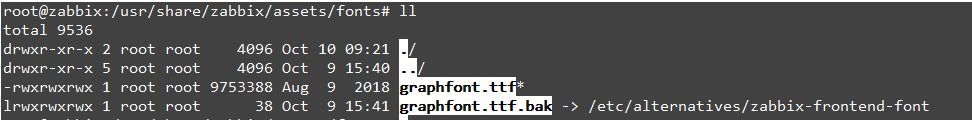
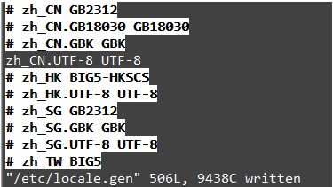
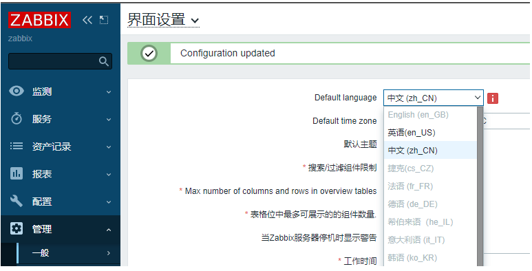
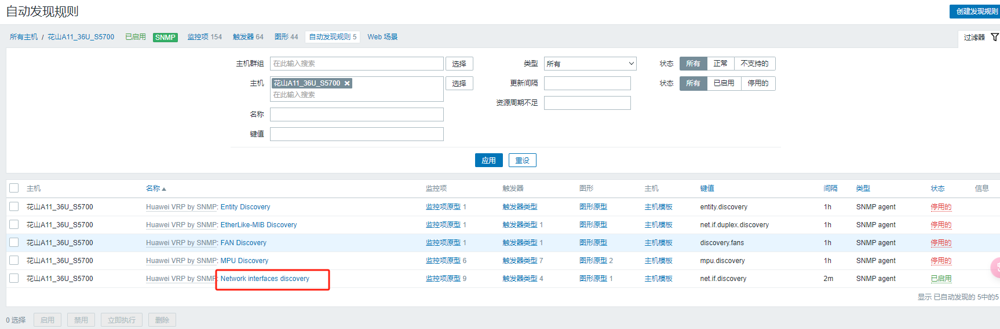
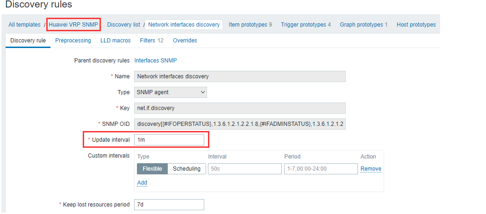
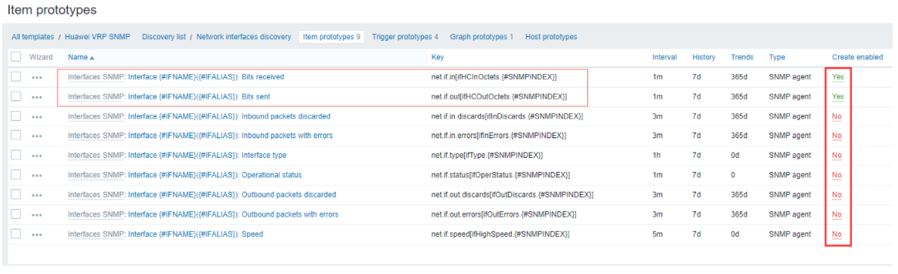
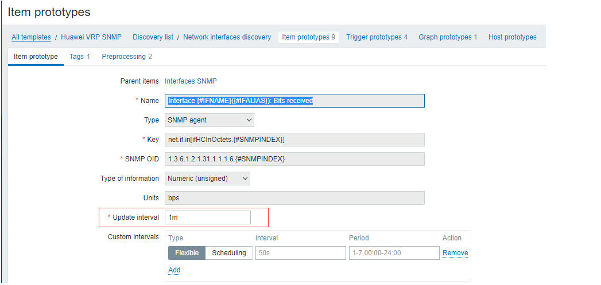
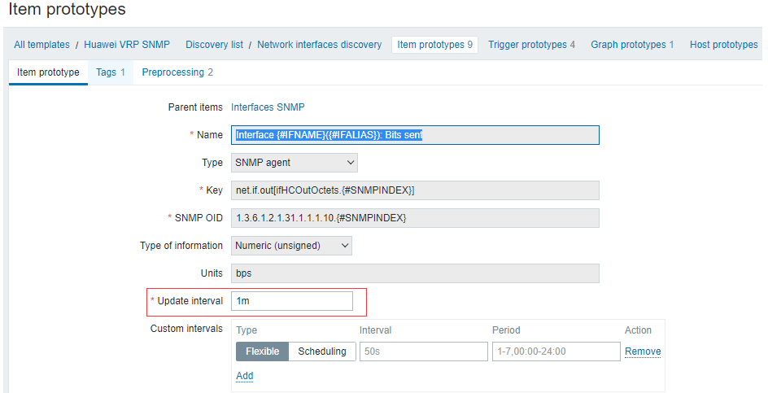
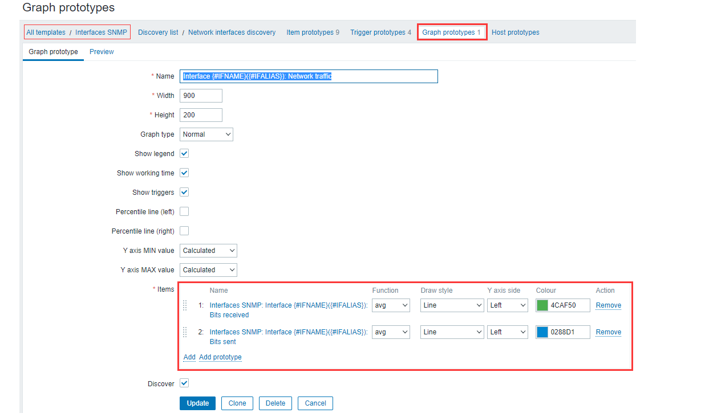
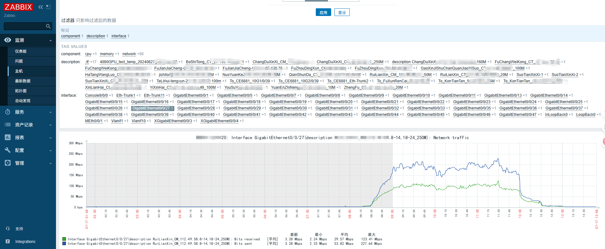

---
# 网络监控
layout: pags
title: Ubuntu部署zabbix
date: 2025-07-17 11:30:54
tags: 网络运维监控部署
categories: 
- [网络运维监控部署] 
---

### Ubuntu安装zabbix（mysql+apache）

服务有两种部署方式

#### 通过shell脚本进行部署
<!-- more -->
脚本
```bash
#!/bin/bash

# 更新系统
echo "Updating system..."
sudo apt update && sudo apt upgrade -y

# 安装必要的工具
echo "Installing necessary tools..."
sudo apt install -y wget vim curl software-properties-common

# 添加 Zabbix 仓库
echo "Adding Zabbix repository..."
wget https://repo.zabbix.com/zabbix/7.2/ubuntu/pool/main/z/zabbix-release/zabbix-release_7.2-1+ubuntu22.04_all.deb
sudo dpkg -i zabbix-release_7.2-1+ubuntu22.04_all.deb
sudo apt update

# 安装 Zabbix Server, Web 界面和 Agent
echo "Installing Zabbix Server, Web interface, and Agent..."
sudo apt install -y zabbix-server-mysql zabbix-frontend-php php-fpm zabbix-nginx-conf zabbix-agent

# 安装 MySQL（MariaDB）并设置数据库
echo "Installing MariaDB and setting up Zabbix database..."
sudo apt install -y mariadb-server
sudo systemctl start mariadb
sudo systemctl enable mariadb

# 设置 MariaDB root 密码
echo "Setting MariaDB root password..."
sudo mysql -e "UPDATE mysql.user SET Password=PASSWORD('YourStrongPassword') WHERE User='root';"
sudo mysql -e "FLUSH PRIVILEGES;"

# 创建 Zabbix 数据库
echo "Creating Zabbix database..."
sudo mysql -u root -pYourStrongPassword -e "CREATE DATABASE zabbix CHARACTER SET utf8mb4 COLLATE utf8mb4_bin;"
sudo mysql -u root -pYourStrongPassword -e "CREATE USER 'zabbix'@'localhost' IDENTIFIED BY 'YourStrongPassword';"
sudo mysql -u root -pYourStrongPassword -e "GRANT ALL PRIVILEGES ON zabbix.* TO 'zabbix'@'localhost';"
sudo mysql -u root -pYourStrongPassword -e "FLUSH PRIVILEGES;"

# 导入 Zabbix 数据库结构
echo "Importing Zabbix database schema..."
zcat /usr/share/doc/zabbix-server-mysql/create.sql.gz | mysql -uzabbix -pYourStrongPassword zabbix

# 配置 Zabbix Server 数据库连接
echo "Configuring Zabbix Server database connection..."
sudo sed -i 's/# DBPassword=/DBPassword=YourStrongPassword/' /etc/zabbix/zabbix_server.conf

# 启动 Zabbix Server 和 Agent
echo "Starting Zabbix Server and Agent..."
sudo systemctl start zabbix-server zabbix-agent nginx php-fpm
sudo systemctl enable zabbix-server zabbix-agent nginx php-fpm

# 配置防火墙
echo "Configuring firewall..."
sudo ufw allow 10051/tcp
sudo ufw allow 80/tcp
sudo ufw reload

# 提示安装完成
echo "Zabbix 7.2 LTS has been successfully installed!"
echo "Access the web interface at http://<your-server-ip>/zabbix"
————————————————
```

- 将上述脚本保存为 install_zabbix.sh

```bash
vim install_zabbix.sh
```

- 给予脚本权限

```bash
chmod +x install_zabbix.sh
```

- 运行脚本

```bash
sudo ./install_zabbix.sh
```

#### 手动部署

1. 下载安装zabbix包：
- 不同系统不同版本软件见官网 [https://www.zabbix.com/cn/download](https://www.zabbix.com/cn/download)

2. 修改DNS新版
```bash
sed -i s/#DNS=.*/DNS=223.5.5.5/g /etc/systemd/resolved.conf
systemctl restart systemd-resolved.service

wget https://repo.zabbix.com/zabbix/5.4/ubuntu/pool/main/z/zabbix-release/zabbix-release_5.4-1+ubuntu18.04_all.deb
dpkg -i zabbix-release_5.4-1+ubuntu18.04_all.deb
apt update
```

3. 安装依赖环境和MySQL

```bash
apt install zabbix-server-mysql zabbix-frontend-php zabbix-apache-conf zabbix-sql-scripts zabbix-agent -y
apt install mysql-server -y
systemctl start mysql.service 
systemctl status mysql.service
```

4. 创建Zabbix数据库

```bash
mysql -uroot -p
mysql> create database zabbix character set utf8 collate utf8_bin;
mysql> create user zabbix@localhost identified by 'zabbix';
mysql> grant all privileges on zabbix.* to zabbix@localhost;
mysql> quit;
```

5. 解压官方附带数据表导入至zabbix数据库:

```bash
zcat /usr/share/doc/zabbix-sql-scripts/mysql/create.sql.gz | mysql -u root -p zabbix
```

6. 修改zabbix配置文件

```bash
vi /etc/zabbix/zabbix_server.conf
DBPassword=zabbix
CacheSize=4G
```

7. 启动服务:

```bash
systemctl restart zabbix-server zabbix-agent apache2
systemctl enable zabbix-server zabbix-agent apache2
```

8. 前端访问

```bash
http://服务器IP/zabbix
Admin
zabbix
```

#### 调优

1. 修改为中文语言

上传一个中文字体到/usr/share/zabbix/assets/fonts ，改名为graphfont.ttf (将原来的graphfont.ttf删掉或者改名,  其实是个软链接)



locale -a    查看已安装的语言

vim /etc/locale.gen,将zh-CN.UTF8 UTF-8注释去掉



执行locale-gen

重启web服务 systemctl restart apache2

重启zabbix服务 systemctl restart zabbix-server

web界面设置，修改语言



模板调整





















生产环境中 有些客户是按流量95值计费的 zabbix的95值调试过于麻烦 所以一般用另一款监控软件（Cacti）来进行95值统计 如果有大佬知道zabbix怎么调95值的 求教程 哈哈

这里简单说明对比一下我现在使用的3款监控软件

1. zabbix  监控精度每分钟刷新一次，数据保存时间二个月，但过一个月流量图就自动压缩了，作为自己排查网络故障的一个工具
2. cacti 监控精度调整至每5分钟刷新一次，数据保存时间三月，减少服务器的负载，作为商务流量计费的工具
3. grafana 对精度和数据保存时间没要求，界面花里胡哨，作为大屏向参观人员展示页面

95计费
   - 弹性带宽介绍95计费：每5分钟取一个点，1个小时12个点，1天288个点，一个月按30天算288*30=8640个点，然后把数值最高的％5的点去掉，剩下的最高带宽就是95计费的计费值了。
   - 计费点数是8208个点。 
   - 有432个点不用计费，就是异常流量的时间在432*5/60=36个小时，即不超过1.5天的异常大带宽（流量），不影响本月的计费。
   - 即：取出所有带宽值，去掉值最高的5%，剩下的最大带宽就是计费带宽。
   - 一般IDC机房大带宽很多是保底+突发带宽来计算，可以被一个或者多个应用共享带宽。每月保底固定的带宽按保底价格计算，超出部分的带宽按超出部分价格计算,超出部分费用采用95计费原则。

这种计费方式是可以进行用流量调度的方式进行偷鸡的 一般运营商还是原来旧的95计费方式，流量大的可以通过调度方式来获利
云厂商现在采用的是增强性95计费规则 这种方式杜绝了偷鸡 具体规则可查阅云厂商文档

