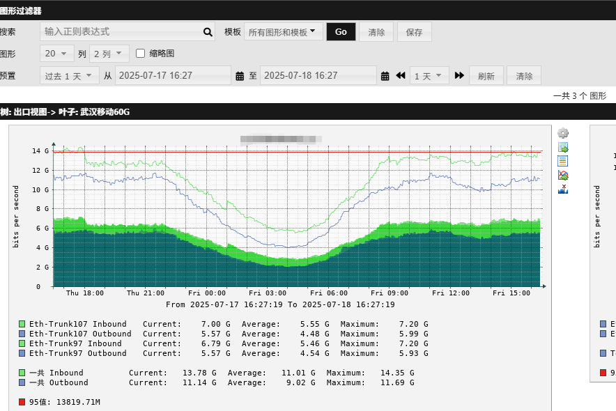

---
# 网络监控
layout: pags
title: Ubuntu部署Cacti
date: 2025-07-18 11:30:54
tags: 网络运维监控部署
categories: 
- [网络运维监控部署] 
---

### Ubuntu部署Cacti

部署前期环境这里就不说了（网卡IP、yun源、系统时区）

创建用户：

```bash
useradd cacti
```

安装cacti依赖环境
<!-- more -->
```bash
apt-get install -y apache2 rrdtool mariadb-server snmp snmpd php php-mysql php-snmp php-xml php-mbstring php-json php-gd php-gmp php-zip php-ldap
```

安装编译环境
```bash
apt install -y build-essential dos2unix dh-autoreconf help2man libssl-dev libmysql++-dev  librrds-perl libsnmp-dev libmysqlclient-dev libmysqld-dev
```

下载cacti软件包

```bash
cd /var/www/html
wget https://www.cacti.net/downloads/cacti-1.2.17.tar.gz
tar zxvf cacti-1.2.17.tar.gz
mv cacti-1.2.17 cacti
chown -R cacti.cacti cacti/
chmod -R a+r cacti
```

Cacti版本根据自己的需求来 

创建cacti日志文件：

```bash
cd /var/www/html/cacti/log
touch cacti.log
touch cacti_stderr.log
chmod 777 cacti.log
chmod 777 cacti_stderr.log
```

修改rra权限

```bash
chown -R cacti.cacti /var/www/html/cacti/rra
chmod 775 /var/www/html/cacti/rra
```

修改cacti子目录权限：

```bash
chmod a+w /var/www/html/cacti/resource/snmp_queries/
chmod a+w /var/www/html/cacti/resource/script_server/
chmod a+w /var/www/html/cacti/resource/script_queries/
chmod a+w /var/www/html/cacti/scripts/
chmod a+w /var/www/html/cacti/log/
chmod a+w /var/www/html/cacti/cache/boost/
chmod a+w /var/www/html/cacti/cache/mibcache/
chmod a+w /var/www/html/cacti/cache/realtime/
chmod a+w /var/www/html/cacti/cache/spikekill/
```

修改Cacti配置文件

```bash
cd /var/www/html/cacti/include
```

有的版本是直接为config.php，有的版本为config.php.dist 示例文件，cp config.php.dist config.php即可

```bash
vi config.php
-----------------------------------
$database_type     = 'mysql';
$database_default  = 'cacti';
$database_hostname = 'localhost';
$database_username = 'cacti';
$database_password = 'cacti';
$database_port     = '3306';
$database_retries  = 5;
$database_ssl      = false;
$database_ssl_key  = '';
```

数据库初始化：

```bash
mysql -u root -p
CREATE DATABASE cacti DEFAULT CHARACTER SET utf8 COLLATE utf8_unicode_ci ;
GRANT ALL PRIVILEGES ON cacti.* TO 'cacti'@'localhost' IDENTIFIED BY 'cacti';
GRANT SELECT ON mysql.time_zone_name TO cacti@localhost;
ALTER DATABASE cacti CHARACTER SET utf8mb4 COLLATE utf8mb4_unicode_ci;
set global collation_server=utf8mb4_unicode_ci;
set global character_set_client=utf8mb4;
set global max_allowed_packet=17700000;
set global join_buffer_size=20971520;
set global innodb_file_per_table=ON;
set global innodb_file_format=Barracuda;
set global innodb_large_prefix=ON;
set global innodb_flush_log_at_trx_commit=2;
FLUSH PRIVILEGES;
exit;
```

MySQL时区支持：

```bash
mysql_tzinfo_to_sql /usr/share/zoneinfo | mysql -u root -p mysql
```

将cacti安装包中的cacti数据库导入：

```bash
mysql -u root cacti < /var/www/html/cacti/cacti.sql
```

创建采集器计划任务：

```bash
touch /etc/cron.d/cacti
vi /etc/cron.d/cacti
*/5 * * * * apache php /var/www/html/cacti/poller.php &>/dev/null
```

添加系统服务：

```bash
vi /var/www/html/cacti/service/cactid.service
------------------------
[Unit]
Description=Cacti Daemon Main Poller Service
After=network.target
#
[Service]
Type=forking
User=cacti
Group=cacti
EnvironmentFile=/etc/sysconfig/cactid
ExecStart=/var/www/html/cacti/cactid.php
Restart=always
RestartSec=5s
#
[Install]
WantedBy=multi-user.target
--------------------------
mkdir /etc/sysconfig
touch /etc/sysconfig/cactid
cp -p /var/www/html/cacti/service/cactid.service /etc/systemd/system
systemctl enable cactid
systemctl start cactid
systemctl status cactid
```

修改php.ini配置以满足cacti需求：        
php.ini的位置不同版本不一样，具体已搜索到的为准 find / -name php.ini        

```bash
vi /etc/php/7.2/apache2/php.ini
memory_limit=1000M
max_execution_time=90
date.timezone=Asia/Shanghai 
 
vi /etc/php/7.2/cli/php.ini
memory_limit=1000M
max_execution_time=90
date.timezone=Asia/Shanghai
```

安装spine，cacti默认采用cmd.php作为轮询器，spine效率更高

```bash
wget https://www.cacti.net/downloads/spine/cacti-spine-latest.tar.gz
tar zxvf cacti-spine-latest.tar.gz
#修改图形右侧水印，可选操作 ，新版本已经支持在管理页面关闭水印
cd cacti-spine-latest/src
vi rrd_graph.c
 找到水印字段，修改为想要的文字，或直接删除
#
cd ..
./bootstrap
./configure
make && make install
#
chown root:root /usr/local/spine/bin/spine
chmod +s /usr/local/spine/bin/spine
```

编辑Cacti Spine配置文件，并将Cacti数据库名称，用户名和密码添加到Spine .conf文件中.有的版本为spine.conf.dist 示例文件，cp spine.conf.dist spine.conf即可

```bash
vi /usr/local/spine/etc/spine.conf
DB_Host localhost
DB_Database cacti
DB_User cacti
DB_Pass cacti
DB_Port 3306
DB_PreG 0
Cacti_Log     /var/www/html/cacti/log/cacti.log
```

修改apache监听端口，按需配置：
```bash
vi /etc/apache2/ports.conf
Listen 80
```

重启web服务：

```bash
systemctl restart apache2
```

安装完毕，访问 http://IP/cacti 进入安装向导，初始账号密码admin/admin ，登录后强制修改密码。

#### 调优

中文乱码需上传字库
- 可直接把自己电脑的C:\Windows\Fonts中的字库上传到/usr/share/fonts/turetype/中

时间筛选bug，无法筛选指定时间段图形的解决办法

```bash
源码中写死了一个时间戳：1600000000 也就是2024/9/13 20:26:40，超过这个时间的cacti便会无法放大图形
cd /var/www/html/cacti
找到graph_xport.php 和 cp graph_image.php 这2个文件，将代码片段
if (!empty($_GET[“graph_end”]) && $_GET[“graph_end”] < 1600000000 )
中的1600000000，替换为3200000000
保存即可。
```

新版本cacti，月数据为2小时取点，精度不满足使用需求，需对配置进行修改：
- 将数据源配置文件5 Minute Collection 中，Monthly的跳数（步进，steps）设置为1，行数大于8928， timespan设置为2678400
- 由于该配置为默认配置，无法修改，需要手动修改数据库表项

```bash
mysql -u root -p
use cacti;
select * from data_source_profiles_rra;
执行
UPDATE data_source_profiles_rra SET `steps`=1,`rows`=9999, `timespan`=2678400 WHERE id=3;
(新版本mysql将rows用做内部变量，需要加反引号)
```

修改完成后，重建poller缓存（如果是先修改，后加入设备则不需要）

其他参数调整查阅Cacti配置文档




