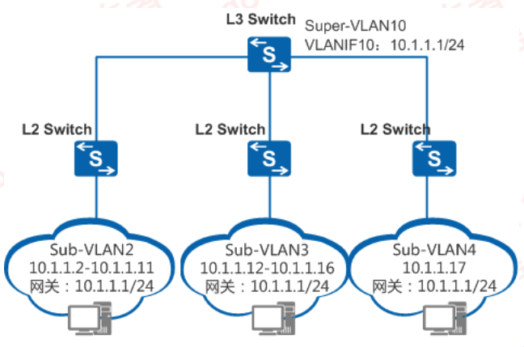
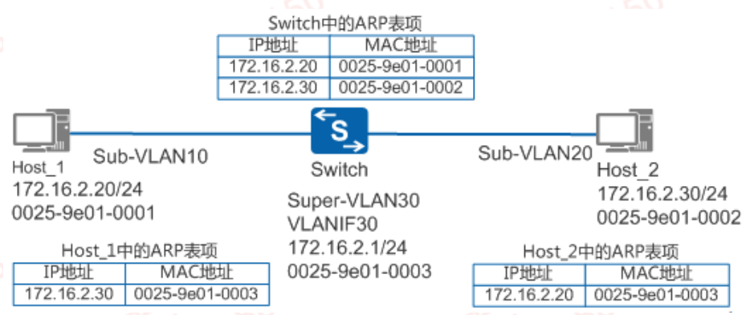
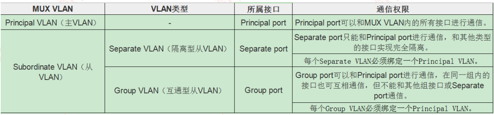
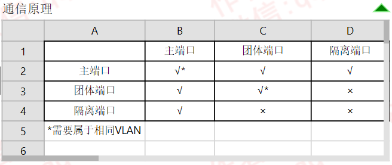

---
# HCIP-VLAN高级特性
layout: pags
title: VLAN高级特性
date: 2025-07-05 11:29:54
tags: Network
categories: 
- [HCIP,6.1VLAN高级特性]
---

### SuperVLAN

- 基本信息
  - 也称为VLAN聚合
  - 在一个物理网络内，用多个VLAN（称为Sub-VLAN）隔离广播域
  - 允许子VLAN使用同一个子网合网关，节约IP资源地址
    - 传统场景中，不同VLAN使用不同地址段
    - 若不同vlan使用相同网段，每个VLAN之间通信消耗额外的地址作为网关
- SuperVLAN组件
  - VLAN聚合通过定义Super-VLAN和Sub-VLAN
  - Sub-VLAN
    - 只包含物理接口，不能建立三层VLANIF接口，用于隔离广播域
  - Super-VLAN
    - 只建立三层VLANIF接口，不包含物理接口，与子网网关对应
  - Sub-VLAN之间默认不能访问，需要开启Proxy-ARO实现通信
 <!-- more -->
 VLAN聚和实现示意图

Sub-vlan2、Sub-VLAN3和Sub-VLAN4共用一个子网10.1.1.1/24      
该网络就只有一个子网号10.1.1.0、一个子网缺省网关地址10.1.1.1和一个网定向广播地址10.1.1.255      

- VLAN间Proxy-ARP
  -  适用场景：处于相同网段但属于不同的VLAN，需要相互通信

 

### MUX VLAN

- 基本信息
  - MUX VLAN(Multiplex VLAN)提供了一种通过VLAN进行网络资源控制的机制
  - MUX VLAN分类

支持跨交换机部署        
部署 MUX VLAN的端口无法支持端口安全相关特性     
MAC地址学习控制功能     
802.1X      
MAC地址认证     

原理描述        

