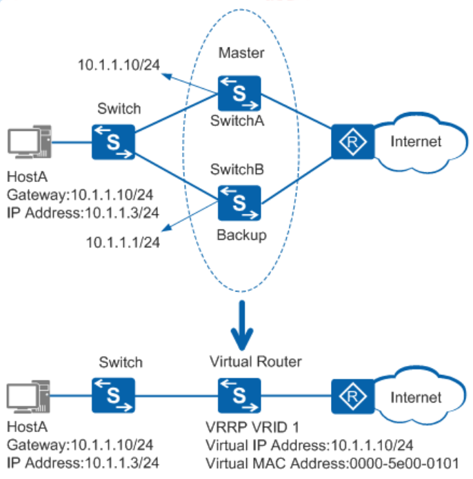

---
# HCIP-VRRP
layout: pags
title: VRRP
date: 2025-07-08 11:24:40
tags: vrrp
categories: 
- [HCIP,8.1VRRP]
---

### VRRP

#### 基本信息

虚拟路由冗余协议

- 虚拟多台网关为一台虚拟网关
- 用户网关指向虚拟网关
- 提供网关冗余与负载分担
- 协议号：112
- 版本分类
  - V2----仅支持IPV4
  - V3----支持IPV4和IPV6
- 信息类型
  - Advertisement
  - 组播通告
    - 组播地址：224.0.0.18
    - 目的MAC地址:01-00-5e-00-00-12
  - 通告周期：1s
  - 超时时间：3S
<!-- more -->
####  工作原理

- VRRP路由器：运行VPPR协议的设备
- 虚拟路由器：又称VRRP备份组由一个Master设备和多个Backup设备组成，被当作一个共享局域网内主机的缺省网关
- Master路由器：承担转发报文任务的VRRP设备
- Backup路由器：一组没有承担转发任务的VRRP设备，当Master设备出现故障时，他们将通过竞选成为新的Master设备
- VRID：虚拟路由器的标识
- 虚拟IP地址：虚拟路由器的IP地址
- IP地址拥有者：如果一个VRRP设备将虚拟路由器IP地址作为真实的接口地址，则该设备被称为IP地址拥有者。
  - 此场景优先级自动置外255 
- 虚拟MAC地址：虚拟路由器根据虚拟路由器ID生成的MAC地址
  - 当虚拟路由器回应ARP请求时，使用虚拟MAC地址，而不是接口的真是MAC地址
 
VRRP角色选举

- IP优先级与IP地址（选择较大）
  - 如果设备的优先级为255，则直接成为Master设备
  - 如果设备的优先级小于255，则会先切换至Backup状态
- 抢占默认启用

VRRP状态机

- 初始状态（Initialize）
  - 该状态为VRRP不可用状态，在此状态时设备不会对VRRP报文做任何处理
  - 通常刚配置VRRP时或设备检测到故障时会进入Initialize状态
  - 收到接口Up的信息后，如果设备的优先级为255，则直接成为Master设备；如果设备的优先级小于255，则会切换至Backup状态
- 活动状态（Master）
  - 定时（Advertisemenrt Interval） 发送VRRP通告报文
  - 以虚拟MAC地址响应对虚拟IP地址的ARP请求
  - 转发目的MAC为虚拟MAC的数据帧---转发实际流量
  - 响应用户ARP请求
  - 如果它是这个虚拟IP地址的拥有者，则接收目的IP地址为这个虚拟IP地址的IP报文。否则，丢弃这个IP报文
- 备份状态（Backup）
  - 监听Master的状态---Backup设备在该定时器超时后仍未收到通告报文，则会转换为Master状态
  - 不响应用户ARP请求
  - 丢弃目的MAC为虚拟MAC的数据帧
  - 如果收到比自己优先级小的报文且该报文优先级不是0，丢弃报文，立刻成为Master
  - 如果收到报文优先级是0。定时器时间设置为Skew_time（偏移时间）
  - Back切换到Master
    - Master Down---切换时间=（3 * Advertisement_Interval）+ Skew_time（偏移时间） 
    - Skew_Time = (256-Priority) / 256
    - 接收到更低的VRRP通告-------立即切换
    - 接收到优先级为0的CRRP通告---1切换时间=（256-Priority ）/ 256
    - Master 与 Backup选举比较优先级与IP地址（选择较大）
    - 选举具有抢占性
    - 优先级范围：0-255

