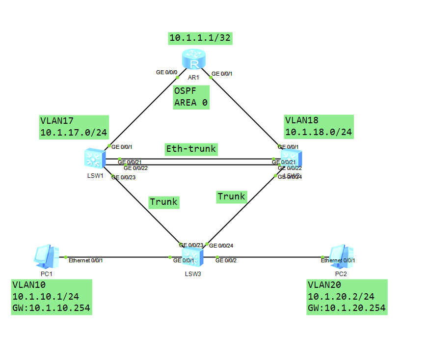
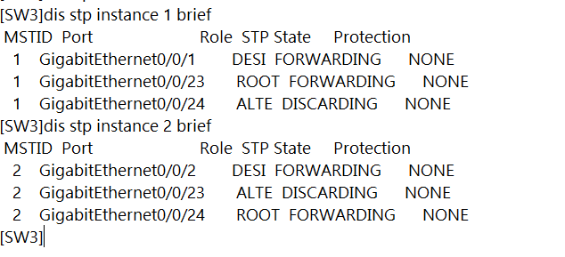
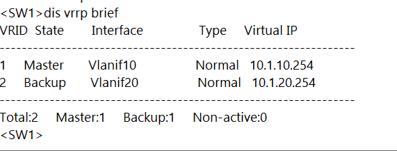
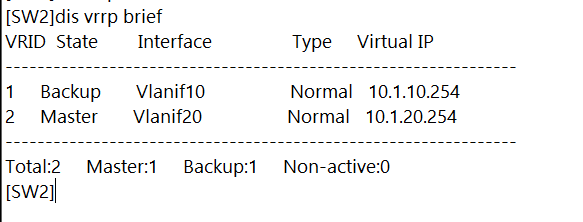
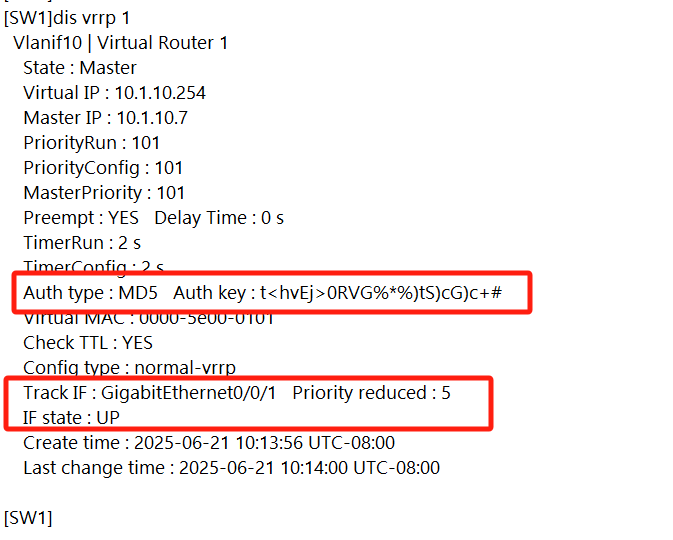

---
# VRRP综合实验
layout: pags
title: VRRP综合实验
date: 2025-06-20 01:23:54
tags: Network
categories: 
- Network
---

### 环境描述

- R1,S1,S2部署OSPF区域0
- VLAN10,VLAN20的网关加入OSPF区域0
- PC1，PC2分别位于VLAN10 ，VLAN20

### 实验拓扑



### 实验需求

1. 配置MST实现VLAN10，VLAN20负载分担
2. 配置VRRP实现配合MST实现负载分担
3. 若上行链路故障，自动切换VRRP主备角色
4. 避免新加入的交换机修改VRRP组网结构

### 实验解法

配置（互联配置略）

```bash
S1
    vlan batch 10 17 20 
    interface eth 1 
        port link-type trunk
        port trunk allow-pass vlan 2 to 4094
    interface g0/0/1
        port link-type access
        port  default vlan 17
    interface g0/0/21
        eth 1 
    interface g0/0/22
        eth 1 
    interface g0/0/23 
        port link-type trunk
        port trunk allow-pass vlan 2 to 4094
S2
    vlan batch 10 18 20
    interface eth 1
        port link-type trunk 
        port trunk allow-pass vlan 2 to 4094
    interface g0/0/1
        port link-type access
        port default vlan 18
   interface g0/0/21
        eth 1
    interface g0/0/22
        eth 1
    interface g0/0/24
        port link-type trunk
        port tru
        nk allow-pass vlan 2 to 4094
```

配置MST

```bash
S1,S2,S3
    stp region-configuration 
        region-name MST
        revision-level 1
        instance 1 vlan 10
        instance 2 vlan 20
        active region-configuration
    S1
        stp instance 1 root primary 
        stp instance 2 root secondary
    S2
        stp instance 2 root primary
        stp instance 1 root seconday
```

配置VRRP

```bash
S1
    interface Vlanif10
        ip address 10.1.10.7 24
        vrrp vrid 1 virtual-ip 10.1.10.254
        vrrp vrid 1 priority 101
        vrrp vrid 1 timer advertise 2
        vrrp vrid 1 track interface g0/0./1 reduced 5
        vrrp vrid 1 authentication-mode md5 HUAWEI
    interface Vlanif20
        ip address 10.1.20.7 255.255.255.0
        vrrp vrid 2 virtual-ip 10.1.20.254
S2
    interface Vlanif 10
        ip address 10.1.10.8 255.255.255.0
        vrrp vrid 1 virtual-ip 10.1.10.254
        vrrp vrid 1 timer advertise 2
        vrrp vrid 1 authentication-mode md5 HUAWEI
    interface Vlanif20
        ip address 10.1.20.8 255.255.255.0
        vrrp vrid 2 virtual-ip 10.1.20.254
        vrrp vrid 2 priority
```

### 验证配置

验证MSTP负载分担



验证VRRP负载分担





验证CRRP端口追踪与安全




