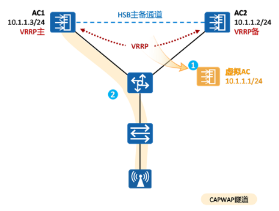

---
# HCIP-大型WLAN组网
layout: pags
title: 高可靠性技术
date: 2025-07-11 10:24:45
tags: Network
categories: 
- [HCIP,11.1大型WLAN组网]
---

### 高可靠技术

1. AC高可靠概述

- 在WLAN组网中，为保证组网的可靠性，常见的备份技术技术有：
  - VRRP双热机备份（主备）
  - 双链路冷备份
  - 双链路热备份
  - N+1备份
- 为了保证WLAN业务的稳定运行，热备份（Host-StandbyBackup）机制
- 可以保证在主设备故障时业务能够不中断的顺利切换到备份设备
<!-- more -->
2. VRRP双机热备

- 两台AC组成的VRRP组。主、备AC对AP始终显示为同一个虚拟IP地址，主AC通过Host-Standby（HSB）主备通道同步业务信息到备AC上 
- 两台AC通过VRRP协议产生一台“虚拟AC”，缺省情况下，主AC担任虚拟AC的具体工作，但主AC故障时，备AC接替其工作。所以AP与“虚拟AC”建立CAPWAP隧道
- AP只看到一个AC的存在，AC间的切换由VRRP决定
- 这种方式一般将主备AC部署在同一地理位置，和其他备份方式比较，其业务切换速度非常快。

3. HSB相关概念

-  HSB（Hot Standby，热备份）是华为主备公共机制
-  主备服务（HSB service ）：建立和维护主备通道，为各个主备业务模块提供通道通判事件和报文发送\接受接口
-  主备备份组（HSB group）：HSB备份组内部绑定HSB service,为各个备份业务模块提供数据备份通道
  - HSB备份组与一个VRRP实例绑定，借用VRRP机制协商出主备实例。同时，HSB备份组还负责通知各个业务模块处理批量备份、实例备份、主备切换等事件。   

4. HSB主备服务

- HSB主备服务负责在两个互为备份的设备间建立主备备份通道，维护主备通到的链路状态，为其他业务提供报文的收发服务，并在备份的链路发生故障时通知主备业务备份组进行相应的处理
- HSB主备服务主要包括两个方面：
  - 建立主备备份通道
  - 维护主备通道的链路状态

5. 数据同步

- 基于VRRP双机热备备份信息包括用户表项、CAPWAP链路信息以及AP表项等信息，备份的方式有实时备份、批量备份，定时备份
  - 批量备份：主用设备将已有的会话表项一次性同步到新加入的备份设备上，使主备AC信息对齐，这个过程称为批量备份。批量备份会在AC主备确立时进行触发。
  - 实时备份：主用设备在产生新表项或表项变化后会及时备份到备份设备上
  - 定时同步：备份设备会每隔30分钟检测其已有会话表项与主用设备是否一致，若不一致则将主用设备上的会话表项同步到备用设备上 

6. VRRP双机热备配置

- 创建VRRP备份组并进行配置虚拟IP地址
- 创建HSB主备服务，建立HSB主备备份通道的IP地址和端口号
- 创建HSB备份组，配置HSB备份组绑定HSB主备服务、VRRP备份组、WLAN业务以及DHCP
- 使能HSB备份组，HSB备份组使能后，对HSB备份组的相关配置才会生效
- 检测VRRP热备份配置结果

