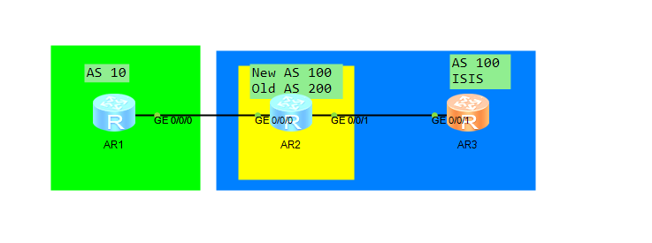
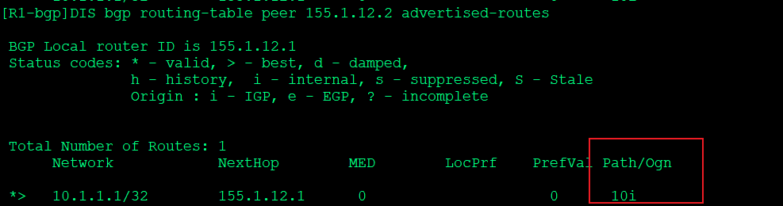
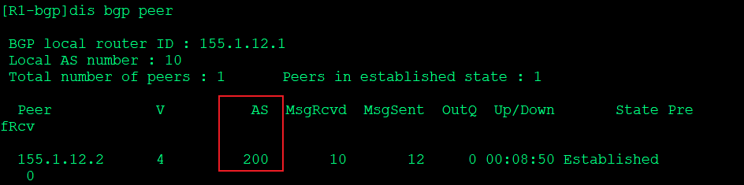
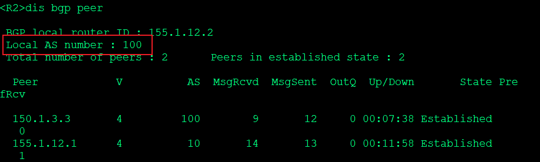

---
# HCIP-BGP
layout: pags
title: Fake-as实验
date: 2025-07-02 12:29:54
tags: Network
categories: 
- [HCIP,4.2BGP路径属性]
---

- 实验拓扑



 <!-- more -->

 - 实验需求     
过滤源自AS包含私有AS的前缀      
不修改R1的配置，迁移R2到AS100

- 实验配置

IP地址，基本路由配置（略） 


```bash
R1
    bgp 10 
    peer 155.1.12.2 as-number 200
    ipv4-family unicast
        undo synchronization
        network 10.1.1.1 32 route-pilicy AS_PATH
        peer 155.1.12.2 enable 
        peer 155.1.12.2 public-as-only   
    ip ip-prefix NET1 index 10 permit 10.1.1.1 32
    route-policy AS_PATH permit node 10
       if-match ip-prefix NET1
    apply as-path 65002 65003 additive  
R2
    bgp 100
    peer 150.1.3.3 as-number 100
    peer 150.1.3.3 connect-interface Loopback0
    peer 1555.1.12.1 as-number 10
    peer 155.1.12.1 fake-as 200     
    ipv4 family unicast
        undo synchronization
        peer 150.1.3.3 enable
        peer 150.1.3.3 next-hop-local
        peer 155.1.12.1 enable
R3
    route-policy SET_AS_PATH permit node 10
          if-match ip-prefix NET3
          apply as-parth 10 overwirte    
   ip ip-prefix NET3 index 10 premit 10.1.3.3 32
   bgp 100
          peer 150.1.2.2 as-number 100
          peer 150.1.2.2 connect-interface Loopback0
          ipv4-family unicast
                 undo synchronization
                 network 10.1.3.3 32 route-policy SET_AS_PATH 
                 peer 150.1.2.2 enable
```

- 验证配置

验证public-as-only



验证fake-as






