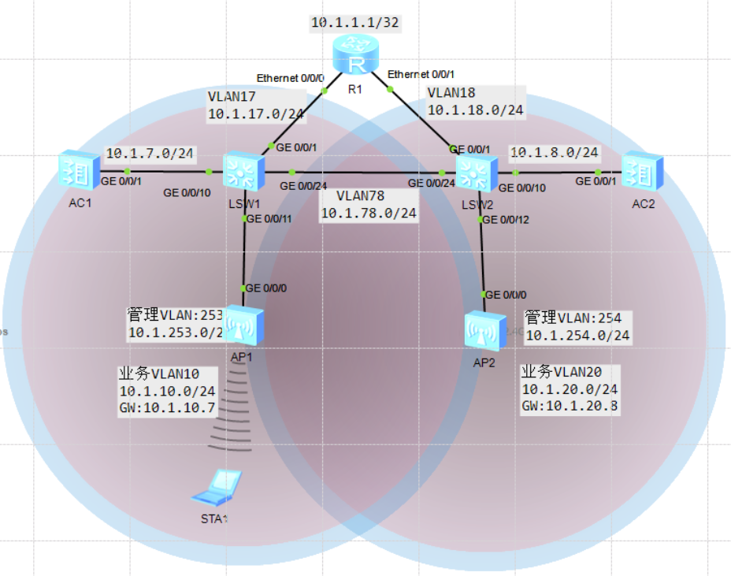
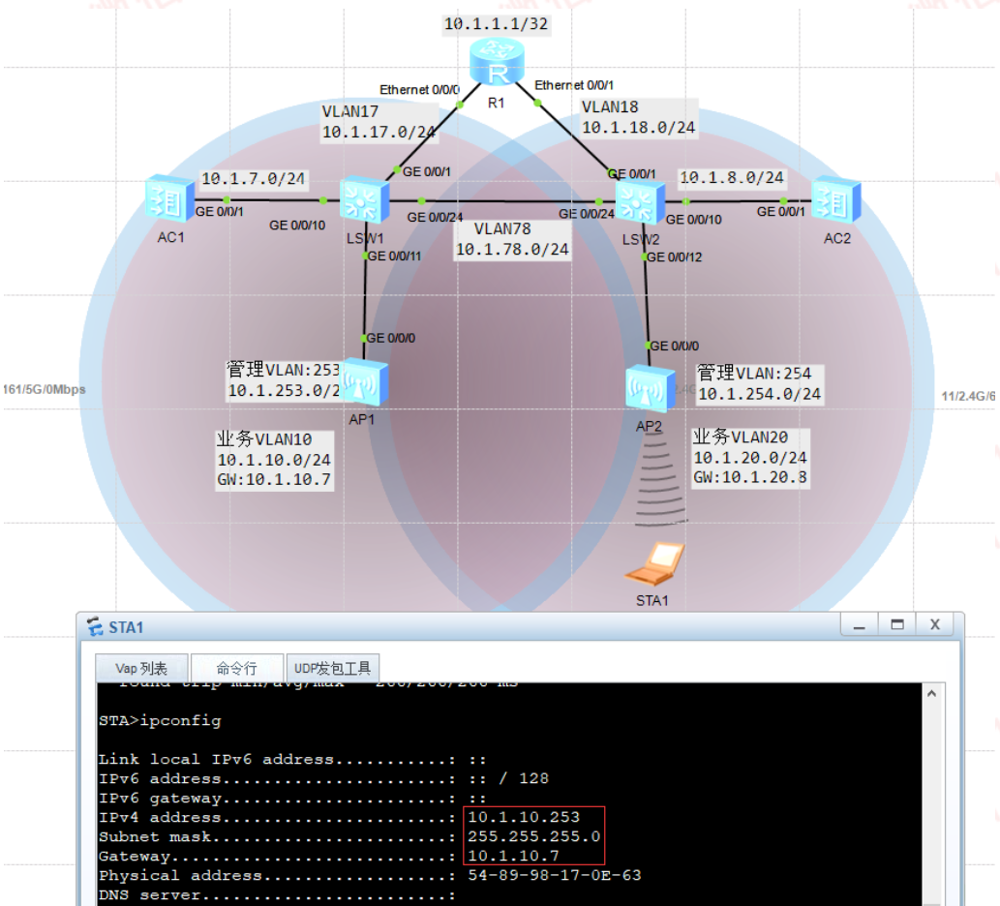
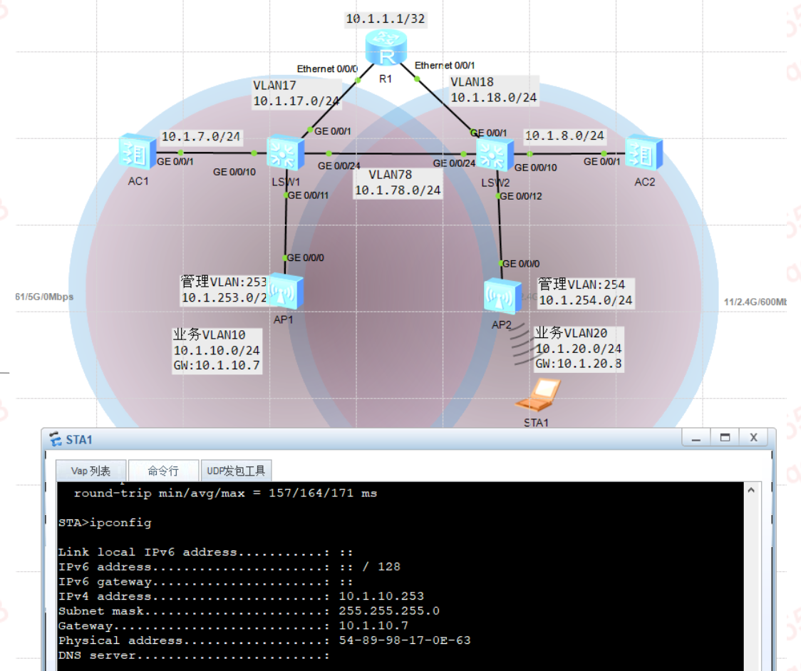

---
# HCIP-大型WLAN组网
layout: pags
title: 三层漫游实验
date: 2025-07-11 8:24:40
tags: Network
categories: 
- [HCIP,11.1大型WLAN组网]
---

### 验证三层漫游直接转发

拓扑


<!-- more -->
实验需求
1. 验证三层漫游直接转发模式
2. AP1业务VLAN10，AP2业务VLAN20

实验配置

```bash
底层互联配置（略）
AC1配置
    wlan 
        security-profile name SEC_PRO
            security wpa2 psk pass-phrase Huawei@123 aes 
        ssid-profile name SSIF_PRO
            ssid HUAWEI
        vap-profile name VAP_PRO
            service-vlan vlan-id 10
            ssid-profile SSID_PRO
            security-profile SEC_PRO
        mobility-group name MOB_GROUP
            member ip-address 10.1.7.10
            member ip-address 10.1.8.10
    ap-id 1 type-id 45 ap-mac 00e0-fc0a-1bb0 ap-sn  210235448310F44ef610
        ap-name AREA_1
        radio 0
            vap-profile VAP_PRO wlan 1
        radio 1
            vap-profile VAP_PRO wlan 1
    vlan  batch 7 10 20
    interface Vlanif 7
        ip add 10.1.7.10 24
    capwwap source interface vlanif 7

AC2配置
    wlan
        security-profile name SEC_PRO
            security wpa2 psk pass-phrase Huawei@123 aes
        ssid-profile name SSID_PRO
            ssid HUAWEI
        vap-profile name VAP_PRO
            service-vlan vlan-id 20
            ssid-profile SSID_PRO
            security-profile SEC_PRO
        mobility-group name MOB_GROUP
            member ip-address 10.1.7.10
            member ip-adress 10.1.8.10
        ap-id 1 type-id 45 ap-mac 00e0-fc0a-1bb0 ap-sn 210235448310F44EF610
            ap-name AREA_1
            radio 0
                vap-profile VAP_PRO wlan 1
            radio 1
                vap-profile VAP-PRO wlan 1
        vlan batch 8 10 20
        interface Vlanif8
            ip address 10.1.8.10 255.255.255.0
        capwap source interface vlanif8
```
验证三层直接转发



### 验证三层漫游隧道转发

拓扑图和上面一样

实验需求
1. 验证三层漫游隧道模式
2. AP1业务VLAN10,AP2业务VLAN20

实验配置

```bash
底层互联配置（略）
AC1配置
    wlan 
        security-profile name SEC_PRO
        security-profile wpa2 psk pass-phrase Huawei@123 ase
        ssid-profile name SSID_PRO
            ssid HUAWEI
        vap-profile name VAP_PRO
            forward-mode tunnel
            service-vlan vlan-id 10
            ssid-profile SSID_PRO
            security-profile SEC_PRO
        mobility-group name M0B_GROUP
            member ip address 10.1.7.10
            member ip address 10.1.8.10
        ap-id 1 type-id 45 ap-mac  00e0-fc0a-1bb0 ap-sn 210235448310F44EF610
            ap-name AREA_1
            radio 0
                vap-profile VAP_PRO wlan 1
            radio 1
                vap-profile VAP-PRO wlan 1
    vlan batch 7 10 20
    interface Vlanif7
        ip address 10.1.7.10 255.255.255.0
    capwap source interface vlanif7

AC2配置
    wlan 
        security-profile name SEC_PRO
        security-profile wpa2 psk pass-phrase Huawei@123 ase
        ssid-profile name SSID_PRO
            ssid HUAWEI
        vap-profile name VAP_PRO
            forward-mode tunnel
            service-vlan vlan-id 20
            ssid-profile SSID_PRO
            security-profile SEC_PRO
        mobility-group name M0B_GROUP
            member ip address 10.1.7.10
            member ip address 10.1.8.10
        ap-id 1 type-id 45 ap-mac  00e0-fc0a-1bb0 ap-sn 210235448310F44EF610
            ap-name AREA_1
            radio 0
                vap-profile VAP_PRO wlan 1
            radio 1
                vap-profile VAP-PRO wlan 1
        vlan batch 8 10 20
        interface Vlanif8
                ip address 10.1.8.10 255.255.255.0
        capwap source interface vlanif8
```

验证三层漫游隧道转发



