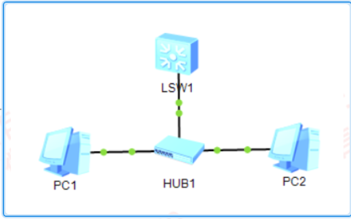
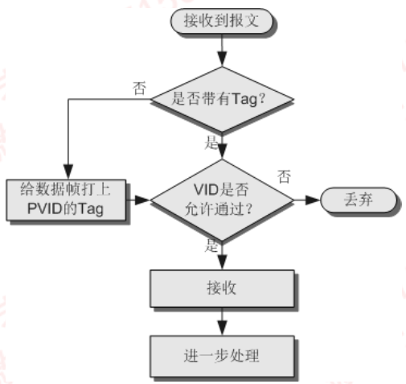
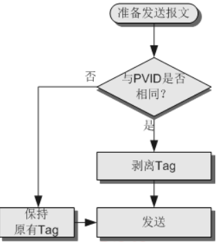
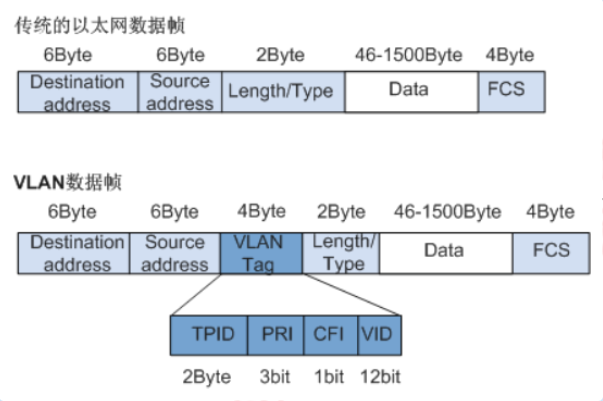
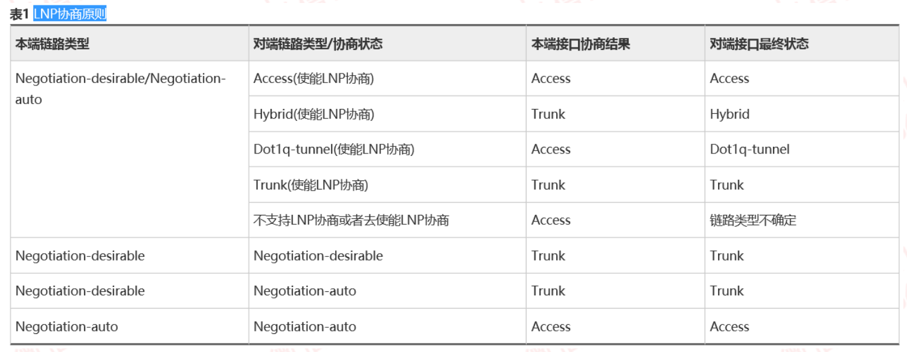
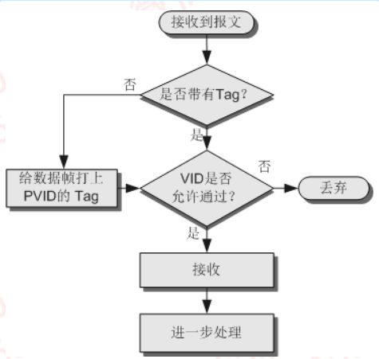
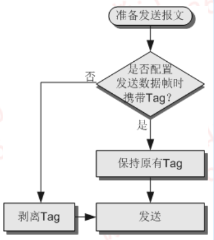
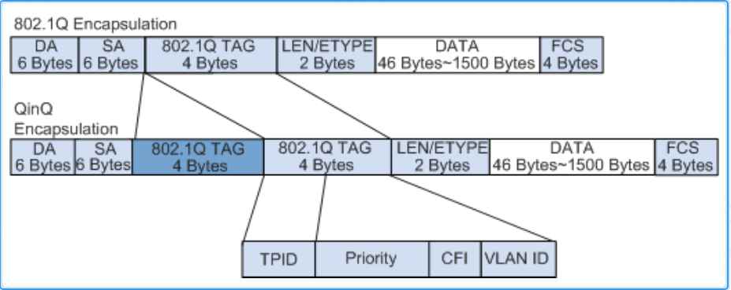

---
# HCIP-交换机端口类型
layout: pags
title: 交换机端口类型
date: 2025-07-05 11:29:54
tags: Network
categories: 
- [HCIP,5.1交换机端口类型] 
---

### 交换机工作原理

- 学习：基于数据帧源MAC构建MAC地址表
- 转发：已知单播
- 泛洪：未知单播；组播；广播
- 丢弃
   - 数据帧校验失败
   - 黑洞MAC地址表项
   - access端口接收到数据帧的VLAN ID≠接口PVID
   - 源MAC与目的MAC位于同一端口  
 <!-- more -->



### 交换机端口类型

1. Access接口

- 基本信息        
   - 仅允许唯一的VLAN ID 通过本接口
   - 添加的VLAN ID 为接口PVID
   - 使用Access接口发往对端设备的以太网帧永远是不带标签的帧
  
- Access处理过程

- 接收过程


- 发送过程


配置
   
接口规划为Access接口

```bash
    vlan 10
    interface g0/0/1 
        port link-type access
        port default vlan 10
    display port vlan g0/0/1  
    nterface g0/0/1 
    port discard tagged-packet  //（可选）配置接口丢弃入方向带VLAN Tag的报文
```

2. Trunk接口

- 基本信息
  - 允许多个VLAN的帧带Tag通过，但只允许一个VLAN的帧从该类接口上发出时不带Tag（即剥除Tag）
  - 提升网络扩展性
  - 允许多个VLAN    的帧（带Tag标记）传输

- 工作原理
- 接收过程



- 发送过程



- VLAN标签
  - 交换机利用VLAN标签中的VID来识别数据帧所属的VLAN
  - 交换机内部处理的数据帧一律都是Tagged帧



- 标签协议标识符，表示数据帧类型
- Prioity,表示数据帧的802.1p优先级
- 标准格式指示位，表示MAC地址在不同的传输介质中是否以标准格式进行封装，用于兼容以太网和令牌环网
- VLAN ID，表示该数据帧所属VLAN的编号

- 常用设备收发数据帧的VLAN标签情况
  - 用户主机、服务器、HUB、傻瓜交换机只能收发Untagged帧
  - 交换机、路由器和AC即能收发Tagged帧，也能收发Untagged帧。
  - 语音终端、AP等设备可以同时收发一个Tagged帧和一个Untagged帧

- 缺省VLAN
  - 缺省VLAN又称PVID（Port Default VLAN ID）
  - 缺省VLAN均为VLAN1
  - 当交换机收到Untagged帧时由接口上的缺省VLAN决定添加Tag
  - 数据帧处理方式
    - 接收Untagged的数据帧，添加PVID对应的Tag
    - 接收到Tag的数据帧，不添加PVID对应的Tag
    - 当接口发送数据帧时，如果发现此数据帧的Tag的VID值与PVID相同，则交换机会将Tag去掉，然后再从此接口发送出去

- 修改缺省VLAN
  - 对于Accesss接口，缺省VLAN就是它允许通过的VLAN，修改接口允许通过的LAN即可更改接口的缺省VLAN
  - 对于Trunk接口和Hybrid接口，一个接口可以允许多个VLAN通过，但是只能由一个缺省VLAN，修改接口允许通过的VLAN不会更改接口的缺省VLAN

- LNP
  - 链路类型协商协议
  - 动态协商以太网接口的链路类型位Access或者Trunk
  - 链路类型
    -  Negotiation-desirable:：主动发送LNP报文
    -  Negotiation-auto ：不会主动发送LNP报文
    -  协商失败时，接口的链路类型为Access
  - LNP协商原则



配置    
1. 全局启用

```bash
 undo lnp disable  //默认启用LNP协商,全局使用链路类型自协商功能
 ```

2. 接口启用

```bash
inter g0/0/0 
  undo port negotiation disable
```

3. 验证配置

```bash
display lnp interface g0/0/1 
display lnp summary
```

3. Hybrifd接口

- 基本信息
  - 允许多个VLAN的帧带Tag通过，且允许从该类接口发出的帧根据需要配置某些VLAN的帧带Tag，某些VLAN的帧剥离Tag
- 接收过程



- 发送过程



- 总结
  - 对于处理无标签的数据帧
    - 添加接口PVID
    - 检查PVID所在VLAN是否存在于VLAN List中
  -  对于处理包含标签的数据帧
    - 接口是否允许处理（接收或发送）需要查看Tag中的VID是否存在于VLAN List中
    - Tag于Untag决定打标与剥离 

4. QinQ

- QinQ技术是一项扩展VLAN空间的技术
  - 通过在802.1Q标签报文的基础上再增加一层802.1Q的tag来达到扩展VLAN空间的功能，可以使私网VLAN穿透公网
- 技术优势
  - 节约运营商VLAN ID分配紧缺问题
  - 简单二层VPN解决方案 
- QinQ报文封装格式



- TPID：标签协议标识
  - 上层协议标识
  - 默认0x8100
- TCI：标签控制信息
- QinQ实现方式
  - 基本QinQ是基本端口方式实现的
    - 当端口上配置了基本QinQ功能后，不论从该端口收到报文是否带有VLAN Tag，设备都会为该报文打上本端口缺省VLAN的Tag
- 灵活QinQ
  - 基于VLAN ID的灵活QinQ 
    - 为具有不同内层VLAN ID的报文添加不同的外层VLAN Tag
  - 基于802.1p优先级的灵活QinQ
    - 根据报文的原有内层VLAN的802.1p优先级添加不同的外层VLAN Tag
  - 基于流策略的灵活QinQ
    - 根据QoS策略添加不同的外层VLAN Tag。基于流策略的灵活QinQ
    - 能够针对业务类型提供差别服务

- 基本QinQ：对进入二层QinQ接口的所有帧都加上相同的外层Tag
- 灵活QinQ：对进入二层QinQ接口的帧，可以根据不同的内存Tag而加上不同的外层Tag
  - 接口类型建议为Hybrid
  - 使能VLAN转换功能
  - 只在当前接口的入方向生效

扩展

二层协议透明传输

- 华为设备支持的透明传输协议：
  - STP(Spanning Tree Protocol) 
  - LACP(Link Aggregation Control Protocol)
  - EOAM3ah(EthernetOperation,Administration，and Maintenance 802.3ah)
  - LLDP(Link Layer Discovery Protocol)
  - GVRP(GARP VLAN Registration Protocol)
  - GMRP(GARP Multicast Registration Protocol)
  - HGMP (HUAWEI Group Management Protocol)
  - VTP(Vlan Trunking Protocol)
  - UDLD(Unidirectional Link Detection)
  - PAGP(PortAggregation Protocol)
  - PAGP(PortAggregation Protocol)
  - CDP(Cisco Discovery Protocol)
  - PVST+(PerVLAN Spanning Tree Plus)
  - SSTP(Shared Spanning Tree Protocol)
  - DTP(Dynamic Trunking Protocol)

