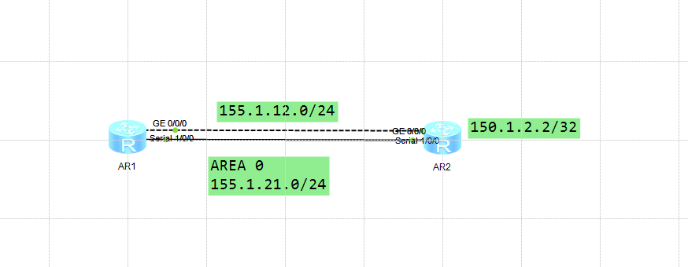

---
# HCIP-OSPF
layout: pags
title: OSPF优先级与开销修改实验
date: 2025-06-27 15:23:54
tags: Network
categories: 
- [HCIP,OSPF路径选择]
---

### 修改优先级与开销实现路径控制实验

- 实验拓扑
  


- 实验需求  
- 实验1
  1. R1-G0/0/0 不加入OSPF进程，S1/0/0 加入OSPF进程
  2. R2的LoopBack0加入OSPF区域0
  3. R1添加静态路由使用以太网链路访问150.1.2.2/32
  4. 修改OSPF优先级，实现R1访问150.1.2.2/32优先级使用以太网链路
- 实验2
   1. R1，R2所有接口加入OSPF，查看R1访问150.1.2.2的下一跳  
<!-- more -->
- 实验1配置

```bash
R1
    ospf 1 
        preerence 61
    interface g0/0/0 
        ip add 155.1.12.1 255.255.255.0
    interface S1/0/0 
        link-protocol ppp
        ip add 155.1.21.1 255.255.255.0
        ospf enable 1 area 0.0.0.0
    ip route-static 150.1.2.2 255.255.255.255 155.1.12.2
R2
    ospf 1
        area 0.0.0.0
    interface G0/0/0 
        ip add 155.1.12.2 255.255.255.0
    interface  S1/0/0 
        link-protocol ppp
        ip address 155.1.21.2 255.255.255.0
        ospf enable 1 area 0.0.0.0
```

- 验证配置

```bash
dis ip routing-table protocol ospf 
```


- 实验2配置
  
```bash
R1,R2
    ospf 1
        area 0.0.0.0
    interface G0/0/0 
        ip add 155.1.12.2 255.255.255.0
        ospf enable 1 area 0.0.0.0
        ospf cost 100
    interface S1/0/0 
        link-protocol ppp
        ip address 155.1.21.2 255.255.255.0
        ospf enable 1 area 0.0.0.0
```

- 验证配置1


