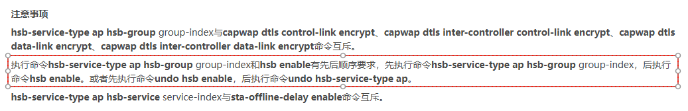

---
# HCIP-大型WLAN组网
layout: pags
title: VRRP双机热备实验
date: 2025-07-11 14:24:40
tags: Network
categories: 
- [HCIP,B.1大型WLAN组网]
---

### 双机热备实验

实验拓扑


<!-- more -->
实验需求
1. S1作为DHCP服务器对AP与用户分配地址
2. AC配置VRRP双机热备

实验配置

```bash
 S1
    dhcp enable
    interface Vlanif254
        ip  address 10.1.254.7 24
        dhcp  select interface 
        dhcp server excluded-ip-address 10.1.254.254
          
AC1
    interface Vlanif254
        ip address 10.1.254.1 24
        vrrp vrid 1 virtual-ip 10.1.254.254
        vrrp vrid 1 priority 101
    hsb-service 0
        service-ip-port local-ip 10.1.254.1 peer-ip 10.1.254.2 local-data-port 10240 peer-data-port 10240
    hsb-group 0
        track vrrp vrid 1 interface Vlanif254
        bind-service 0
        hsb enable   
hsb-service-type ap hsb-group
AC2
    interface Vlanif254
        ip address 10.1.254.2 24
        vrrp vrid 1 virtual-ip 10.1.254.254
    hsb-service 0
        service-ip-port local-ip 10.1.254.2 peer-ip 10.1.254.1 local-data-port 10240 peer-data-port 10240
    hsb-group 0
        track vrrp vrid 1 interface Vlanif254
        bind-service 0
        hsb enable                  
hsb-service-type ap hsb-group
WLAN业务配置
    wlan
        security-profile name SEC_PRO
        security wpa2 psk pass-phrase Huawei@123 ase
        ssid-profile name SSID_PRO
            ssid HUAWEI
        vap-profile name VAP_PRO
            service-vlan vlan-id 10
            ssid-profile SSID_PRO
            security-profile SEC_PRO 
        ap-id 1 ap-mac 00e0-fcd7-42d0
            ap-name AREA_1
                radio 0
                    vap-profile VAP_PRO wlan 1
                radio 1
                    vap-profile VAP_PRO wlan 1
capwap source ip-address 10.1.254.254
```

验证配置

查看HSB服务


查看HSB主备机


查看AP上线状态


查看PC设备状态


说明：hsb-service-type ap hsb-group 在hsb enable 之前配置 这是一个比较坑的地方 拦了我大半个小时 排错都没有日志信息提示 官方文档如下




